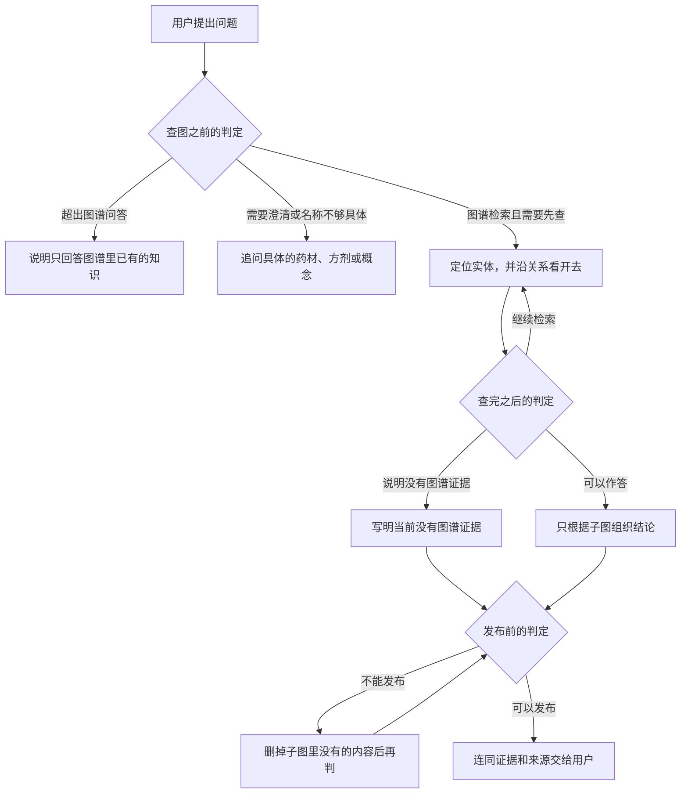
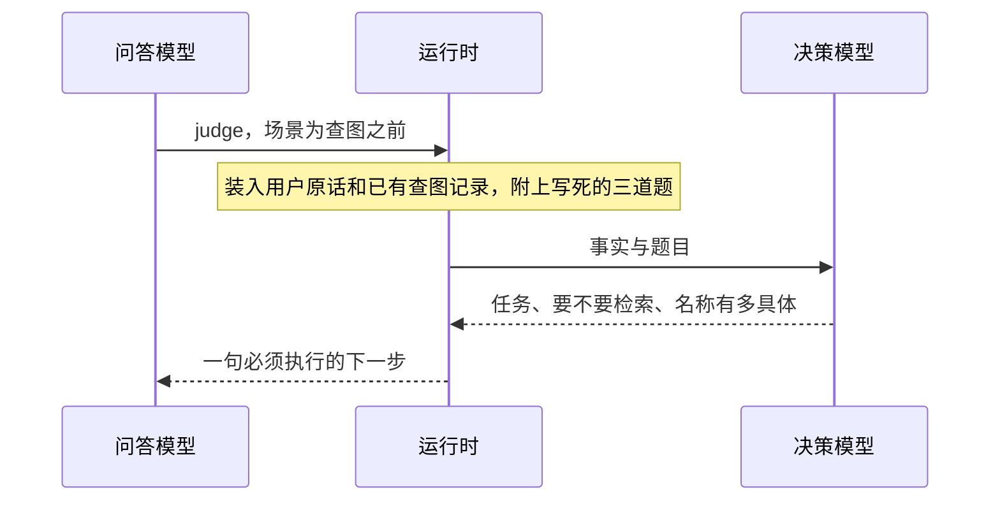

# 白草药坛 BaiCao ShiTan

面向中医药场景的 Agent 驱动可信知识搜集与利用平台。


> 白草不是再做一个中医药聊天页，而是把高密度、强关联的中医药知识，变成可搜集、可利用、可沉淀、结果可信的知识资产。

## 做什么

中医药知识密度高、来源散、关系复杂，检索和复用成本高。白草把图谱和 Agent 绑在一起：

- 图谱表达药材、功效、成分、配伍等实体与路径
- Agent 把查、串、比、整、用做成任务流
- 来源、证据、验证状态跟着走，结论可复核

适合研究 / 知识工程团队，以及需要在中医药场景里做检索与探索的专业用户。

## 一轮问答怎么走

问答模型负责查图和写结论。它在三个时刻发起判定，自己不打分，也不编写题目：查图之前、每次查完、把结论交给用户之前。运行时把事实和写死的题目交给 TypeSafe 的决策模型，再把答卷收成一句必须执行的下一步。



### 能不能用图谱回答

这是查图之前的一次判定。问答模型还没查图，只调用 `judge`，场景为 `intake`，可以附一句自己正在决定什么。三道题和标准在 `turn_judgment.py` 里，模型改不了。



事实只有三样：用户原话、这一轮已经返回的查图记录（这时通常还是空的）、问答模型可选的关注点。决策模型一次答完：

| 题 | 答法 | 在判什么 |
| --- | --- | --- |
| 任务 | 三选一 | 图谱检索、需要澄清，或超出图谱问答 |
| 需要检索 | 是的概率，0 到 1 | 回答前是否必须先查图 |
| 问题具体程度 | 从 0 起按档打分 | 0 没有可查的名称；1 有名称但可能对应多类实体；2 有明确中文名称或标识 |

运行时不把答卷原样交给问答模型，而是收成下一步。概率不低于 0.7 视为是，不高于 0.3 视为否，中间视为不确定。选项置信度低于 0.5 时不采用那个标签。

- 任务是「超出图谱问答」：不查图，说明只回答已入库的知识。诊断、开方、个人用药建议落在这里；问某味药的性味、归经、功效或某张方的组成则不是。
- 任务是「需要澄清」，或任务、是否检索不确定，或虽是「图谱检索」但具体程度落在最低一档：追问要查的名称，先不查图。
- 任务是「图谱检索」，需要检索为是，而且名称已经具体：先按名称定位，不要直接作答。
- 任务是「图谱检索」但需要检索为否：已有查图记录够用，写结论前再做一次发布判定。

### 查完和发布

后两处仍是同一套分工，换的是题目。查完用场景 `evidence`：锚点有没有定位、证据够不够、下一步是继续查、可以写，还是说明没有，以及离「能回答且能给出处」还差几档。决策模型只看查图记录，不用自己的药理知识。发布用场景 `claim`，问答模型必须把准备给用户的全文放进草稿：有没有写出子图里没有的实体、关系、剂量或出处，有没有新编剂量或出处，以及能不能发布。三道都明确通过才交给用户，否则改草稿后再判。

查找只有四件事：用名称或标识找到实体，按关系类型找到边，从已定位的实体再看出去一两跳，或回看一个实体的属性。找到的内容叠成这一轮的子图。出处优先来自其中的「由证据支持」；来源有「来源于」时用它，否则用节点上的导入源。

判定服务没接上时，上面三处不发生，问答模型仍用这四种查找来作答。结论边写边出现，旁边能看到查过的实体、关系和证据。同一段对话记得前面的问答；半小时没有继续，这段记忆就清掉。下一问会等上一问结束。

## 当前阶段

`MVP early`。可运行的 monorepo、问答与图谱主链路、验证与数据处理工作台已经在。药典 605 与苏子阳 v3 已入库。

脱敏后的 public HF dataset 已真实发布并通过 Viewer 验收；问答主链为 pydantic-ai-slim + 结构化图工具、citation、Neo4j integration。第三数据源已完成本地结构清洗；因上游无许可证，不进入 public Parquet。

多 worker 会话共享、专家治理、鉴权、事件驱动与监控还没做。这是研发仓库，不是生产系统。

## 快速开始

需要 Python 3.12+、Node.js 22+、pnpm、Docker。推荐 `uv`。

```bash
cp .env.schema .env
cp infra/.env.schema infra/.env
make deps up
make stack up
```

`.env` 里补 Universal Auth（`INFISICAL_CLIENT_ID` / `INFISICAL_CLIENT_SECRET`）。API 用官方 Python SDK 拉 secret，不需要安装 Infisical CLI。不用 Infisical、改端口、手动起进程、样例数据和验证命令见 [docs/local-development.md](docs/local-development.md)。

- Web: <http://localhost:3000>
- API: <http://localhost:8000>

## 仓库结构

```text
BaiCao/
├── packages/
│   ├── api/              # FastAPI 后端
│   ├── web/              # React 前端
│   ├── shared/           # 跨端共享类型
│   ├── knowledge_model/  # 共享知识模型
│   ├── data_ingestion/   # 数据采集
│   └── db/               # Cypher、导入样例
├── infra/                # Docker Compose
├── datasets/             # 自有知识数据集 staging
└── docs/                 # 架构、验收、计划
```

## 文档

| 想看什么 | 去哪 |
| --- | --- |
| 文档门户 | [docs/README.md](docs/README.md) |
| 本地开发 | [docs/local-development.md](docs/local-development.md) |
| 架构 | [docs/architecture/README.md](docs/architecture/README.md) |
| 验收 | [docs/acceptance/README.md](docs/acceptance/README.md) |
| Agent 规范 | [AGENTS.md](AGENTS.md) |
