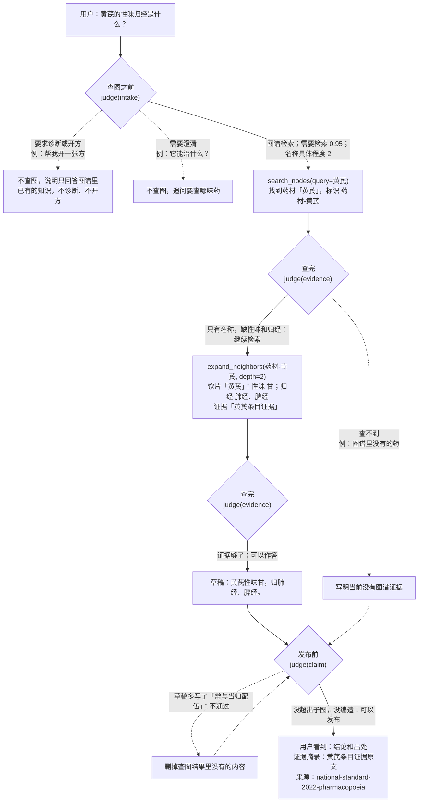

# 白草药坛 BaiCao ShiTan

面向中医药场景的 Agent 驱动可信知识搜集与利用平台。


> 白草不是再做一个中医药聊天页，而是把高密度、强关联的中医药知识，变成可搜集、可利用、可沉淀、结果可信的知识资产。

## 做什么

中医药知识密度高、来源散、关系复杂，检索和复用成本高。白草把图谱和 Agent 绑在一起：

- 图谱表达药材、功效、成分、配伍等实体与路径
- Agent 把查、串、比、整、用做成任务流
- 来源、证据、验证状态跟着走，结论可复核

适合研究 / 知识工程团队，以及需要在中医药场景里做检索与探索的专业用户。

## 一轮问答怎么走

以用户问「黄芪的性味归经是什么？」为例。问答模型负责查图和写结论；每到菱形处，它调用 `judge`，由决策模型（TypeSafe）回答写死的判定题，运行时再把答案换算成下一步。实线是这个问题实际走的路，虚线是换个问法时的走向。



几点说明：

- 带个人情况的问题，比如「我气虚，该吃黄芪吗？」，也走实线：按图谱里黄芪的功效和主治作答，不替用户决定该不该吃，并说明是否适用需由医生判断。
- 第二次查图要看两层（`depth=2`），因为药典数据里性味和归经挂在饮片上，不在药材上。
- 药典数据没有「来源于」关系，所以来源取节点上的导入源。

查图结果按药典数据在图里的实际结构做了简化，判定数值只是示意。

判定题、查图工具和出处规则的完整说明见 [架构文档](docs/architecture/README.md#图谱-agent)。

## 快速开始

需要 Python 3.12+、Node.js 22+、pnpm、Docker。推荐 `uv`。

```bash
cp .env.schema .env
cp infra/.env.schema infra/.env
make deps up
make stack up
```

环境变量（含 Infisical）、访问地址、手动启动、样例数据和验证命令见 [docs/local-development.md](docs/local-development.md)。

## 仓库结构

```text
BaiCao/
├── packages/
│   ├── api/              # FastAPI 后端
│   ├── web/              # React 前端
│   ├── shared/           # 跨端共享类型
│   ├── knowledge_model/  # 共享知识模型
│   ├── data_ingestion/   # 数据采集
│   └── db/               # Cypher、导入样例
├── infra/                # Docker Compose
├── datasets/             # 本地数据集工作目录（不进 Git，发布到 Hugging Face）
└── docs/                 # 架构、验收、计划
```

## 文档

| 想看什么 | 去哪 |
| --- | --- |
| 文档门户 | [docs/README.md](docs/README.md) |
| 本地开发 | [docs/local-development.md](docs/local-development.md) |
| 架构 | [docs/architecture/README.md](docs/architecture/README.md) |
| 验收 | [docs/acceptance/README.md](docs/acceptance/README.md) |
| Agent 规范 | [AGENTS.md](AGENTS.md) |
