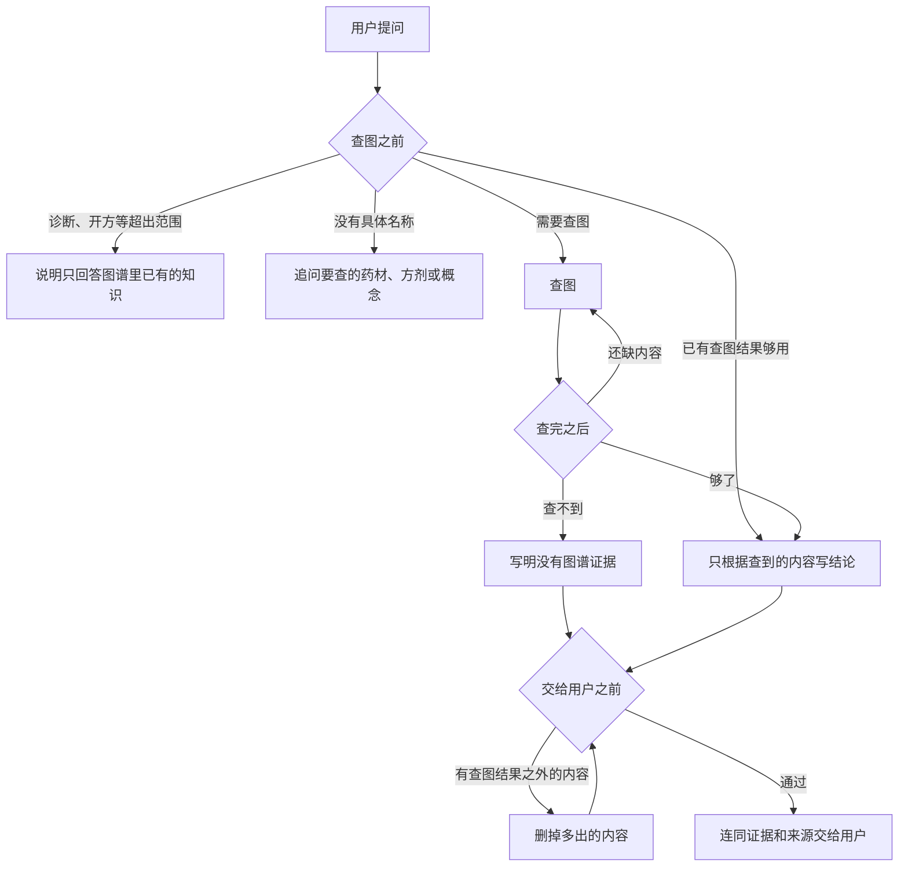

# 白草药坛 BaiCao ShiTan

面向中医药场景的 Agent 驱动可信知识搜集与利用平台。


> 白草不是再做一个中医药聊天页，而是把高密度、强关联的中医药知识，变成可搜集、可利用、可沉淀、结果可信的知识资产。

## 做什么

中医药知识密度高、来源散、关系复杂，检索和复用成本高。白草把图谱和 Agent 绑在一起：

- 图谱表达药材、功效、成分、配伍等实体与路径
- Agent 把查、串、比、整、用做成任务流
- 来源、证据、验证状态跟着走，结论可复核

适合研究 / 知识工程团队，以及需要在中医药场景里做检索与探索的专业用户。

## 一轮问答怎么走

一轮问答里有两个模型，各管一件事：

- **问答模型**（OpenAI 兼容接口）：查图，写结论。
- **决策模型**（TypeSafe）：只回答固定的判定题，不查图，也不写结论。

问答模型在三个时刻调用 `judge` 工具：查图之前、每次查完、交给用户之前。判定题和标准写死在 [`turn_judgment.py`](packages/api/app/services/chat_agent_runtime/turn_judgment.py)，问答模型改不了，也不能自己给自己打分。运行时把决策模型的答案换算成一句下一步，问答模型照着做。



### 三次判定

| 时机 | 场景 | 判什么 | 可能的下一步 |
| --- | --- | --- | --- |
| 查图之前 | `intake` | 这一问是图谱检索、需要澄清，还是超出范围；要不要先查图；名称够不够具体 | 说明超出范围、追问名称、先查图，或沿用已有结果去写 |
| 每次查完 | `evidence` | 要查的实体找到没有；证据够不够答；离「能回答且能给出处」还差多少 | 继续查、开始写，或说明没有图谱证据 |
| 交给用户之前 | `claim` | 草稿有没有写出查图结果里没有的实体、关系、剂量或出处；能不能发布 | 发布，或删改后再判 |

决策模型看到的只有：用户原话、本轮最近 6 次查图记录，以及交给用户之前的草稿全文。它只按这些记录判断，不用自己的药理知识。

怎么算超出范围：诊断、开方、针对个人的用药建议算；问某味药的性味、归经、功效，或某张方的组成，不算。

### 答案怎么换算成下一步

决策模型给出的是概率、选项和分档，运行时按固定规则换算：

- 是非题给的是「是」的概率：不低于 0.7 算是，不高于 0.3 算否，中间算不确定。
- 选择题的置信度低于 0.5，算不确定。
- 判定不确定时，先追问名称或换个名称再查，不直接作答。
- 答案缺题时按没判定处理，不发布结论。
- 交给用户之前的三道题必须全部明确通过才发布。没查到证据时，只有明确写出「当前没有图谱证据」才算通过。

### 怎么查图

问答模型只用四个只读操作，不写 Cypher：

| 操作 | 作用 |
| --- | --- |
| `search_nodes` | 按名称或标识找到实体 |
| `search_edges` | 按关系类型找边 |
| `expand_neighbors` | 从已找到的实体向外看 1 到 2 层 |
| `lookup_nodes` | 按标识回看实体属性 |

查到的节点和关系拼成本轮子图。出处由运行时从子图里提取，不从模型写的文字里解析：证据摘录来自「由证据支持」关系；来源优先用「来源于」关系，没有时用节点上的「导入源」。

### 其他行为

- 没有配置 TypeSafe（`TYPESAFE_API_KEY`、`TYPESAFE_BASE_URL`）时，`judge` 不注册，三次判定都跳过，问答模型直接查图作答。
- 页面上，每次查图和查到的实体、关系会实时出现；结论写完后显示，最后附上证据和来源。
- 同一会话会记住前面的问答，30 分钟没有新提问就清掉。同一会话里，下一问会等上一问结束。

## 当前阶段

`MVP early`。已经能跑：monorepo 本地开发栈、图谱问答主链路、数据验证与处理工作台。2022 年药典（605 条目）和道医苏子阳 v3 已导入图谱。

问答基于 pydantic-ai-slim，通过上面四个只读操作查 Neo4j，出处从子图生成。知识数据集放在 Hugging Face 私有仓库，其中脱敏后的公开层已通过 Dataset Viewer 验收。第三个数据源 DragonTCM 已在本地完成清洗；上游没有许可证，不进公开层。

多 worker 会话共享、专家治理、鉴权、事件驱动与监控还没做。这是研发仓库，不是生产系统。

## 快速开始

需要 Python 3.12+、Node.js 22+、pnpm、Docker。推荐 `uv`。

```bash
cp .env.schema .env
cp infra/.env.schema infra/.env
make deps up
make stack up
```

`.env` 里补 Universal Auth（`INFISICAL_CLIENT_ID` / `INFISICAL_CLIENT_SECRET`）。API 用官方 Python SDK 拉 secret，不需要安装 Infisical CLI。不用 Infisical、改端口、手动起进程、样例数据和验证命令见 [docs/local-development.md](docs/local-development.md)。

- Web: <http://localhost:3000>
- API: <http://localhost:8000>

## 仓库结构

```text
BaiCao/
├── packages/
│   ├── api/              # FastAPI 后端
│   ├── web/              # React 前端
│   ├── shared/           # 跨端共享类型
│   ├── knowledge_model/  # 共享知识模型
│   ├── data_ingestion/   # 数据采集
│   └── db/               # Cypher、导入样例
├── infra/                # Docker Compose
├── datasets/             # 本地数据集工作目录（不进 Git，发布到 Hugging Face）
└── docs/                 # 架构、验收、计划
```

## 文档

| 想看什么 | 去哪 |
| --- | --- |
| 文档门户 | [docs/README.md](docs/README.md) |
| 本地开发 | [docs/local-development.md](docs/local-development.md) |
| 架构 | [docs/architecture/README.md](docs/architecture/README.md) |
| 验收 | [docs/acceptance/README.md](docs/acceptance/README.md) |
| Agent 规范 | [AGENTS.md](AGENTS.md) |
