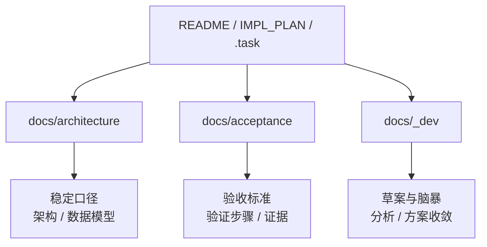

# 文档系统

这里是 BaiCao ShiTan 的总文档门户，用来统一回答三个问题：

1. 先看哪份文档才能最快建立全局认知
2. 哪些文档代表当前稳定口径，哪些只是研发草案
3. 新增或修改文档时，应该把信息放到哪里

## 一页看懂

- `architecture/`：长期维护文档，描述系统边界、架构和数据模型
- `acceptance/`：验收标准与验证方式，回答“如何证明它真的完成了”
- `_dev/`：研发草案与 brainstorm，回答“我们曾经如何分析、讨论、收敛方案”

## 推荐阅读路径

### 路径 A：第一次接触项目

1. [../README.md](../README.md)
2. [architecture/README.md](architecture/README.md)
3. [architecture/system-overview.md](architecture/system-overview.md)
4. [architecture/data-model.md](architecture/data-model.md)
5. [_dev/brainstorm/README.md](_dev/brainstorm/README.md)

### 路径 B：要开始实现功能

1. [../IMPL_PLAN.md](../IMPL_PLAN.md)
2. [architecture/system-overview.md](architecture/system-overview.md)
3. [architecture/data-model.md](architecture/data-model.md)
4. [acceptance/README.md](acceptance/README.md)
5. 对应 `.task/` 任务文件

### 路径 C：要判断“当前代码”与“目标方案”的差异

1. [../README.md](../README.md)
2. [architecture/README.md](architecture/README.md)
3. [_dev/README.md](_dev/README.md)
4. [_dev/brainstorm/README.md](_dev/brainstorm/README.md)

## 文档分层



## 文档目录

| 目录 | 定位 | 内容特点 | 何时阅读 |
|------|------|----------|----------|
| [architecture/](architecture/README.md) | 长期维护 | 稳定、可引用、面向长期演进 | 建立全局视图、统一术语、核对边界 |
| [acceptance/](acceptance/README.md) | 验收与完成定义 | 可执行、可复现、可对照实现 | 验证功能是否完成、补齐验收脚本 |
| [_dev/](_dev/README.md) | 草案与中间产物 | WIP、探索性、可能过期 | 回看分析过程、理解方案来源 |

## 当前文档现状

截至目前，文档系统的成熟度大致如下：

| 区域 | 当前状态 | 说明 |
|------|------|------|
| `docs/architecture/` | 已形成主入口 | 已有系统总览与数据模型两份稳定文档 |
| `docs/acceptance/` | 已形成首批实例 | 已有模板和 3 条主链路验收文档，可直接执行 |
| `docs/_dev/brainstorm/` | 内容最完整 | 已沉淀产品和架构 brainstorm 结果，适合回溯思路 |
| `docs/_dev/` 其他区域 | 较轻 | 当前主要承担草案说明和毕业规则 |

## 如何放置信息

为了避免文档漂移，信息放置遵循下面的规则：

### 放进 `architecture/`

- 已确认的系统边界
- 长期有效的术语定义
- 稳定的数据模型
- 会影响后续多个模块实现的架构约束

### 放进 `acceptance/`

- 功能验收标准
- 验证命令和复现步骤
- 成功 / 失败判定条件
- 与实现证据相关的检查项
- 与根级统一命令一致的主链路验证入口

### 放进 `_dev/`

- 还在讨论中的方案
- 分析过程、权衡记录、brainstorm 产物
- 尚未确认是否毕业到稳定文档的内容

## 现状与目标的区分规则

本项目文档统一使用以下口径：

- 当前现状：以仓库代码、配置、脚本、现有接口为准
- 目标形态：以 [../IMPL_PLAN.md](../IMPL_PLAN.md) 和 `_dev/brainstorm/` 中已收敛方向为准
- 若两者不一致，必须显式写明 `已实现`、`进行中` 或 `规划中`

不要把草案里的目标能力直接写成当前事实。

## 文档索引

### 稳定文档

| 文档 | 摘要 |
|------|------|
| [architecture/README.md](architecture/README.md) | 架构入口页，统一架构口径与阅读顺序 |
| [architecture/system-overview.md](architecture/system-overview.md) | 系统整体架构、模块边界、关键数据流 |
| [architecture/data-model.md](architecture/data-model.md) | 图模型与关系模型设计 |
| [acceptance/README.md](acceptance/README.md) | 验收文档目录与基本原则 |
| [acceptance/graph-query-mainline.md](acceptance/graph-query-mainline.md) | 图谱查询主链路验收 |
| [acceptance/chat-mainline.md](acceptance/chat-mainline.md) | 智能问答主链路验收 |
| [acceptance/verification-workflow.md](acceptance/verification-workflow.md) | 验证申请与审核闭环验收 |

### 草案与分析

| 文档 | 摘要 |
|------|------|
| [_dev/README.md](_dev/README.md) | 草案文档规则与毕业路径 |
| [_dev/brainstorm/README.md](_dev/brainstorm/README.md) | brainstorm 总索引，连接产品与架构分析产物 |

## 文档维护规则

### 必须遵守

- 新增或移动任何 `docs/**.md` 时，同步更新对应目录的 `README.md`
- 文档解释优先，协议和字段真源优先回到代码或规划文档
- 需要长期维护的内容，不要只留在 `_dev/`
- 验收相关内容不要混进架构说明，保持“说明”和“验证”分层

### 引用建议

- `docs/**` 内部引用：优先使用相对路径 Markdown 链接
- 从仓库根目录引用 docs：使用 `docs/...` 路径
- 面向实现证据：使用 `path:line` 格式，例如 `packages/api/app/main.py:1`

### 元信息建议

当文档会被频繁按需加载时，建议在开头添加 front matter：

```html
<!--
---
doc_kind: architecture
status: stable
tags: ["knowledge-graph", "neo4j"]
summary: 知识图谱数据模型设计
audience: developer
---
-->
```

推荐字段：

- `doc_kind`: `architecture` | `acceptance` | `dev` | `notes`
- `status`: `stable` | `wip` | `draft` | `deprecated`
- `tags`: 字符串数组
- `summary`: 一句话摘要
- `audience`: `operator` | `developer` | `agent`

## 快速自检

```bash
rg -l "TODO|FIXME" docs/
rg "\.\./" docs/ --type md
```

## 与仓库其他真源的关系

- 项目总入口：[../README.md](../README.md)
- 项目规划真源：[../IMPL_PLAN.md](../IMPL_PLAN.md)
- 任务真源：`../.task/`
- 共享类型真源：`../packages/shared/types/`
- 运行编排事实：`../infra/docker-compose.yml`
