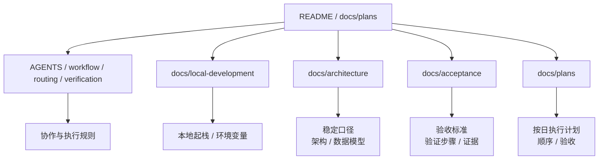

# 文档系统

这里是 BaiCao ShiTan 的总文档门户，用来统一回答四个问题：

1. 先看哪份文档才能最快建立全局认知
2. 哪些文档代表当前稳定口径，哪些只是当轮执行计划
3. agent / 开发者开始实现前，应该走哪条工作流
4. 新增或修改文档时，应该把信息放到哪里

## 一页看懂

- `architecture/`：长期维护文档，描述系统边界、架构和数据模型
- `acceptance/`：验收标准与验证方式，回答“如何证明它真的完成了”
- `local-development.md`：本地起栈、Infisical、手动启动、样例数据与验证命令
- `plans/`：按日落盘的执行计划，回答“这一轮按什么顺序落地、如何验收”
- `packages/api/app/services/chat_agent_runtime/`：当前 chat 主链的 agent runtime 真源，负责 pydantic-ai-slim loop、官方 mcp v2 同进程客户端、会话 `message_history` 与 SSE 事件适配
- 根级协作文档：`AGENTS.md`、`workflow.md`、`docs/agent-skill-routing.md`、`docs/verification-matrix.md`，回答“agent / 开发者现在应该如何推进”

## 推荐阅读路径

### 路径 A：第一次接触项目

1. [../README.md](../README.md)
2. [local-development.md](local-development.md)
3. [architecture/README.md](architecture/README.md)
4. [architecture/system-overview.md](architecture/system-overview.md)
5. [architecture/data-model.md](architecture/data-model.md)
6. [architecture/knowledge-model-and-ingestion.md](architecture/knowledge-model-and-ingestion.md)
7. [architecture/data-pipeline-workbench.md](architecture/data-pipeline-workbench.md)

### 路径 B：要开始实现功能

1. [../AGENTS.md](../AGENTS.md)
2. [../workflow.md](../workflow.md)
3. [agent-skill-routing.md](agent-skill-routing.md)
4. [plans/README.md](plans/README.md)
5. [architecture/system-overview.md](architecture/system-overview.md)
6. [acceptance/README.md](acceptance/README.md)
7. 对应 `plans/` 计划文件

### 路径 C：要判断“当前代码”与“目标方案”的差异

1. [../README.md](../README.md)
2. [plans/README.md](plans/README.md)
3. [architecture/README.md](architecture/README.md)
4. [acceptance/README.md](acceptance/README.md)

### 路径 D：要维护 agent / 研发规范

1. [../AGENTS.md](../AGENTS.md)
2. [../workflow.md](../workflow.md)
3. [agent-skill-routing.md](agent-skill-routing.md)
4. [verification-matrix.md](verification-matrix.md)
5. [plans/README.md](plans/README.md)

## 文档分层



## 文档目录

| 目录 / 文档 | 定位 | 内容特点 | 何时阅读 |
|------|------|----------|----------|
| [../AGENTS.md](../AGENTS.md) | 仓库级 agent 入口 | 高层规则、导航、交付口径 | 进入仓库、准备开始任务时 |
| [../workflow.md](../workflow.md) | 任务分流与 contract-first 工作流 | 作用域判断、跨模块顺序、交付约定 | 非 trivial 任务开始前 |
| [local-development.md](local-development.md) | 本地开发 | make 栈、Infisical、手动启动、样例数据、验证命令 | 第一次把仓库跑起来时 |
| [agent-skill-routing.md](agent-skill-routing.md) | skill 选择入口 | 流程 skill、领域 skill、协作 skill 路由 | 需要判断先用哪类 skill 时 |
| [verification-matrix.md](verification-matrix.md) | 验证标准入口 | 各类改动的最低验证要求 | 准备宣称完成、补验收证据时 |
| [architecture/](architecture/README.md) | 长期维护 | 稳定、可引用、面向长期演进 | 建立全局视图、统一术语、核对边界 |
| [acceptance/](acceptance/README.md) | 验收与完成定义 | 可执行、可复现、可对照实现 | 验证功能是否完成、补齐验收脚本 |
| [plans/](plans/README.md) | 按日落盘的执行计划 | 怎么落到现码、顺序、验收 | 设计已写进 `architecture/` 之后要动手时 |

## 当前文档现状

截至目前，文档系统的成熟度大致如下：

| 区域 | 当前状态 | 说明 |
|------|------|------|
| 根级协作文档 | 已补齐入口 | 现在由 `AGENTS.md`、`workflow.md`、`agent-skill-routing.md`、`verification-matrix.md` 共同承担 agent 入口、工作流、skill 路由与验证口径 |
| `docs/local-development.md` | 已从根 README 拆出 | 本地起栈、Infisical、手动启动、样例数据与验证命令 |
| `docs/architecture/` | 已形成主入口 | 已有系统总览与数据模型两份稳定文档 |
| `docs/acceptance/` | 已有六条主链路实例 | 图谱、问答、验证、知识模型/采集、数据处理工作台、review/export，结论均为 `pass` |
| `docs/plans/` | 按日落盘的执行计划 | 新实施步骤写这里；当前：[问答 chat 走最新 MCP 并清适配](plans/2026/09-06/问答-chat-走最新-mcp-并清适配-b042.md)、[中文属性与实体消歧合并](plans/2026/09-06/中文属性与实体消歧合并-94ae.md)、[清洗完成后删除原文与中间态](plans/2026/09-06/清洗完成后删除原文与中间态-4fa3.md) |
| `datasets/baicao-knowledge/` | 数据台账 staging | 源注册、VIEW、计划/完成量；载荷不进 git |

## 如何放置信息

为了避免文档漂移，信息放置遵循下面的规则：

### 放进根级 `README.md`

- 产品定位、受众、当前阶段
- 最短可运行入口（几条命令 + 链接）
- 不要放 Infisical 细节、端口表、验证命令释义、架构图、样例数据路径

### 放进根级协作文档

- 仓库级 agent 行为规范与交付格式
- 任务分流规则、contract-first 顺序、多模块执行约束
- skill 选择、协作路由、验证矩阵
- 会影响默认研发动作的规则

### 放进 `local-development.md`

- 本地起栈、端口、Infisical / 手动 `.env`
- 样例图谱导入
- 验证命令怎么跑（命令含义仍以 `verification-matrix.md` 为准）

### 放进 `architecture/`

- 已确认的系统边界
- 长期有效的术语定义
- 稳定的数据模型
- 会影响后续多个模块实现的架构约束

### 放进 `acceptance/`

- 功能验收标准
- 验证命令和复现步骤
- 成功 / 失败判定条件
- 与实现证据相关的检查项
- 与根级统一命令一致的主链路验证入口

### 放进 `docs/plans/`

- 按日落盘的实施步骤、顺序、验收命令
- 用 `plan-docs` 脚本建档，不要手拼路径
- 未稳定的分析不要另建过程目录；确认后的口径写进 `architecture/`

### 放进 `datasets/baicao-knowledge/`

- 自有数据源注册、`SOURCE.md` / `VIEW.md`
- 计划处理量与已完成量（`catalog.json`、`tasks/ledger.json`）
- 不把原文和大 JSONL 提交进 git；HF private dataset 才是载荷发布面

### `plans` 完成后的毕业

当 `docs/plans/` 对应的任务已经完成时，默认按下面的顺序处理：

1. 稳定实现事实毕业到 `docs/architecture/`
2. 验收步骤、验证命令、结果判定与实现证据毕业到 `docs/acceptance/`
3. 会影响默认研发动作的规则毕业到根级协作文档或 `workflow.md` / `verification-matrix.md`
4. 执行计划留在 `docs/plans/`，不再承担稳定真源

补充约束：

- 若新需求已完整覆盖旧 plan，旧文档应直接删除，而不是并行保留两条 requirement lineage
- 完成毕业或删除后，必须同步更新相关 `README.md`、目录索引和状态字段，避免出现“文档存在但无法发现”或“入口仍指向旧真源”

## 现状与目标的区分规则

本项目文档统一使用以下口径：

- 当前现状：以仓库代码、配置、脚本、现有接口为准
- 目标形态：以 [../README.md](../README.md) 与 [plans/README.md](plans/README.md) 中已收敛方向为准
- 若两者不一致，必须显式写明 `已实现`、`进行中` 或 `规划中`

不要把草案里的目标能力直接写成当前事实。

## 文档索引

### 稳定文档与协作文档

| 文档 | 摘要 |
|------|------|
| [../AGENTS.md](../AGENTS.md) | 仓库级 agent 入口、导航、交付口径 |
| [../workflow.md](../workflow.md) | 仓库级任务分流、contract-first 顺序、跨模块工作流 |
| [local-development.md](local-development.md) | 本地开发栈、环境变量、样例数据、验证命令 |
| [agent-skill-routing.md](agent-skill-routing.md) | skill 选择顺序、多代理协作路由 |
| [verification-matrix.md](verification-matrix.md) | 各类改动的最低验证标准 |
| [architecture/README.md](architecture/README.md) | 架构入口页，统一架构口径与阅读顺序 |
| [architecture/system-overview.md](architecture/system-overview.md) | 系统整体架构、模块边界、关键数据流 |
| [architecture/data-model.md](architecture/data-model.md) | 图模型与关系模型设计 |
| [architecture/graph-workbench.md](architecture/graph-workbench.md) | `/graph` 的 Graph Workbench、metadata、D3 结果视图与 Neo4j 连接边界 |
| [architecture/knowledge-model-and-ingestion.md](architecture/knowledge-model-and-ingestion.md) | 图模型唯一真源、中文知识结构定义、数据采集架构与 graph runtime / agent 边界 |
| [architecture/chat-agent-mcp.md](architecture/chat-agent-mcp.md) | 问答 agent 轻量检索、执行中的 system_one 判定、MCP 工具/资源与规范对齐 |
| [architecture/data-pipeline-workbench.md](architecture/data-pipeline-workbench.md) | 固定步骤、可预览、可人工放行的数据处理工作台架构 |
| [acceptance/README.md](acceptance/README.md) | 验收文档目录与基本原则 |
| [acceptance/graph-workbench-mainline.md](acceptance/graph-workbench-mainline.md) | Graph Workbench `/graph` 主链路验收 |
| [acceptance/chat-mainline.md](acceptance/chat-mainline.md) | 智能问答主链路验收 |
| [acceptance/verification-workflow.md](acceptance/verification-workflow.md) | 验证申请与审核闭环验收 |
| [acceptance/data-ingestion-and-knowledge-model.md](acceptance/data-ingestion-and-knowledge-model.md) | 共享图模型与数据采集边界验收 |
| [acceptance/data-pipeline-workbench-mainline.md](acceptance/data-pipeline-workbench-mainline.md) | 数据处理工作台主链路验收 |
| [acceptance/review-export-persistence-wave-2.md](acceptance/review-export-persistence-wave-2.md) | review/export 持久化验收 |
| [architecture/data-sources.md](architecture/data-sources.md) | 数据源审核队列、各源仓库路径与人工质量校验清单 |
| [architecture/knowledge-dataset.md](architecture/knowledge-dataset.md) | 自有 HF dataset 任务定义与 Parquet 发布 |
| [architecture/entity-resolution.md](architecture/entity-resolution.md) | 中文属性、身份键、消歧与合并策略 |
| [plans/README.md](plans/README.md) | 按日归档的执行计划 |
| [../datasets/baicao-knowledge/README.md](../datasets/baicao-knowledge/README.md) | 自有知识数据集 staging 与产量台账 |

## 文档维护规则

### 必须遵守

- 新增或移动任何 `docs/**.md` 时，同步更新对应目录的 `README.md`
- 新增或修改根级协作文档时，同步检查 `docs/README.md` 中的入口是否仍然正确
- 文档解释优先，协议和字段真源优先回到代码、规划文档或共享类型
- 需要长期维护的内容，不要只留在 `docs/plans/`
- 验收相关内容不要混进架构说明，保持“说明”和“验证”分层
- `docs/plans/` 任务完成后，稳定内容必须毕业到稳定目录；被新需求完整覆盖的旧 plan 必须删除

### 引用建议

- `docs/**` 内部引用：优先使用相对路径 Markdown 链接
- 从仓库根目录引用 docs：使用 `docs/...` 路径
- 面向实现证据：使用 `path:line` 格式，例如 `packages/api/app/main.py:1`

### 元信息建议

当文档会被频繁按需加载时，建议在开头添加 front matter：

```html
<!--
---
doc_kind: architecture
status: stable
tags: ["knowledge-graph", "neo4j"]
summary: 知识图谱数据模型设计
audience: developer
---
-->
```

推荐字段：

- `doc_kind`: `architecture` | `acceptance` | `dev` | `notes` | `workflow`
- `status`: `stable` | `wip` | `draft` | `deprecated`
- `tags`: 字符串数组
- `summary`: 一句话摘要
- `audience`: `operator` | `developer` | `agent`

## 快速自检

```bash
rg -l "TODO|FIXME" docs/
rg "\.\./" docs/ --type md
rg -n "workflow.md|agent-skill-routing|verification-matrix" docs/ --type md
```

## 与仓库其他真源的关系

- 项目总入口：[../README.md](../README.md)
- 本地开发：[local-development.md](local-development.md)
- 项目入口与阶段信息：[../README.md](../README.md)、[plans/README.md](plans/README.md)
- 任务真源：`docs/plans/`
- 共享类型真源：`../packages/shared/types/`
- 图模型唯一真源（目标形态）：`../packages/knowledge_model/`
- Chat 主链 runtime 真源：`../packages/api/app/services/chat_agent_runtime/`
- 运行编排事实：`../infra/docker-compose.yml`
