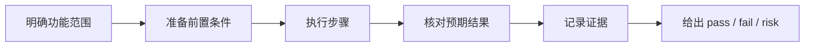

# 验收文档

这里是 BaiCao ShiTan 的验收入口，负责回答一个非常具体的问题：

> 某个功能看起来“已经写完”，但我们如何证明它真的可用、可复现、可交付？

`docs/acceptance/` 不负责解释系统为什么这样设计，那是 `docs/architecture/` 的职责；这里负责把“完成”变成可执行、可核对、可回溯的验收结果。

## 一页看懂

- 目标：把“功能完成”转换为“可执行验收”
- 内容：验收标准、前置条件、操作步骤、期望结果、失败记录、实现证据
- 读者：开发者、测试者、评审者、AI Agent
- 口径：以当前仓库事实为准，不把规划中能力写成已通过项

## 推荐使用方式

### 什么时候应该写验收文档

- 新增一个用户可感知功能
- 完成一个跨模块功能闭环
- 引入需要回归验证的核心改动
- 准备把一轮执行计划推进到“可交付”

### 什么时候只需要最小验证记录

- 纯重命名、纯注释、纯文案小改
- 不影响行为的局部重构
- 只改内部实现且已有更高层稳定验收覆盖

## 推荐阅读顺序

1. [../../README.md](../../README.md)
2. [../README.md](../README.md)
3. [../architecture/README.md](../architecture/README.md)
4. 对应功能的实施计划文件（`../plans/`）或项目总入口 `../../README.md`
5. 当前目录下对应功能的验收文档

## 验收的最小闭环



一个完整的验收文档，至少要包含下面 5 件事：

1. 验什么
2. 在什么环境下验
3. 怎么操作
4. 看到什么才算通过
5. 证据在哪里

## 当前目录现状

截至目前，`docs/acceptance/` 已从“入口已建”升级为“入口 + 模板 + 主链路实例”：

| 项目 | 当前状态 | 说明 |
|------|------|------|
| 验收入口页 | 已有 | 当前文件作为目录入口与规则说明 |
| 验收模板 | 已补齐 | 使用 [template.md](template.md) 作为后续新文档起点 |
| 具体功能验收文档 | 已补更多主链路 | 已补六条主链路，当前结论均为 `pass` |

## 文档索引

| 文档 | 状态 | 摘要 |
|------|------|------|
| [README.md](README.md) | stable | 验收入口、规则、结构和证据格式 |
| [template.md](template.md) | stable | 功能验收模板，适合复制后开始填写 |
| [graph-workbench-mainline.md](graph-workbench-mainline.md) | stable | Graph Workbench `/graph` 三栏工作台主链路验收 |
| [chat-mainline.md](chat-mainline.md) | stable | 智能问答主链路已通过真实 Neo4j/provider、citation 与 E2E 验收 |
| [verification-workflow.md](verification-workflow.md) | stable | 验证申请与审核闭环验收 |
| [data-ingestion-and-knowledge-model.md](data-ingestion-and-knowledge-model.md) | stable | 共享图模型、导入导出与数据采集边界主链路验收 |
| [data-pipeline-workbench-mainline.md](data-pipeline-workbench-mainline.md) | stable | 数据处理工作台七步预览、映射门禁与回退主链路验收 |
| [review-export-persistence-wave-2.md](review-export-persistence-wave-2.md) | stable | 数据工作台人工确认持久化、显式导出执行、JSONL snapshot 与 Neo4j 写入验收 |

## 一份好的验收文档应该写什么

### 1. 范围与目标

- 这个文档验证哪个功能或闭环
- 哪些场景在范围内
- 哪些场景暂时不在范围内

### 2. 前置条件

- 依赖哪些服务
- 需要哪些环境变量、样例数据、账号或角色
- 需要启动哪些进程

### 3. 验收步骤

- 用最小步骤描述操作顺序
- 尽量写成可复制命令
- 对 UI 场景说明清楚入口页面和点击路径

### 4. 期望结果

- 页面应该展示什么
- 接口应该返回什么
- 数据应该写入哪里
- 日志、状态或数据库中应出现什么证据

### 5. 证据与结论

- 最终结论：`pass` / `fail` / `risk`
- 证据路径：命令输出摘要、接口响应、截图、`path:line`
- 若未通过：明确失败点、影响范围、下一步处理建议

## 推荐结构

推荐每篇验收文档都按下面顺序组织：

1. 概述
2. 验收范围
3. 前置条件
4. 验收步骤
5. 期望结果
6. 证据记录
7. 风险与未覆盖项
8. 结论

后续新增验收文档时，建议直接从 [template.md](template.md) 复制。

## 证据格式建议

为了便于追溯，验收证据建议同时覆盖以下几类信息：

### 实现证据

- `packages/api/app/main.py:1`
- `packages/web/src/App.tsx:1`
- `infra/docker-compose.yml:1`

### 运行证据

- 命令：`uv run ruff check app tests`
- 命令：`uv run ty check`
- 命令：`uv run pytest`
- 命令：`pnpm build`
- 命令：`docker compose -f infra/docker-compose.yml up --build`

### 结果证据

- 接口返回摘要
- 页面截图或关键可见结果
- 数据库 / 图数据库中的状态变化

## 结论状态建议

建议统一使用以下三种状态：

| 状态 | 含义 | 适用场景 |
|------|------|----------|
| `pass` | 已按预期通过 | 主链路闭环完成，证据充分 |
| `fail` | 未通过 | 存在明确问题，当前不可交付 |
| `risk` | 主链路基本通过，但仍有残余风险 | 需要说明风险边界与后续补充项 |

## 与项目其他真源的关系

- 需求与阶段目标：`../../README.md`、`../plans/`
- 当前实现事实：仓库代码、脚本、配置
- 长期系统解释：`../architecture/`
- 任务状态来源：`../plans/`

## 验收写作原则

### 必须遵守

- 每个功能必须有可执行的验收标准
- 验收测试必须可复现
- 验收结果必须关联到具体实现证据
- 不要把“理论上应该如此”写成“已经验过”
- 未执行的步骤必须明确标注未执行原因

### 推荐实践

- 优先最小验证闭环，不要堆大而空的测试矩阵
- 先写主链路，再补边界场景
- 对跨模块功能，按“入口 -> 处理 -> 存储/展示”串起证据
- 尽量复用真实启动命令和真实样例数据

## 快速自检

```bash
rg -n "pass|fail|risk" docs/acceptance --type md
rg -n "前置条件|验收步骤|期望结果|证据|结论" docs/acceptance --type md
```

## 下一步建议

六条主链路均为 `pass`。public HF Dataset Viewer 已通过匿名 `/is-valid`、`/splits` 与行读取验收；公开 Parquet 只含脱敏结构化结果。

数据工作的稳定口径：`docs/architecture/knowledge-dataset.md`
