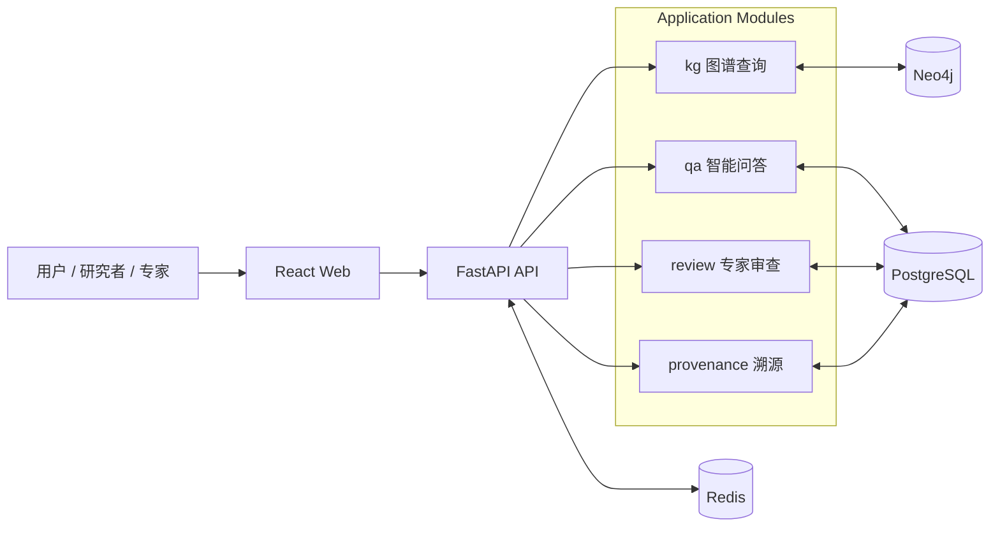

# 架构文档

这里是白草药坛的长期维护架构入口，目标不是重复实现细节，而是统一回答 3 个问题：

1. 系统为什么这样分层
2. 当前已经落地到什么程度
3. 后续扩展应该沿着什么边界继续演进

## 当前统一口径

- 产品定位：可溯源、可解释、可验证的中药材知识图谱智能问答系统
- 当前阶段：MVP 早期实现中；药典 + 苏子阳已入图，下一波是数据集发布与 Workbench / 问答消费新类型
- 架构模式：Modular Monolith
- 核心能力闭环：问答 -> 图谱 -> 溯源 -> 审查 -> 状态回流
- 存储分工：Neo4j 负责知识图谱，PostgreSQL 负责结构化事务数据，Redis 负责缓存与后续异步演进预留

## 推荐阅读顺序

| 顺序 | 文档 | 适合场景 | 说明 |
|------|------|----------|------|
| 1 | [system-overview.md](system-overview.md) | 新人建立全局视图 | 先看系统角色、模块边界、数据流和当前实现状态 |
| 2 | [data-model.md](data-model.md) | 深入数据设计 | 看 Neo4j 节点/关系模型与 PostgreSQL 侧职责 |
| 3 | [graph-workbench.md](graph-workbench.md) | 理解 `/graph` 的当前稳定实现 | 看 Graph Workbench、metadata、D3 结果视图和 Neo4j 运行时边界 |
| 4 | [knowledge-model-and-ingestion.md](knowledge-model-and-ingestion.md) | 理解共享图模型与数据采集边界 | 看仓库级图模型唯一真源、中文语义与数据采集二级子项目架构 |
| 5 | [chat-agent-mcp.md](chat-agent-mcp.md) | 理解问答 agent 检索面 | 看轻量 agent 边界、四个图工具、prompt 与 MCP 规范对齐 |
| 6 | [data-pipeline-workbench.md](data-pipeline-workbench.md) | 理解固定步骤的数据处理工作台 | 看持久化处理任务、步骤预览、人工放行与导出 / 入库流程 |
| 7 | [data-sources.md](data-sources.md) | 校验数据源质量 | 审核队列、各源仓库路径、许可边界与人工审阅记录 |
| 8 | [knowledge-dataset.md](knowledge-dataset.md) | 维护 HF 数据集 | 任务定义、信封、Parquet、苏子阳抽取验收 |
| 9 | [entity-resolution.md](entity-resolution.md) | 入库消歧与中文属性 | 拼音/拉丁剥离、身份键、合并策略 |

## 文档索引

| 文档 | 状态 | 摘要 |
|------|------|------|
| [system-overview.md](system-overview.md) | stable | 系统整体架构、模块边界、当前实现与目标形态 |
| [data-model.md](data-model.md) | stable | 数据模型设计，覆盖关系模型、图模型和验证状态 |
| [graph-workbench.md](graph-workbench.md) | stable | `/graph` 的 Graph Workbench、metadata、D3 结果视图与 Neo4j 连接边界 |
| [knowledge-model-and-ingestion.md](knowledge-model-and-ingestion.md) | stable | 仓库级图模型唯一真源、中文知识结构定义与数据采集架构 |
| [chat-agent-mcp.md](chat-agent-mcp.md) | stable | 问答与 Cursor 共用官方 mcp v2 知识 server；pydantic-ai 只做 loop |
| [data-pipeline-workbench.md](data-pipeline-workbench.md) | stable | 固定步骤、可预览、可人工放行的数据处理工作台架构 |
| [data-sources.md](data-sources.md) | review | 审核队列、各源仓库路径、许可边界与人工质量校验清单 |
| [knowledge-dataset.md](knowledge-dataset.md) | stable | 自有 HF dataset 任务定义、Parquet 发布、源/批次筛选 |
| [entity-resolution.md](entity-resolution.md) | stable | 中文名称属性、身份键、消歧与合并策略（目标形态） |

## 架构主线

## 如何理解“现状”和“目标”

阅读本目录文档时，统一按下面的区分理解：

- 当前现状：以仓库代码、配置、脚本和现有接口为准
- 目标形态：以 `../../README.md`、`../superpowers/plans/` 和 `../_dev/brainstorm/` 中已确认方向为准
- 若两者不一致，README 与架构文档必须显式说明“已实现 / 规划中”，避免把目标写成事实

## 单一事实来源

- 长期架构口径：`docs/architecture/*.md`
- 项目入口与阶段任务：`../../README.md`、`../superpowers/plans/`
- 本地开发：`../local-development.md`
- 共享类型真源：`../../packages/shared/types/`
- 图模型唯一真源（目标形态）：`../../packages/knowledge_model/`
- 运行与编排事实：`../../infra/docker-compose.yml`
- 后端入口事实：`../../packages/api/app/main.py`

## 主题标签

- `knowledge-graph` - Neo4j 知识图谱相关
- `api` - FastAPI 后端相关
- `frontend` - React 前端相关
- `database` - 数据库设计相关
- `provenance` - 数据溯源相关
- `review` - 专家审查与验证流程相关
