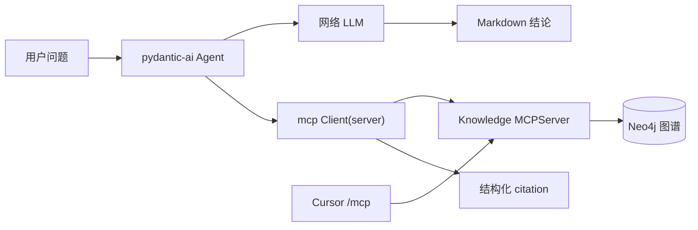
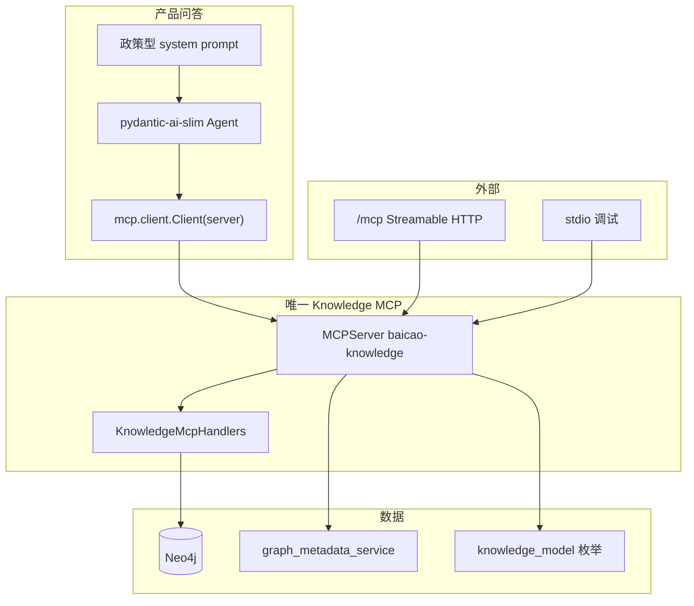
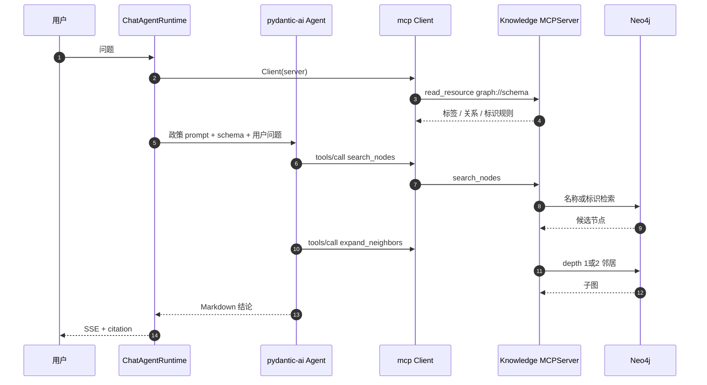
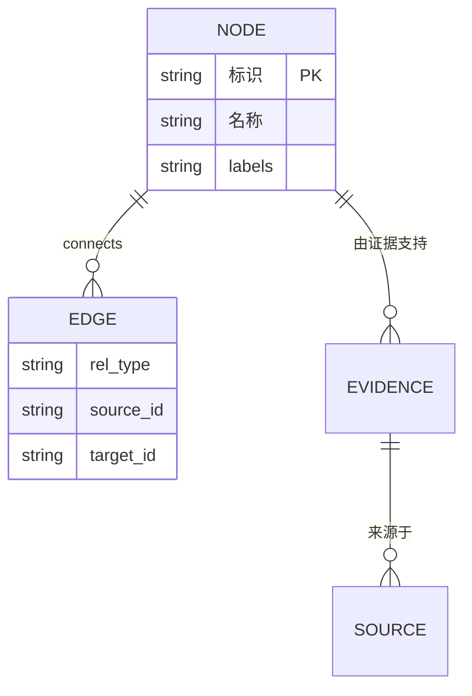

<!--
---
doc_kind: architecture
status: stable
tags: ["qa", "mcp", "agent", "knowledge-graph"]
summary: 问答与 Cursor 共用一套官方 mcp v2 知识 server；pydantic-ai 只做 agent loop
audience: developer
---
-->

# 问答 Agent 检索与 MCP 边界

## Overview

BaiCao 的产品问答 agent 不是通用研究助手，也不是本机 coding agent。它只负责一件事：用图里已经入库的知识回答问题，并带上可核验的出处。

因此检索面必须轻：模型走网络调用，知识走数据库（当前是 Neo4j 结构化工具）。本机文件、向量库、原始 Cypher、多 agent 编排都不进入这条主链。Web 搜索最多作为后续可选补强，不能替代图谱证据。

**产品 chat 必须是我们自己的 Knowledge MCP 的客户端。** 四个图 tool 和 `graph://schema` 只在这一套 server 上出现一次：问答、Cursor、stdio 调试都走它。pydantic-ai 只做 agent loop 和 SSE 流，不再另写一份 `graph_agent_tools`。

上一轮为了躲开 stdio 子进程、以及 `pydantic-ai-slim[mcp]` 与 `mcp>=1.29,<2` 的依赖冲突，把 chat 改成了进程内 Function Tool 直调 handler。那是权宜之计，不是产品边界。正确收口是：把官方 Python MCP SDK 升到 **v2 / 协议 `2026-07-28`**，chat 用同进程 `mcp.client.Client(server)` 连这台 server，不再绕开 MCP。

## Key Concepts

| 术语 | 含义 |
|------|------|
| 产品 agent | `/api/v1/chat/stream` 上的 Graph Specialist，面向终端用户问答 |
| 轻量检索 | 只暴露少量、有界、只读的图操作；模型自己决定何时调用 |
| Knowledge MCP | 官方 `mcp` v2 的 `MCPServer`：四个图 tool + `graph://schema` |
| 同进程客户端 | `mcp.client.Client(knowledge_mcp)`，DirectDispatcher，不走 HTTP、不拉子进程 |
| Streamable HTTP | 同一台 server 挂在 FastAPI `/mcp`，给 Cursor 等外部客户端 |
| MCP Tools | `search_nodes` / `search_edges` / `expand_neighbors` / `lookup_nodes` |
| MCP Resources | 应用控制的只读上下文：`graph://schema`。chat 开场 `read_resource`，不要旁路 `build_graph_schema()` 再塞进 prompt |

规范里 Tools / Resources / Prompts 的控制权划分以 [MCP server concepts](https://modelcontextprotocol.io/docs/2026-07-28/learn/server-concepts.md) 为准。轻量 agent 只用 Tools + Resources。

## Architecture

### 当前代码

产品 chat 用 `mcp.client.Client(knowledge_mcp)` 同进程调用官方 mcp v2 `MCPServer`。`/mcp` 与 stdio 是同一台 server 的外部入口。pydantic-ai 只做 loop；MCP tools 经 `mcp_agent_tools.tools_from_mcp_client` 暴露，不再复制 handler。

### 目标拓扑

一套 server，三条入口（同进程 Client、`/mcp`、stdio）。不要再为 chat 复制 tool 实现，也不要为 pydantic-ai 再装 FastMCP / `pydantic-ai-slim[mcp]`。

### 为什么不用 pydantic-ai MCP extra

`pydantic-ai` 的 `MCPToolset` / `MCP` capability 包的是 **FastMCP Client**（`pydantic-ai-slim[mcp]`）。文档示例仍 `from mcp.server.fastmcp import FastMCP`，而官方 SDK **v2 已删除该模块**，改名为 `MCPServer`。再装 extra 会引入第二套 MCP 客户端，和「升官方 mcp」打架。

同进程 `Client(server)` 是官方 v2 给「测试与单进程部署」的入口，正好覆盖产品 chat 与 FastAPI 同进程的事实。外部 Cursor 继续走 Streamable HTTP，不必让 chat 再 HTTP 打自己。

## How It Works

SSE 事件形状不变：`session` / `tool_start` / `tool_result` / `subgraph_patch` / `answer_chunk` / `final`。只保留一份 pydantic-ai → SSE 映射；LangGraph 那份删掉。

### 四个 tool 的推荐用法

| 工具 | 何时用 | 不要用来 |
|------|--------|----------|
| `search_nodes` | 问题里的实体还没变成节点标识 | 猜 Cypher；在已有 `标识` 时重复模糊搜 |
| `search_edges` | 已知关系类型、还没锁定锚点 | 代替邻居展开 |
| `expand_neighbors` | 已有锚点，要组方 / 功效 / 证据邻居 | 无界全图遍历 |
| `lookup_nodes` | 已有 `标识`，回看属性 | 当搜索用 |

不要再给 agent 加第五个图 tool。

## 检索工具评估

四个只读图 tool 的契约（structured dict、空结果 hint、depth 1..2、名称+标识检索、`graph://schema`）已经收口，本轮不要重做。缺口变成：**chat 没走 MCP、SDK 停在 1.x、旁边还有第二套 LangChain 包装。**

仍不做：别名 / 拼音检索。

## Prompt 评估

政策 + 失败协议留在 `build_graph_specialist_system_prompt()`。标签、关系、标识格式只来自 `graph://schema`（chat 经 MCP Resource 读取）。不要再旁路 `build_graph_schema()` 拼进 instructions。

## MCP 规范对齐

对照 [Understanding MCP servers (2026-07-28)](https://modelcontextprotocol.io/docs/2026-07-28/learn/server-concepts.md) 与官方 [v1 → v2 迁移指南](https://py.sdk.modelcontextprotocol.io/migration/)。

| 规范能力 | 谁控制 | 目标仓库 | 轻量问答是否需要 |
|----------|--------|----------|------------------|
| `tools/list` + `tools/call` | 模型 | 四个图 tool | 需要 |
| Streamable HTTP | 传输 | FastAPI `/mcp` | 外部客户端需要 |
| 同进程 `Client(server)` | 传输 | 产品 chat | 需要，避免子进程与自连 HTTP |
| stdio | 传输 | `python -m app.services.knowledge_mcp` | 只留给 Cursor / 本机调试 |
| HTTP+SSE | 传输 | 删除 `--transport sse` | Deprecated，不要 |
| Resources | 应用 | `graph://schema`；chat 经 Client 读 | 需要 |
| Prompts / subscriptions / Apps / Tasks | — | 不实现 | 不需要 |

依赖目标：`mcp>=2,<3`。机械改动以迁移指南为准：`FastMCP` → `MCPServer`，传输参数从构造器挪到 `streamable_http_app()` / `run()`，测试用 `Client(server)` 替代已删除的 `create_connected_server_and_client_session`。

## Agent Runtime SDK

| 选项 | 结论 |
|------|------|
| pydantic-ai 进程内 Function Tool 复制 MCP 面 | 上一轮权宜之计，删 |
| `pydantic-ai-slim[mcp]` / FastMCP Client | 第二套 MCP 栈，且与官方 v2 模块路径冲突，不要 |
| pydantic-ai Harness | 过重，不要 |
| **官方 mcp v2 `MCPServer` + `Client(server)` + pydantic-ai-slim[openai] loop** | 推荐。一套协议，两种入口（同进程 / HTTP） |

pydantic-ai 只替代 agent loop 与流式事件。MCP 客户端用官方 SDK，不要再包一层 FastMCP。

## 轻量边界

只做：

- 网络 LLM（OpenAI 兼容 provider）
- 官方 mcp v2 知识 server（四个只读图 tool + `graph://schema`）
- 产品 chat：同进程 MCP 客户端
- `/mcp` 与 stdio：同一台 server 的外部入口
- agent loop：`pydantic-ai-slim[openai]`，不要 Harness、不要 pydantic-ai MCP extra

明确不做：

- 原始 Cypher 给模型；顺手删掉仅给 LangChain 用的 `read_cypher` handler
- 本机文件 / 向量 RAG / 第二套知识库
- LangGraph / LangChain `graph_tools` 回流 chat
- 把已删除的 `packages/graph_runtime` 接回 chat
- MCP Prompts、Apps、Tasks、subscriptions
- pydantic-ai Harness、WebSearch、第二套 FastMCP 客户端
- 为「更聪明」继续堆 tool
- chat 再拉 stdio 子进程，或 HTTP 打本机 `/mcp`

pipeline 抽取仍可用 LangChain Chat 模型；那不是问答检索面。不要把 pipeline 用的 `langchain` / `langchain-openai` 从仓库卸掉。问答侧不要再装 `langgraph` 或 `langchain-neo4j`。

## Data Model

Agent 看见的节点必须能回到图主键。

`标识` 是 `expand_neighbors` / `lookup_nodes` 的输入。`名称` 只用于 `search_nodes`。活图默认不写入 `来源于` 与原文片段；citation 优先用已查询子图的「由证据支持」，出处回落到节点 `导入源`。若图上仍有「来源于」边则继续用。见 `chat_agent_runtime/citations.py`。

## Configuration

| 项 | 当前事实 |
|----|----------|
| Agent loop | `pydantic-ai-slim[openai]` |
| MCP 依赖 | `mcp>=2,<3` |
| Chat 客户端 | `mcp.client.Client(knowledge_mcp)` 同进程 |
| HTTP 挂载 | FastAPI `/mcp` → 同一 `MCPServer.streamable_http_app()` |
| 独立进程 | `python -m app.services.knowledge_mcp --transport stdio` 或 `streamable-http` |
| System prompt | `chat_agent_runtime/system_prompt.py`（政策） |
| Schema | MCP Resource `graph://schema` |

## Troubleshooting

| 现象 | 更可能的原因 |
|------|----------------|
| 模型说图里没有，Workbench 里有 | `search_nodes` 只匹配名称/标识，或 limit 截断 |
| 有实体、没有出处 | 未把 `expand_neighbors` 的 depth 设为 2 |
| 展开失败 | 传入的是名称不是 `标识` |
| `ModuleNotFoundError: mcp.server.fastmcp` | 仍按 v1 导入；应 `mcp.server.mcpserver.MCPServer` |
| chat 又拉起 knowledge_mcp 子进程 | 错误地用了 stdio 客户端；应 `Client(server)` |
| 装了 `pydantic-ai-slim[mcp]` 后解析失败 | extra 与官方 mcp v2 冲突；不要装 |

## 相关文档

- [system-overview.md](system-overview.md#61-问答链路) — 问答 SSE 主链
- [knowledge-model-and-ingestion.md](knowledge-model-and-ingestion.md#51-graph-runtime--agent-运行边界) — runtime 边界与中文图模型
- [graph-workbench.md](graph-workbench.md) — 人看的 metadata / 展开；agent 应复用同一份图事实
- [../acceptance/chat-mainline.md](../acceptance/chat-mainline.md) — 问答验收
