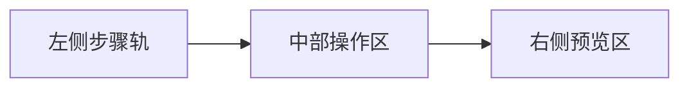
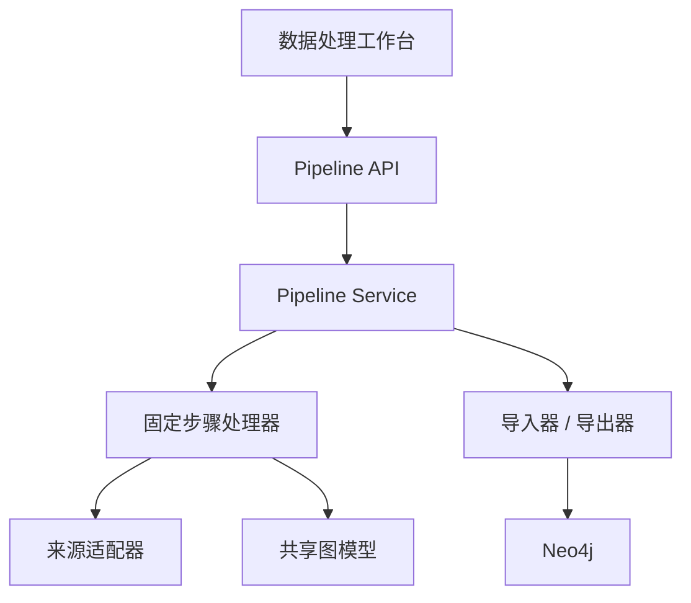

<!--
---
doc_kind: architecture
status: stable
tags: ["data-ingestion", "pipeline", "workbench", "knowledge-graph"]
summary: 固定步骤、可预览、可人工放行的数据处理工作台架构
audience: developer
---
-->

# 数据处理工作台架构

## 1. 目标

本项目需要面对多种来源与多种结构形态的数据，包括：

- Hugging Face 数据集
- CSV / JSONL
- 网页文本
- PDF / Office 文档
- 人工整理表与半结构化记录

这些数据的来源适配方式可以不同，但处理主流程不应各做一套。  
因此，本项目确认一条统一稳定口径：

- 面向多来源数据的处理主线采用**固定的通用步骤模板**
- 每一步都必须支持**结果预览**
- 只有在人工确认后，任务才能进入下一步
- 整个处理过程必须作为**可保存、可恢复的处理任务**持久化

## 2. 核心原则

### 2.1 固定步骤模板

不同来源可以有不同适配器，但所有数据都通过同一条主流程推进：

1. 接入来源
2. 原始内容预览
3. 规范化清洗
4. 结构抽取
5. 映射到共享图模型
6. 人工确认与修订
7. 导出 / 入库

### 2.2 预览优先，确认放行

系统默认不会在关键步骤间自动推进。

每个步骤至少有两类动作：

- `运行预览`
- `确认进入下一步`

允许：

- 重新运行当前步骤
- 回退到前一步重新处理
- 暂停任务并在之后恢复

### 2.3 图模型唯一真源不在工作台内定义

数据处理工作台不定义自己的图结构。  
它只负责把外部来源转成候选结果，并在第 5 步统一映射到仓库级共享图模型真源。

关于图模型唯一真源的稳定口径，见：

- [knowledge-model-and-ingestion.md](knowledge-model-and-ingestion.md)

## 3. 页面形态

推荐前端入口：

```text
/data/pipeline
```

推荐页面名称：

- 数据处理工作台

推荐布局：



### 3.1 左侧步骤轨

展示固定步骤模板和每一步状态：

- 未开始
- 运行中
- 已生成预览
- 待确认
- 已确认
- 已完成
- 已失败

### 3.2 中部操作区

负责当前步骤的说明、参数和操作：

- 展示当前步骤目标
- 编辑当前步骤参数
- 触发预览运行
- 确认进入下一步
- 重跑当前步骤
- 退回上一步

### 3.3 右侧预览区

根据当前步骤展示不同预览形式：

- 文本预览
- 表格预览
- 候选实体预览
- 候选关系预览
- 图模型映射预览
- 差异预览
- 错误与警告列表

## 4. 处理任务模型

数据处理工作台围绕一个持久化对象运转，推荐主对象名称：

- 中文：处理任务
- 英文技术名：`PipelineRun`

一个处理任务至少包含：

- 任务标识
- 来源类型
- 来源定位
- 当前步骤
- 整体状态
- 步骤执行记录
- 预览快照
- 人工确认记录
- 最终导出结果

## 5. 状态模型

### 5.1 任务整体状态

- 待开始
- 处理中
- 待人工确认
- 已完成
- 已失败
- 已归档

### 5.2 单步骤状态

- 未开始
- 运行中
- 已生成预览
- 待确认
- 已确认
- 已跳过
- 已失败

关键区别：

- `已生成预览` 表示系统已经得到结果，但未放行
- `待确认` 表示该步骤必须人工确认
- `已确认` 表示该步结果已被接受并允许继续

## 6. 后端处理架构

推荐把数据处理能力抽象成独立的 `pipeline` 模块，而不是把逻辑写进页面专用接口。



### 6.1 建议模块分层

- `处理任务层`
  - 管理任务生命周期
  - 恢复任务
  - 推进步骤
  - 记录人工确认

- `步骤执行层`
  - 负责 7 个固定步骤的统一协议

- `来源适配层`
  - 负责不同来源的数据获取与来源侧定制化处理

- `共享图模型映射层`
  - 负责把抽取结果映射到唯一真源

## 7. 固定步骤职责

### 步骤 1：接入来源

- 创建任务
- 记录来源配置
- 拉取或读取原始数据

### 步骤 2：原始内容预览

- 对原始内容做切片、分页、采样
- 不做结构变换

### 步骤 3：规范化清洗

- 文本清洗
- 结构对齐
- chunk 划分
- 标准化中间原始片段

### 步骤 4：结构抽取

- 规则抽取
- agent 抽取
- 输出候选实体、候选关系、候选来源片段

### 步骤 5：映射到共享图模型

- 把候选结果转换成统一图模型结构
- 严格校验共享真源约束

### 步骤 6：人工确认与修订

- 接受、删除、修改、补充候选结果
- 形成最终放行版本

### 步骤 7：导出 / 入库

- 导出标准中间文件
- 或写入正式图谱
- 记录统计结果

## 8. 持久化策略

推荐存储职责如下：

- PostgreSQL
  - 保存处理任务
  - 步骤状态
  - 人工确认记录
  - 预览元数据与产物引用

- 文件系统或对象存储样式目录
  - 保存较大的中间产物
  - 保存预览快照
  - 保存差异结果与原始切片

- Neo4j
  - 仅接收最终确认后的正式图谱结果

补充约束：

- 第 1 到第 6 步的结果都是处理中结果
- 只有第 7 步放行后，数据才进入正式图谱

## 9. API 设计原则

推荐 API 采用“任务驱动”而不是“一次性导入驱动”。

建议接口家族：

- `POST /api/v1/pipeline/runs`
- `GET /api/v1/pipeline/runs`
- `GET /api/v1/pipeline/runs/{id}`
- `POST /api/v1/pipeline/runs/{id}/steps/{step}/preview`
- `GET /api/v1/pipeline/runs/{id}/steps/{step}/preview`
- `POST /api/v1/pipeline/runs/{id}/steps/{step}/confirm`
- `POST /api/v1/pipeline/runs/{id}/steps/{step}/rerun`
- `POST /api/v1/pipeline/runs/{id}/steps/{step}/rollback`

每个步骤的统一返回建议包含：

- `step_status`
- `summary`
- `preview_kind`
- `preview_payload`
- `warnings`
- `errors`
- `artifacts`
- `next_step_ready`

## 10. 与现有仓库的结合方式

### 10.1 前端

推荐新增页面与组件：

- `packages/web/src/pages/DataPipelinePage.tsx`
- `packages/web/src/components/pipeline/*`
- `packages/web/src/hooks/usePipelineRun.ts`
- `packages/web/src/services/pipelineApi.ts`
- `packages/web/src/stores/pipelineStore.ts`
- `packages/web/src/types/pipeline.ts`

### 10.2 后端

推荐新增模块：

- `packages/api/app/api/pipeline.py`
- `packages/api/app/pipeline/*`

### 10.3 与现有导入器关系

导入器不废弃，但职责下沉：

- `pipeline` 负责过程化处理
- `importers` / `exporters` 负责正式图谱记录的输入输出
- `knowledge_model` 负责唯一结构真源

## 11. 当前事实与目标形态

当前仓库内已经具备“固定步骤、可预览、人工放行、可恢复”的统一数据处理任务系统：

- 已有独立的 `/data/pipeline` 页面与导航入口
- 已有 7 个固定步骤模板与步骤状态持久化
- 已有每一步 preview / confirm / rerun / rollback 主链路
- 已接入共享图模型映射门禁
- 已在后续 wave 中扩展到 review 持久化、显式 export execute、JSONL snapshot 与 Neo4j 写入

当前仍在后续扩展中的部分是：

- 真实 HuggingFace 远端抓取
- 批量文件导入在工作台中的正式执行链路
- 更完整的页面回归证据与更细粒度交互能力

## 12. 相关文档

- [knowledge-model-and-ingestion.md](knowledge-model-and-ingestion.md)
- [data-model.md](data-model.md)
