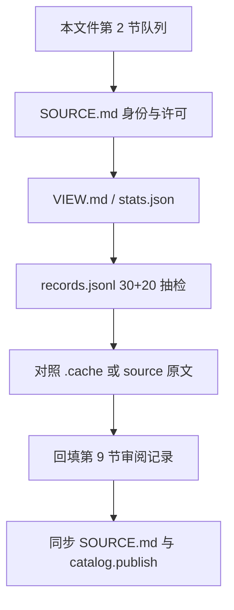

# BaiCao 数据源与质量校验清单

截至 2026-08-20，catalog 里有 **30 个正式登记源**。本文是人工质量审核入口，不替代产量真源。

| 真源 | 路径 |
|---|---|
| 登记状态、产量、`publish` | [`datasets/baicao-knowledge/catalog.json`](../../datasets/baicao-knowledge/catalog.json) |
| 每源身份与边界 | [`datasets/baicao-knowledge/sources/<source_id>/SOURCE.md`](../../datasets/baicao-knowledge/sources/) |
| 每源展示数字 | 同目录 [`VIEW.md`](../../datasets/baicao-knowledge/sources/)（由脚本生成，勿手改） |
| 图模型 | [`packages/knowledge_model/`](../../packages/knowledge_model/) |
| 身份门禁 | [`packages/data_ingestion/data_ingestion/entity_identity.py`](../../packages/data_ingestion/data_ingestion/entity_identity.py) |
| 数据集发布口径 | [`knowledge-dataset.md`](knowledge-dataset.md) |

`.cache/`、`sources/*/processed/`、`sources/*/work/`、`sources/*/source/` **不进 Git**。这些链接只在本地工作区可跳。

## 目录

1. [你要审核什么](#review-what)
2. [本轮审核队列](#review-queue)
3. [怎么打开一个源](#how-to-open)
4. [已登记源路径](#registered-sources)
5. [纳入决策](#inclusion)
6. [TCMChat 子集与已关闭候选](#tcmchat-subsets)
7. [不独立登记 / 未持有](#not-registered)
8. [校验方法](#methods)
9. [审阅记录](#review-log)

<a id="review-what"></a>

## 1. 你要审核什么

你不是在核对 `catalog.json` 里的条数。每个源要给出四项结论：**许可**、**结构**、**语义**、**是否允许 public**。抽检只用来发现明显问题，不代表统计学质量保证。

### 1.1 打开一个源时看这 6 样

| 顺序 | 看什么 | 进 Git？ | 你要回答的问题 |
|---|---|---|---|
| 1 | `SOURCE.md` | 是 | 身份、上游 URL/commit、许可、消费边界是否写清楚 |
| 2 | `VIEW.md` + `processed/latest/stats.json` | VIEW 是；stats 仅本地 | 产量、类型分布是否和 SOURCE / catalog 一致 |
| 3 | `processed/latest/records.jsonl` 随机 30 条 | 仅本地 | 节点类型、属性、证据字段是否像样 |
| 4 | 针对已知风险再抽 20 条 | 仅本地 | 见各源「本源要审」；不要只抽开心路径 |
| 5 | 原文（`.cache/` 或 `source/`）对照若干条 | 仅本地 | 记录能否回到原文件/表行/章节 |
| 6 | 适配器 `.py` | 是 | 映射和隔离规则是否与 SOURCE 声明一致 |

硬门禁（任一失败则 `reject` 或保持 `publish: false`）：

- 身份能追溯到上游 URL、版本或 commit
- `unverified` / `unlicensed` 不得公开发布
- 原文、PII、医案隐私、品牌/国药准字不进 public
- 共现、模型问答、说明书跨度不得伪装成已验证临床事实

### 1.2 三列必须分开看

| 列 | 含义 | 本轮你要动的 |
|---|---|---|
| 纳入登记 | 是否在 catalog / 本清单跟踪 | 一般不动；30 个源已登记 |
| 纳入图谱 | 实体/关系能否进本地 Neo4j | 抽检语义后确认或降级 |
| 纳入 public 层 | 能否进 `data/public/`（同一 private HF 仓） | 只有许可 + 脱敏都过才改 `publish: true` / `release_tier=public` |

`public` 不是质量结论。公开面只发脱敏结构化结果。当前 public 只有 `BC-01` 与 `BC-02`，共 `5,118 records / 11,202 edges`。

2026-08-20 已按**数据质量**把可用清洗结果写入本地 Neo4j（许可 / public 仍后置）。wangekxy 剩余 9 个专题公开 sample 入图后全图约 **132,117 节点 / 630,601 边**。原先因许可隔离的已持有源（NER、古典医籍、TCM-SD 病历、TCMChat 剩余结构化文件、方书样本）以及本草/医案/针灸等专题 sample 已按非商用本地入图。版权过滤后置。`BC-18` 有 3,267 条悬空边。

### 1.3 状态口径

| 字段 | 允许值 | 含义 |
|---|---|---|
| 持有状态 | `published` / `imported` / `cleaned_local` / `staged_local` / `not_held` | 当前实际处理位置 |
| 结构质量 | `pass` / `partial` / `pending` | 能否稳定解析、是否有坏端点、缺失或重复 |
| 语义质量 | `pass` / `conditional` / `pending` / `blocked` | 实体、关系和属性是否符合中医药语义 |
| 许可状态 | `confirmed` / `restricted` / `unverified` / `unlicensed` | 能否复制、派生和公开发布 |
| 审阅结论 | `accept` / `conditional` / `reject` / `pending` | 人工质量校验的最终决定 |

### 1.4 审核时必须遵守

- 上游**未明确禁止**复制、派生或本地入图时，允许纳入白草数据源。
- 明确禁止的例子：Dataset Card 写 `proprietary-commercial`、条款写禁止再发布或仅限竞赛提交。
- Apache-2.0、CC-BY（无 NC）等明示许可，优先使用。
- 必须过滤：患者姓名/姓氏+年龄+身份、电话、身份证、住院号；药品商品名、企业品牌、国药准字。
- 文献作者名、历史医家名保留为来源，不按个人隐私删除。
- 合并只允许：同一节点类型 + 规范名一致 + 稳定 ID 一致，且非空属性无冲突。禁止用别名、拼音、编辑距离或 LLM 自动合并。

<a id="review-queue"></a>

## 2. 本轮审核队列

按这个顺序审。P3 与已跳过项不要重新排队，除非后面要当原文证据或抽取器。

| 优先级 | 源 | 你要判定的问题 | 先打开 |
|---|---|---|---|
| P0 | [`BC-01`](#bc-01) [`BC-02`](#bc-02) | 已公开。语义正确率、许可说明、脱敏是否真的不含原文 | 各自 `SOURCE.md` → `records.jsonl` |
| P0 | [`BC-03`](#bc-03) [`BC-04`](#bc-04) | 本地大图。是否值得继续争取授权，还是永远只留本地 | `SOURCE.md` + 已知隔离样本 |
| P1 | [`BC-05`](#bc-05) [`BC-06`](#bc-06) [`BC-07`](#bc-07) | 结构化映射、跨类型同名、被隔离边是否该保持隔离 | `SOURCE.md` + `stats.json` |
| P1 | [`BC-15`](#bc-15) | 痞气两条不合并；成方 TXT 1869 已解析，前言 2620 缺 751 不在文件里 | [`national-standard-terms/SOURCE.md`](../../datasets/baicao-knowledge/sources/national-standard-terms/SOURCE.md) |
| P1 | [`BC-16`](#bc-16) [`BC-17`](#bc-17) [`BC-18`](#bc-18) | 去标识是否干净；提及/SFT 边有没有被当成事实 | 分源 `SOURCE.md` + `records.jsonl` |
| P2 | [`BC-08`](#bc-08) | 148 个证候术语；残留病历标识是否还出现在下游 | [`tcm-sd/SOURCE.md`](../../datasets/baicao-knowledge/sources/tcm-sd/SOURCE.md) |
| P2 | [`BC-19`](#bc-19) [`BC-20`](#bc-20) | daiy 病名行、ChatMed 提及是否保持「不当事实」 | 分源 `SOURCE.md` |
| P2 | [`BC-21`](#bc-21)～[`BC-30`](#bc-30) | wangekxy 公开 sample 词表提及是否误当已验证事实；未购买全量是否被混入 | 分源 `SOURCE.md` + `work/notes/suitability.md` |
| P3 | [`BC-09`](#bc-09)～[`BC-14`](#bc-14) | 已审计。只在需要原文证据或抽取器时再单独立项 | 对应 `SOURCE.md` / `work/notes/skip.md` |
| — | TCMChat 剩余 SFT / 百科全文 | 已审计跳过，不独立登记 | [§6](#tcmchat-subsets) |



<a id="how-to-open"></a>

## 3. 怎么打开一个源

每个已登记源的工作目录都是：

```text
datasets/baicao-knowledge/sources/<source_id>/
  SOURCE.md              # 身份，进 Git
  VIEW.md                # 展示口径，进 Git
  source/                # 原文（仅苏子阳等少数源；gitignore）
  work/                  # 队列与抽取中间态（gitignore）
  processed/latest/      # 可导入快照（gitignore）
    records.jsonl
    stats.json
```

原始语料按平台放在 [`.cache/`](../../.cache/README.md)：`huggingface/`、`github/`、`dropbox/`。[`tmp/qibo-datasets/`](../../tmp/qibo-datasets/README.md) 只留指针。

从本文件点链接即可。`source_id` 是 catalog 主键；`BC-xx` 只是本清单编号。

<a id="registered-sources"></a>

## 4. 已登记源路径

速览（点名称进 `SOURCE.md`）：

| ID | 数据源 | `source_id` | 状态 | 审阅 | 图谱 | public |
|---|---|---|---|---|---|---|
| BC-01 | [2022 年中药药典](../../datasets/baicao-knowledge/sources/national-standard-2022-pharmacopoeia/SOURCE.md) | `national-standard-2022-pharmacopoeia` | `imported` | `pending` | 是 | 脱敏结构 |
| BC-02 | [道医苏子阳](../../datasets/baicao-knowledge/sources/daoyi-suyang/SOURCE.md) | `daoyi-suyang` | `imported` | `pending` | 是 | 脱敏结构 |
| BC-03 | [Knowlegde_Graph_TCM](../../datasets/baicao-knowledge/sources/fengxi177-knowledge-graph-tcm/SOURCE.md) | `fengxi177-knowledge-graph-tcm` | `imported` | `blocked` | 仅本地 | 否 |
| BC-04 | [ShenNong TCM-KG](../../datasets/baicao-knowledge/sources/shennong-tcm-kg/SOURCE.md) | `shennong-tcm-kg` | `imported` | `blocked` | 仅本地，排除化学边 | 否 |
| BC-05 | [tcm-db](../../datasets/baicao-knowledge/sources/tcm-db/SOURCE.md) | `tcm-db` | `imported` | `blocked` | 仅本地 | 否 |
| BC-06 | [DragonTCM](../../datasets/baicao-knowledge/sources/dragontcm/SOURCE.md) | `dragontcm` | `imported` | `blocked` | 仅本地，限 SNOMED disorder | 否 |
| BC-07 | [TCM-MKG V1.0](../../datasets/baicao-knowledge/sources/tcm-mkg/SOURCE.md) | `tcm-mkg` | `imported` | `blocked` | 仅本地主域子图 | 否 |
| BC-08 | [TCM-SD / ZY-BERT](../../datasets/baicao-knowledge/sources/tcm-sd/SOURCE.md) | `tcm-sd` | `imported` | `blocked` | 证候术语已入；原文不去标识当评测 | 否 |
| BC-09 | [TCM-NER / DeepNER](../../datasets/baicao-knowledge/sources/tcm-ner/SOURCE.md) | `tcm-ner` | `imported` | `blocked` | 说明书跨度已入本地图 | 否 |
| BC-10 | [TCM-Ancient-Books](../../datasets/baicao-knowledge/sources/tcm-ancient-books/SOURCE.md) | `tcm-ancient-books` | `imported` | `blocked` | 正文词表提及已入本地图 | 否 |
| BC-11 | [classical-tcm-canon](../../datasets/baicao-knowledge/sources/classical-tcm-canon/SOURCE.md) | `classical-tcm-canon` | `imported` | `blocked` | 115 部来源+提及已入本地图 | 否 |
| BC-12 | [SylvanL TCM Pretrain](../../datasets/baicao-knowledge/sources/sylvanl-tcm-pretrain/SOURCE.md) | `sylvanl-tcm-pretrain` | `imported` | `blocked` | 可分源词条已入；不整包入图 | 否 |
| BC-13 | [ZY-BERT 预训练语料](../../datasets/baicao-knowledge/sources/zybert-pretrain-corpus/SOURCE.md) | `zybert-pretrain-corpus` | `imported` | `blocked` | 方剂索引 + 非索引词表提及 | 否 |
| BC-14 | [TCMChat-dataset-600k](../../datasets/baicao-knowledge/sources/tcmchat-600k/SOURCE.md) | `tcmchat-600k` | `imported` | `conditional` | 剩余结构化文件已入本地图 | 否 |
| BC-15 | [国标临床术语与成方](../../datasets/baicao-knowledge/sources/national-standard-terms/SOURCE.md) | `national-standard-terms` | `imported` | `conditional` | 仅本地术语/成方节点 | 否 |
| BC-16 | [TCMChat 名医验案](../../datasets/baicao-knowledge/sources/tcmchat-medical-cases/SOURCE.md) | `tcmchat-medical-cases` | `imported` | `conditional` | 仅本地 | 否 |
| BC-17 | [TCMChat 教材](../../datasets/baicao-knowledge/sources/tcmchat-textbooks/SOURCE.md) | `tcmchat-textbooks` | `imported` | `conditional` | 仅本地 | 否 |
| BC-18 | [TCMChat SFT knowledge](../../datasets/baicao-knowledge/sources/tcmchat-sft-knowledge/SOURCE.md) | `tcmchat-sft-knowledge` | `imported` | `conditional` | 仅本地候选；不当事实 | 否 |
| BC-19 | [TCMChat web](../../datasets/baicao-knowledge/sources/tcmchat-web/SOURCE.md) | `tcmchat-web` | `imported` | `conditional` | 仅 daiy 病名 | 否 |
| BC-20 | [TCMChat ChatMed](../../datasets/baicao-knowledge/sources/tcmchat-chatmed/SOURCE.md) | `tcmchat-chatmed` | `imported` | `conditional` | 仅对话提及；不当事实 | 否 |
| BC-21 | [中医方书样本](../../datasets/baicao-knowledge/sources/tcm-formulary/SOURCE.md) | `tcm-formulary` | `imported` | `blocked` | 3 部公开样本已入本地图 | 否 |
| BC-22 | [中医本草样本](../../datasets/baicao-knowledge/sources/tcm-materia-medica/SOURCE.md) | `tcm-materia-medica` | `imported` | `blocked` | 3 部公开样本；词表提及 | 否 |
| BC-23 | [中医医案古籍样本](../../datasets/baicao-knowledge/sources/tcm-case-records/SOURCE.md) | `tcm-case-records` | `imported` | `blocked` | 3 部公开样本；不建整书医案节点 | 否 |
| BC-24 | [针灸古籍样本](../../datasets/baicao-knowledge/sources/tcm-acupuncture-classics/SOURCE.md) | `tcm-acupuncture-classics` | `imported` | `blocked` | 3 部公开样本；词表提及 | 否 |
| BC-25 | [中医诊法样本](../../datasets/baicao-knowledge/sources/tcm-diagnostics/SOURCE.md) | `tcm-diagnostics` | `imported` | `blocked` | 3 部公开样本；不发明脉象/舌象节点 | 否 |
| BC-26 | [中医妇幼样本](../../datasets/baicao-knowledge/sources/tcm-gynecology-pediatrics/SOURCE.md) | `tcm-gynecology-pediatrics` | `imported` | `blocked` | 3 部公开样本；词表提及 | 否 |
| BC-27 | [中医外科样本](../../datasets/baicao-knowledge/sources/tcm-external-surgical/SOURCE.md) | `tcm-external-surgical` | `imported` | `blocked` | 3 部公开样本；词表提及 | 否 |
| BC-28 | [中医医论样本](../../datasets/baicao-knowledge/sources/tcm-collected-works/SOURCE.md) | `tcm-collected-works` | `imported` | `blocked` | 3 部公开样本；医论不当事实 | 否 |
| BC-29 | [中医养生样本](../../datasets/baicao-knowledge/sources/tcm-health-cultivation/SOURCE.md) | `tcm-health-cultivation` | `imported` | `blocked` | 3 部公开样本；不发明导引类型 | 否 |
| BC-30 | [医部类书样本](../../datasets/baicao-knowledge/sources/tcm-reference-compendia/SOURCE.md) | `tcm-reference-compendia` | `imported` | `blocked` | 3 卷切片；词表提及 | 否 |

<a id="bc-01"></a>

### BC-01 2022 年中药药典 — `pending`

605 条目；3,431 条抽取记录。`imported` · `publish: true`。原始载体是 TCMChat-600k；公开面只含脱敏结构，上游再发布条款仍需独立复核。

- 工作目录：[sources/national-standard-2022-pharmacopoeia/](../../datasets/baicao-knowledge/sources/national-standard-2022-pharmacopoeia/)
- 身份：[SOURCE.md](../../datasets/baicao-knowledge/sources/national-standard-2022-pharmacopoeia/SOURCE.md) · 展示：[VIEW.md](../../datasets/baicao-knowledge/sources/national-standard-2022-pharmacopoeia/VIEW.md)
- 快照：[stats.json](../../datasets/baicao-knowledge/sources/national-standard-2022-pharmacopoeia/processed/latest/stats.json) · [records.jsonl](../../datasets/baicao-knowledge/sources/national-standard-2022-pharmacopoeia/processed/latest/records.jsonl)
- 原文：[`.cache/.../2022年中药药典.txt`](../../.cache/huggingface/ZJUFanLab/TCMChat-dataset-600k/pretrain/train/books/national_standard/2022年中药药典.txt)
- 适配器：[national_standard_2022_pharmacopoeia/](../../packages/data_ingestion/data_ingestion/processors/huggingface/zjufanlab_tcmchat_dataset_600k/national_standard_2022_pharmacopoeia/)

**本源要审：** 上游具体再发布条款；605 条目 LLM 语义抽样；4 个近重复合并是否合理；public Parquet 是否仍含原文。

<a id="bc-02"></a>

### BC-02 道医苏子阳 — `pending`

389 章叙事医案；1,687 条抽取记录。`imported` · `publish: true`。原文未获转载授权，公开面不含全文。

- 工作目录：[sources/daoyi-suyang/](../../datasets/baicao-knowledge/sources/daoyi-suyang/)
- 身份：[SOURCE.md](../../datasets/baicao-knowledge/sources/daoyi-suyang/SOURCE.md) · 展示：[VIEW.md](../../datasets/baicao-knowledge/sources/daoyi-suyang/VIEW.md)
- 快照：[stats.json](../../datasets/baicao-knowledge/sources/daoyi-suyang/processed/latest/stats.json) · [records.jsonl](../../datasets/baicao-knowledge/sources/daoyi-suyang/processed/latest/records.jsonl)
- 原文：[source/道医苏子阳.md](../../datasets/baicao-knowledge/sources/daoyi-suyang/source/道医苏子阳.md) · [source/chapters/](../../datasets/baicao-knowledge/sources/daoyi-suyang/source/chapters/)
- 抽取契约：[EXTRACT_SUYANG.md](../../packages/data_ingestion/data_ingestion/EXTRACT_SUYANG.md)

**本源要审：** 叙事抽取、同名实体、诊疗语义；262 章 skip 是否合理；public 不含原文。

<a id="bc-03"></a>

### BC-03 Knowlegde_Graph_TCM — `blocked`

19,923 条原始关系；4,996 records / 11,445 edges。上游无 LICENSE，禁止公开逐条派生。

- 工作目录：[sources/fengxi177-knowledge-graph-tcm/](../../datasets/baicao-knowledge/sources/fengxi177-knowledge-graph-tcm/)
- 身份：[SOURCE.md](../../datasets/baicao-knowledge/sources/fengxi177-knowledge-graph-tcm/SOURCE.md) · 展示：[VIEW.md](../../datasets/baicao-knowledge/sources/fengxi177-knowledge-graph-tcm/VIEW.md)
- 快照：[stats.json](../../datasets/baicao-knowledge/sources/fengxi177-knowledge-graph-tcm/processed/latest/stats.json) · [records.jsonl](../../datasets/baicao-knowledge/sources/fengxi177-knowledge-graph-tcm/processed/latest/records.jsonl)
- 原文：[`.cache/github/fengxi177/Knowlegde_Graph_TCM/`](../../.cache/github/fengxi177/Knowlegde_Graph_TCM/)
- 适配器：[qibo_tcm_kg.py](../../packages/data_ingestion/data_ingestion/qibo_tcm_kg.py)

**本源要审：** 737 条组成无剂量；疑似截断词、剂量混入药名、一对多别名。许可不闭合则保持 `blocked`。

<a id="bc-04"></a>

### BC-04 ShenNong TCM-KG — `blocked`

123,358 条原始三元组；19,066 records / 52,247 edges。两仓库无许可证且限定学术研究。

- 工作目录：[sources/shennong-tcm-kg/](../../datasets/baicao-knowledge/sources/shennong-tcm-kg/)
- 身份：[SOURCE.md](../../datasets/baicao-knowledge/sources/shennong-tcm-kg/SOURCE.md) · 展示：[VIEW.md](../../datasets/baicao-knowledge/sources/shennong-tcm-kg/VIEW.md)
- 快照：[stats.json](../../datasets/baicao-knowledge/sources/shennong-tcm-kg/processed/latest/stats.json) · [records.jsonl](../../datasets/baicao-knowledge/sources/shennong-tcm-kg/processed/latest/records.jsonl)
- 原文：[TCM-KG_triples.txt](../../.cache/github/michael-wzhu/ShenNong-TCM-LLM/src/TCM-KG_triples.txt)
- 适配器：[shennong_tcm_kg.py](../../packages/data_ingestion/data_ingestion/shennong_tcm_kg.py)

**本源要审：** 化学边 67,481 排除是否干净；`TS_MS` 245 条、功能冲突 337 条；3,278 个来源标注证候与 12,687 个未分类临床概念。

<a id="bc-05"></a>

### BC-05 tcm-db — `blocked`

1,746 个主域实体行；1,715 records / 654 edges。混合上游权利链未闭合。

- 工作目录：[sources/tcm-db/](../../datasets/baicao-knowledge/sources/tcm-db/)
- 身份：[SOURCE.md](../../datasets/baicao-knowledge/sources/tcm-db/SOURCE.md) · 展示：[VIEW.md](../../datasets/baicao-knowledge/sources/tcm-db/VIEW.md)
- 快照：[stats.json](../../datasets/baicao-knowledge/sources/tcm-db/processed/latest/stats.json) · [records.jsonl](../../datasets/baicao-knowledge/sources/tcm-db/processed/latest/records.jsonl)
- 原文：[tcm_knowledge.db](../../.cache/github/xiaogege6697/tcm-db/tcm_knowledge.db)
- 适配器：[tcm_db.py](../../packages/data_ingestion/data_ingestion/tcm_db.py)

**本源要审：** 29 个异常方剂、2 条冲突白芷、1 条同名跨类型边；症状/证候是否保持独立。

<a id="bc-06"></a>

### BC-06 DragonTCM — `blocked`

4,743 个实体行；11,598 records / 46,666 edges。`CC-BY-NC-4.0`，书籍/SNOMED 条款未闭合。

- 工作目录：[sources/dragontcm/](../../datasets/baicao-knowledge/sources/dragontcm/)
- 身份：[SOURCE.md](../../datasets/baicao-knowledge/sources/dragontcm/SOURCE.md) · 展示：[VIEW.md](../../datasets/baicao-knowledge/sources/dragontcm/VIEW.md)
- 快照：[stats.json](../../datasets/baicao-knowledge/sources/dragontcm/processed/latest/stats.json) · [records.jsonl](../../datasets/baicao-knowledge/sources/dragontcm/processed/latest/records.jsonl)
- 原文：[`.cache/huggingface/f-galkin/DragonTCM/`](../../.cache/huggingface/f-galkin/DragonTCM/)
- 适配器：[dragontcm.py](../../packages/data_ingestion/data_ingestion/dragontcm.py)

**本源要审：** 仅 803 个 disorder 映射病证；316 个非 disorder 与 11,930 条不安全关系隔离；中英文 alias 不自动合并。

<a id="bc-07"></a>

### BC-07 TCM-MKG V1.0 — `blocked`

D1-D7/D18 共 213,655 行；19,519 records / 177,672 edges。Zenodo NC + WHO NC-SA/ND，不兼容 public。

- 工作目录：[sources/tcm-mkg/](../../datasets/baicao-knowledge/sources/tcm-mkg/)
- 身份：[SOURCE.md](../../datasets/baicao-knowledge/sources/tcm-mkg/SOURCE.md) · 展示：[VIEW.md](../../datasets/baicao-knowledge/sources/tcm-mkg/VIEW.md)
- 快照：[stats.json](../../datasets/baicao-knowledge/sources/tcm-mkg/processed/latest/stats.json) · [records.jsonl](../../datasets/baicao-knowledge/sources/tcm-mkg/processed/latest/records.jsonl)
- 原文：[`.cache/huggingface/JX-Lab/TCM-MKG/`](../../.cache/huggingface/JX-Lab/TCM-MKG/)
- 适配器：[tcm_mkg.py](../../packages/data_ingestion/data_ingestion/tcm_mkg.py)

**本源要审：** 10 个 TCMT/ICD 精确同名合并；13 组方剂/饮片同名隔离；D3/D5 降级为中性关联。

<a id="bc-08"></a>

### BC-08 TCM-SD / ZY-BERT — `blocked`

54,152 条标注；148 records / 0 edges。`CC-BY-NC-SA-4.0`；论文脱敏声明被本地残留标识否定。

- 工作目录：[sources/tcm-sd/](../../datasets/baicao-knowledge/sources/tcm-sd/)
- 身份：[SOURCE.md](../../datasets/baicao-knowledge/sources/tcm-sd/SOURCE.md) · 展示：[VIEW.md](../../datasets/baicao-knowledge/sources/tcm-sd/VIEW.md)
- 快照：[stats.json](../../datasets/baicao-knowledge/sources/tcm-sd/processed/latest/stats.json) · [records.jsonl](../../datasets/baicao-knowledge/sources/tcm-sd/processed/latest/records.jsonl)
- 原文：[TCM-SD/](../../.cache/github/Borororo/ZY-BERT/TCM-SD/) · 仓库快照：[repo/](../../.cache/github/Borororo/ZY-BERT/repo/)（禁止双计数）
- 适配器：[tcm_sd.py](../../packages/data_ingestion/data_ingestion/tcm_sd.py)

**本源要审：** 148 个证候术语；病例原文、2,023 个病-证共现、跨类型同名「风寒湿痹证」；下游消费面有无残留标识。

<a id="bc-09"></a>

### BC-09 TCM-NER / DeepNER — `blocked`

train/dev/test/stack 共 2,500 篇；0 records。竞赛镜像无许可证；官方包未持有。

- 工作目录：[sources/tcm-ner/](../../datasets/baicao-knowledge/sources/tcm-ner/)
- 身份：[SOURCE.md](../../datasets/baicao-knowledge/sources/tcm-ner/SOURCE.md) · 展示：[VIEW.md](../../datasets/baicao-knowledge/sources/tcm-ner/VIEW.md)
- 快照：[stats.json](../../datasets/baicao-knowledge/sources/tcm-ner/processed/latest/stats.json) · [skip.md](../../datasets/baicao-knowledge/sources/tcm-ner/work/notes/skip.md)
- 原文：[data/raw_data/](../../.cache/github/z814081807/DeepNER/data/raw_data/)
- 适配器：[tcm_ner.py](../../packages/data_ingestion/data_ingestion/tcm_ner.py)

**本源要审：** 不把 17,757 条跨度当图事实；商品名/药厂名是否隔离。默认不排队。

<a id="bc-10"></a>

### BC-10 TCM-Ancient-Books — `blocked`

700 个编号 TXT + 李培生医论；9188 records / 464834 条 `来源于`。仓库无许可证；数字整理版权未核实。

- 工作目录：[sources/tcm-ancient-books/](../../datasets/baicao-knowledge/sources/tcm-ancient-books/)
- 身份：[SOURCE.md](../../datasets/baicao-knowledge/sources/tcm-ancient-books/SOURCE.md) · 展示：[VIEW.md](../../datasets/baicao-knowledge/sources/tcm-ancient-books/VIEW.md)
- 快照：[stats.json](../../datasets/baicao-knowledge/sources/tcm-ancient-books/processed/latest/stats.json) · [records.jsonl](../../datasets/baicao-knowledge/sources/tcm-ancient-books/processed/latest/records.jsonl)
- 原文：[`.cache/github/xiaopangxia/TCM-Ancient-Books/`](../../.cache/github/xiaopangxia/TCM-Ancient-Books/)
- 适配器：[tcm_ancient_books.py](../../packages/data_ingestion/data_ingestion/tcm_ancient_books.py)

**本源要审：** 词表提及有没有被当成组成/疗效事实；李培生是否该与古籍书目并列。

<a id="bc-11"></a>

### BC-11 classical-tcm-canon — `blocked`

115 部、9,401,166 字。Dataset Card `proprietary-commercial`，禁止整包再用。

- 工作目录：[sources/classical-tcm-canon/](../../datasets/baicao-knowledge/sources/classical-tcm-canon/)
- 身份：[SOURCE.md](../../datasets/baicao-knowledge/sources/classical-tcm-canon/SOURCE.md) · 展示：[VIEW.md](../../datasets/baicao-knowledge/sources/classical-tcm-canon/VIEW.md)
- 快照：[stats.json](../../datasets/baicao-knowledge/sources/classical-tcm-canon/processed/latest/stats.json) · [skip.md](../../datasets/baicao-knowledge/sources/classical-tcm-canon/work/notes/skip.md)
- 原文：[classical-tcm-canon.parquet](../../.cache/huggingface/wangekxy/classical-tcm-canon/classical-tcm-canon.parquet)
- 适配器：[classical_tcm_canon.py](../../packages/data_ingestion/data_ingestion/classical_tcm_canon.py)

**本源要审：** 无需再排队。确认全文隔离、未进 public 即可。

<a id="bc-12"></a>

### BC-12 SylvanL TCM Pretrain — `blocked`

177,054 条 `{text}`；4,962 records。Card 为 Apache-2.0，内容混杂。

- 工作目录：[sources/sylvanl-tcm-pretrain/](../../datasets/baicao-knowledge/sources/sylvanl-tcm-pretrain/)
- 身份：[SOURCE.md](../../datasets/baicao-knowledge/sources/sylvanl-tcm-pretrain/SOURCE.md) · 展示：[VIEW.md](../../datasets/baicao-knowledge/sources/sylvanl-tcm-pretrain/VIEW.md)
- 快照：[stats.json](../../datasets/baicao-knowledge/sources/sylvanl-tcm-pretrain/processed/latest/stats.json) · [records.jsonl](../../datasets/baicao-knowledge/sources/sylvanl-tcm-pretrain/processed/latest/records.jsonl)
- 原文：[`.cache/huggingface/SylvanL/Traditional-Chinese-Medicine-Dataset-Pretrain/`](../../.cache/huggingface/SylvanL/Traditional-Chinese-Medicine-Dataset-Pretrain/)
- 适配器：[sylvanl_tcm_pretrain.py](../../packages/data_ingestion/data_ingestion/sylvanl_tcm_pretrain.py)

**本源要审：** `source2` index 11949 亚锡葡庚糖酸钠Ⅰ串入氨苄西林/舒巴坦；注射用西药过滤。默认不排队。

<a id="bc-13"></a>

### BC-13 ZY-BERT 预训练语料 — `blocked`

RAR 218 MB 已解压为约 821 MB TXT。许可不继承 TCM-SD。方剂书目索引已入本地图。

- 工作目录：[sources/zybert-pretrain-corpus/](../../datasets/baicao-knowledge/sources/zybert-pretrain-corpus/)
- 身份：[SOURCE.md](../../datasets/baicao-knowledge/sources/zybert-pretrain-corpus/SOURCE.md) · 展示：[VIEW.md](../../datasets/baicao-knowledge/sources/zybert-pretrain-corpus/VIEW.md)
- 快照：[stats.json](../../datasets/baicao-knowledge/sources/zybert-pretrain-corpus/processed/latest/stats.json) · [skip.md](../../datasets/baicao-knowledge/sources/zybert-pretrain-corpus/work/notes/skip.md)
- 原文：[tcm_pretrain_corpus_a.rar](../../.cache/dropbox/zybert/tcm_pretrain_corpus_a.rar)
- 适配器：[zybert_pretrain.py](../../packages/data_ingestion/data_ingestion/zybert_pretrain.py)

**本源要审：** 无需解压。确认未当图记录、未进 public。

<a id="bc-14"></a>

### BC-14 TCMChat-dataset-600k — `conditional`

整包 Apache-2.0，61 文件 / 1.57 GB；0 条整包图记录。可入图子集已分源；剩余 SFT / 百科全文已审计跳过。

- 工作目录：[sources/tcmchat-600k/](../../datasets/baicao-knowledge/sources/tcmchat-600k/)
- 身份：[SOURCE.md](../../datasets/baicao-knowledge/sources/tcmchat-600k/SOURCE.md) · 展示：[VIEW.md](../../datasets/baicao-knowledge/sources/tcmchat-600k/VIEW.md)
- 快照：[stats.json](../../datasets/baicao-knowledge/sources/tcmchat-600k/processed/latest/stats.json) · [skip.md](../../datasets/baicao-knowledge/sources/tcmchat-600k/work/notes/skip.md)
- 原文：[`.cache/huggingface/ZJUFanLab/TCMChat-dataset-600k/`](../../.cache/huggingface/ZJUFanLab/TCMChat-dataset-600k/)
- 适配器：[tcmchat_600k.py](../../packages/data_ingestion/data_ingestion/tcmchat_600k.py)

**本源要审：** 把它当整包目录看，不要当图事实源。子集结论见 [§6](#tcmchat-subsets)。

<a id="bc-15"></a>

### BC-15 国标临床术语与成方 — `conditional`

5,219 records / 0 edges。病证 3,358、方剂 1,861。Apache-2.0；滤批准文号。

- 工作目录：[sources/national-standard-terms/](../../datasets/baicao-knowledge/sources/national-standard-terms/)
- 身份：[SOURCE.md](../../datasets/baicao-knowledge/sources/national-standard-terms/SOURCE.md) · 展示：[VIEW.md](../../datasets/baicao-knowledge/sources/national-standard-terms/VIEW.md)
- 快照：[stats.json](../../datasets/baicao-knowledge/sources/national-standard-terms/processed/latest/stats.json) · [records.jsonl](../../datasets/baicao-knowledge/sources/national-standard-terms/processed/latest/records.jsonl)
- 原文：[national_standard/](../../.cache/huggingface/ZJUFanLab/TCMChat-dataset-600k/pretrain/train/books/national_standard/)（不含药典文件）
- 适配器：[national_standard_terms.py](../../packages/data_ingestion/data_ingestion/national_standard_terms.py)

**本源要审：** 两条痞气按父类限定、不合并；成方未解析 759 不补猜；不重复消费药典。

<a id="bc-16"></a>

### BC-16 TCMChat 名医验案 — `conditional`

461 医案；3,989 records。去姓氏、留性别年龄。agent 仍可补抽。

- 工作目录：[sources/tcmchat-medical-cases/](../../datasets/baicao-knowledge/sources/tcmchat-medical-cases/)
- 身份：[SOURCE.md](../../datasets/baicao-knowledge/sources/tcmchat-medical-cases/SOURCE.md) · 展示：[VIEW.md](../../datasets/baicao-knowledge/sources/tcmchat-medical-cases/VIEW.md)
- 快照：[stats.json](../../datasets/baicao-knowledge/sources/tcmchat-medical-cases/processed/latest/stats.json) · [records.jsonl](../../datasets/baicao-knowledge/sources/tcmchat-medical-cases/processed/latest/records.jsonl) · [agent_queue.jsonl](../../datasets/baicao-knowledge/sources/tcmchat-medical-cases/processed/latest/agent_queue.jsonl)
- 原文：[medical_case/](../../.cache/huggingface/ZJUFanLab/TCMChat-dataset-600k/pretrain/train/books/medical_case/)
- 适配器：[tcmchat_case_units.py](../../packages/data_ingestion/data_ingestion/tcmchat_case_units.py)

**本源要审：** 姓氏是否去干净；性别年龄是否误删；词表提及会不会升格成病-证事实。

<a id="bc-17"></a>

### BC-17 TCMChat 教材 — `conditional`

7 本、232 章；7,373 records。原文不进 public。

- 工作目录：[sources/tcmchat-textbooks/](../../datasets/baicao-knowledge/sources/tcmchat-textbooks/)
- 身份：[SOURCE.md](../../datasets/baicao-knowledge/sources/tcmchat-textbooks/SOURCE.md) · 展示：[VIEW.md](../../datasets/baicao-knowledge/sources/tcmchat-textbooks/VIEW.md)
- 快照：[stats.json](../../datasets/baicao-knowledge/sources/tcmchat-textbooks/processed/latest/stats.json) · [records.jsonl](../../datasets/baicao-knowledge/sources/tcmchat-textbooks/processed/latest/records.jsonl) · [agent_queue.jsonl](../../datasets/baicao-knowledge/sources/tcmchat-textbooks/processed/latest/agent_queue.jsonl)
- 原文：[textbook/](../../.cache/huggingface/ZJUFanLab/TCMChat-dataset-600k/pretrain/train/books/textbook/)
- 适配器：[tcmchat_textbooks.py](../../packages/data_ingestion/data_ingestion/tcmchat_textbooks.py)

**本源要审：** `伤寒论.txt` 只是歌诀摘录；`药理学.txt` 偏西药，有没有被当成中药事实。

<a id="bc-18"></a>

### BC-18 TCMChat SFT knowledge — `conditional`

7,459 records / 75,949 edges。方剂 5,906、药材 659、词表病证提及 894。不当事实。

- 工作目录：[sources/tcmchat-sft-knowledge/](../../datasets/baicao-knowledge/sources/tcmchat-sft-knowledge/)
- 身份：[SOURCE.md](../../datasets/baicao-knowledge/sources/tcmchat-sft-knowledge/SOURCE.md) · 展示：[VIEW.md](../../datasets/baicao-knowledge/sources/tcmchat-sft-knowledge/VIEW.md)
- 快照：[stats.json](../../datasets/baicao-knowledge/sources/tcmchat-sft-knowledge/processed/latest/stats.json) · [records.jsonl](../../datasets/baicao-knowledge/sources/tcmchat-sft-knowledge/processed/latest/records.jsonl)
- 原文：[knowledge.json](../../.cache/huggingface/ZJUFanLab/TCMChat-dataset-600k/sft/train/knowledge.json)
- 适配器：[pending_extract.py](../../packages/data_ingestion/data_ingestion/pending_extract.py) · [extract_pending.py](../../packages/data_ingestion/data_ingestion/cli/extract_pending.py)

**本源要审：** 注射剂名是否已丢；边有没有被当成已验证临床事实。

<a id="bc-19"></a>

### BC-19 TCMChat web — `conditional`

2,290 records。仅 daiy「中医病名 / 中医病证名」行；百科全文不独立登记。

- 工作目录：[sources/tcmchat-web/](../../datasets/baicao-knowledge/sources/tcmchat-web/)
- 身份：[SOURCE.md](../../datasets/baicao-knowledge/sources/tcmchat-web/SOURCE.md) · 展示：[VIEW.md](../../datasets/baicao-knowledge/sources/tcmchat-web/VIEW.md)
- 快照：[stats.json](../../datasets/baicao-knowledge/sources/tcmchat-web/processed/latest/stats.json) · [records.jsonl](../../datasets/baicao-knowledge/sources/tcmchat-web/processed/latest/records.jsonl)
- 原文：[daiy_data.txt](../../.cache/huggingface/ZJUFanLab/TCMChat-dataset-600k/pretrain/train/web/daiy_data.txt)
- 适配器：[pending_extract.py](../../packages/data_ingestion/data_ingestion/pending_extract.py)

**本源要审：** 是否混进百科全文或品牌行。

<a id="bc-20"></a>

### BC-20 TCMChat ChatMed — `conditional`

1043 records。全量 535240 有效行唯一词表提及；对话不当事实。

- 工作目录：[sources/tcmchat-chatmed/](../../datasets/baicao-knowledge/sources/tcmchat-chatmed/)
- 身份：[SOURCE.md](../../datasets/baicao-knowledge/sources/tcmchat-chatmed/SOURCE.md) · 展示：[VIEW.md](../../datasets/baicao-knowledge/sources/tcmchat-chatmed/VIEW.md)
- 快照：[stats.json](../../datasets/baicao-knowledge/sources/tcmchat-chatmed/processed/latest/stats.json) · [records.jsonl](../../datasets/baicao-knowledge/sources/tcmchat-chatmed/processed/latest/records.jsonl)
- 原文：[ChatMed_TCM-v0.2_.txt](../../.cache/huggingface/ZJUFanLab/TCMChat-dataset-600k/pretrain/train/opendata/ChatMed_TCM-v0.2_.txt)
- 适配器：[pending_extract.py](../../packages/data_ingestion/data_ingestion/pending_extract.py)

**本源要审：** 模型生成问答有没有被写成已验证关系。

<a id="bc-21"></a>

### BC-21 中医方书样本 — `blocked`

3 部 HF 公开样本；494 records / 600 边。`imported` · `publish: false`。全量 91 部未购买。

- 工作目录：[sources/tcm-formulary/](../../datasets/baicao-knowledge/sources/tcm-formulary/)
- 身份：[SOURCE.md](../../datasets/baicao-knowledge/sources/tcm-formulary/SOURCE.md) · 展示：[VIEW.md](../../datasets/baicao-knowledge/sources/tcm-formulary/VIEW.md)
- 快照：[stats.json](../../datasets/baicao-knowledge/sources/tcm-formulary/processed/latest/stats.json)
- 原文：[sample.jsonl](../../.cache/huggingface/wangekxy/tcm-formulary/sample.jsonl)
- 适配器：[tcm_formulary.py](../../packages/data_ingestion/data_ingestion/tcm_formulary.py)

**本源要审：** 词表提及有没有被当成方剂组成事实。

<a id="bc-22"></a>

### BC-22 中医本草样本 — `blocked`

3 部公开样本；705 records / 790 边。读过《石药尔雅》《易牙遗意》《药性歌括四百味》。`publish: false`。全量 59 部未购买。

- 工作目录：[sources/tcm-materia-medica/](../../datasets/baicao-knowledge/sources/tcm-materia-medica/)
- 身份：[SOURCE.md](../../datasets/baicao-knowledge/sources/tcm-materia-medica/SOURCE.md) · 展示：[VIEW.md](../../datasets/baicao-knowledge/sources/tcm-materia-medica/VIEW.md)
- 适合性：[suitability.md](../../datasets/baicao-knowledge/sources/tcm-materia-medica/work/notes/suitability.md)
- 原文：[sample.jsonl](../../.cache/huggingface/wangekxy/tcm-materia-medica/sample.jsonl)
- 适配器：[wangekxy_topic_sample.py](../../packages/data_ingestion/data_ingestion/wangekxy_topic_sample.py)

**本源要审：** 《易牙遗意》食经是否被当成本草事实。

<a id="bc-23"></a>

### BC-23 中医医案古籍样本 — `blocked`

3 部公开样本；482 records / 605 边。读过《一瓢医案》《许氏医案》《曹仁伯医案论》。整书全文不建 `医案` 节点。`publish: false`。

- 工作目录：[sources/tcm-case-records/](../../datasets/baicao-knowledge/sources/tcm-case-records/)
- 身份：[SOURCE.md](../../datasets/baicao-knowledge/sources/tcm-case-records/SOURCE.md) · 展示：[VIEW.md](../../datasets/baicao-knowledge/sources/tcm-case-records/VIEW.md)
- 适合性：[suitability.md](../../datasets/baicao-knowledge/sources/tcm-case-records/work/notes/suitability.md)
- 原文：[sample.jsonl](../../.cache/huggingface/wangekxy/tcm-case-records/sample.jsonl)
- 适配器：[wangekxy_topic_sample.py](../../packages/data_ingestion/data_ingestion/wangekxy_topic_sample.py)

**本源要审：** 医案姓名官职是否进入 public；有没有把整书当成一条医案。

<a id="bc-24"></a>

### BC-24 针灸古籍样本 — `blocked`

3 部公开样本；197 records / 231 边。读过《炙膏肓腧穴法》《针经节要》《黄庭内景五藏六府图》。`publish: false`。

- 工作目录：[sources/tcm-acupuncture-classics/](../../datasets/baicao-knowledge/sources/tcm-acupuncture-classics/)
- 身份：[SOURCE.md](../../datasets/baicao-knowledge/sources/tcm-acupuncture-classics/SOURCE.md) · 展示：[VIEW.md](../../datasets/baicao-knowledge/sources/tcm-acupuncture-classics/VIEW.md)
- 适合性：[suitability.md](../../datasets/baicao-knowledge/sources/tcm-acupuncture-classics/work/notes/suitability.md)
- 原文：[sample.jsonl](../../.cache/huggingface/wangekxy/tcm-acupuncture-classics/sample.jsonl)
- 适配器：[wangekxy_topic_sample.py](../../packages/data_ingestion/data_ingestion/wangekxy_topic_sample.py)

**本源要审：** 当前词表未命中穴位名时，有没有被补造 `穴位` 节点。

<a id="bc-25"></a>

### BC-25 中医诊法样本 — `blocked`

3 部公开样本；410 records / 449 边。读过《察舌辨症新法》《脉象统类》《咽喉脉证通论》。不发明脉象/舌象节点。`publish: false`。

- 工作目录：[sources/tcm-diagnostics/](../../datasets/baicao-knowledge/sources/tcm-diagnostics/)
- 身份：[SOURCE.md](../../datasets/baicao-knowledge/sources/tcm-diagnostics/SOURCE.md) · 展示：[VIEW.md](../../datasets/baicao-knowledge/sources/tcm-diagnostics/VIEW.md)
- 适合性：[suitability.md](../../datasets/baicao-knowledge/sources/tcm-diagnostics/work/notes/suitability.md)
- 原文：[sample.jsonl](../../.cache/huggingface/wangekxy/tcm-diagnostics/sample.jsonl)
- 适配器：[wangekxy_topic_sample.py](../../packages/data_ingestion/data_ingestion/wangekxy_topic_sample.py)

**本源要审：** 浮/沉/迟/数等脉名有没有被提升成独立节点类型。

<a id="bc-26"></a>

### BC-26 中医妇幼样本 — `blocked`

3 部公开样本；435 records / 512 边。读过《鬻婴提要说》《张氏妇科》《颅囟经》。`publish: false`。

- 工作目录：[sources/tcm-gynecology-pediatrics/](../../datasets/baicao-knowledge/sources/tcm-gynecology-pediatrics/)
- 身份：[SOURCE.md](../../datasets/baicao-knowledge/sources/tcm-gynecology-pediatrics/SOURCE.md) · 展示：[VIEW.md](../../datasets/baicao-knowledge/sources/tcm-gynecology-pediatrics/VIEW.md)
- 适合性：[suitability.md](../../datasets/baicao-knowledge/sources/tcm-gynecology-pediatrics/work/notes/suitability.md)
- 原文：[sample.jsonl](../../.cache/huggingface/wangekxy/tcm-gynecology-pediatrics/sample.jsonl)
- 适配器：[wangekxy_topic_sample.py](../../packages/data_ingestion/data_ingestion/wangekxy_topic_sample.py)

**本源要审：** 子烦/子淋等病证名是否挂错类型。

<a id="bc-27"></a>

### BC-27 中医外科样本 — `blocked`

3 部公开样本；432 records / 470 边。读过《走马急疳真方》《幼科种痘心法要旨》《脏腑虚实标本用药式》。`publish: false`。

- 工作目录：[sources/tcm-external-surgical/](../../datasets/baicao-knowledge/sources/tcm-external-surgical/)
- 身份：[SOURCE.md](../../datasets/baicao-knowledge/sources/tcm-external-surgical/SOURCE.md) · 展示：[VIEW.md](../../datasets/baicao-knowledge/sources/tcm-external-surgical/VIEW.md)
- 适合性：[suitability.md](../../datasets/baicao-knowledge/sources/tcm-external-surgical/work/notes/suitability.md)
- 原文：[sample.jsonl](../../.cache/huggingface/wangekxy/tcm-external-surgical/sample.jsonl)
- 适配器：[wangekxy_topic_sample.py](../../packages/data_ingestion/data_ingestion/wangekxy_topic_sample.py)

**本源要审：** 种痘论述有没有被发明成独立类型。

<a id="bc-28"></a>

### BC-28 中医医论样本 — `blocked`

3 部公开样本；411 records / 475 边。读过《医学举要》《上池杂说》《三消论》。医论保持 pending，不当事实。`publish: false`。

- 工作目录：[sources/tcm-collected-works/](../../datasets/baicao-knowledge/sources/tcm-collected-works/)
- 身份：[SOURCE.md](../../datasets/baicao-knowledge/sources/tcm-collected-works/SOURCE.md) · 展示：[VIEW.md](../../datasets/baicao-knowledge/sources/tcm-collected-works/VIEW.md)
- 适合性：[suitability.md](../../datasets/baicao-knowledge/sources/tcm-collected-works/work/notes/suitability.md)
- 原文：[sample.jsonl](../../.cache/huggingface/wangekxy/tcm-collected-works/sample.jsonl)
- 适配器：[wangekxy_topic_sample.py](../../packages/data_ingestion/data_ingestion/wangekxy_topic_sample.py)

**本源要审：** 医话夹验案有没有被写成已验证临床关系。

<a id="bc-29"></a>

### BC-29 中医养生样本 — `blocked`

3 部公开样本；99 records / 103 边。读过《万氏家传养生四要》《养生肤语》《陆地仙经》。不发明导引类型。`publish: false`。

- 工作目录：[sources/tcm-health-cultivation/](../../datasets/baicao-knowledge/sources/tcm-health-cultivation/)
- 身份：[SOURCE.md](../../datasets/baicao-knowledge/sources/tcm-health-cultivation/SOURCE.md) · 展示：[VIEW.md](../../datasets/baicao-knowledge/sources/tcm-health-cultivation/VIEW.md)
- 适合性：[suitability.md](../../datasets/baicao-knowledge/sources/tcm-health-cultivation/work/notes/suitability.md)
- 原文：[sample.jsonl](../../.cache/huggingface/wangekxy/tcm-health-cultivation/sample.jsonl)
- 适配器：[wangekxy_topic_sample.py](../../packages/data_ingestion/data_ingestion/wangekxy_topic_sample.py)

**本源要审：** 养生口诀有没有被当成临床事实。

<a id="bc-30"></a>

### BC-30 医部类书样本 — `blocked`

3 卷切片；465 records / 645 边。读过医部全录肩门/腋门/懊憹门。`title` 是卷号，`author` 实为门类名。`publish: false`。全量 14 部未购买。

- 工作目录：[sources/tcm-reference-compendia/](../../datasets/baicao-knowledge/sources/tcm-reference-compendia/)
- 身份：[SOURCE.md](../../datasets/baicao-knowledge/sources/tcm-reference-compendia/SOURCE.md) · 展示：[VIEW.md](../../datasets/baicao-knowledge/sources/tcm-reference-compendia/VIEW.md)
- 适合性：[suitability.md](../../datasets/baicao-knowledge/sources/tcm-reference-compendia/work/notes/suitability.md)
- 原文：[sample.jsonl](../../.cache/huggingface/wangekxy/tcm-reference-compendia/sample.jsonl)
- 适配器：[wangekxy_topic_sample.py](../../packages/data_ingestion/data_ingestion/wangekxy_topic_sample.py)

**本源要审：** 类书引文有没有被升级成独立古籍节点；author 门类名有没有被当成人物。

<a id="inclusion"></a>

## 5. 纳入决策

登记列已在第 4 节速览表。这里只保留「为什么」和明确不登记项。

| ID | 纳入图谱 | 纳入 public | 原因 |
|---|---|---|---|
| `BC-01` | 是 | 是，仅脱敏结构 | 国家标准条目，结构稳定，已入图；原文载体条款仍需复核 |
| `BC-02` | 是 | 是，仅脱敏结构 | 项目自有医案抽取，已入图；原文未获转载授权 |
| `BC-03` | 是，仅本地 | 否 | 中文药材/方剂边可本地用；上游无许可证 |
| `BC-04` | 是，仅本地且排除化学边 | 否 | 三元组可映射中性关联；无许可证且限定学术研究 |
| `BC-05` | 是，仅本地 | 否 | 显式实体/关系表可用；混合上游权利链未闭合 |
| `BC-06` | 是，仅本地且限 SNOMED disorder | 否 | 英文方剂库可补对照；CC-BY-NC-4.0 且上游未闭合 |
| `BC-07` | 是，仅本地主域子图 | 否 | D1-D7/D18 可映射；Zenodo NC 与 WHO 条款不兼容 public |
| `BC-08` | 证候术语可入；原文去标识后只作评测 | 否 | CC-BY-NC-SA；标签不是病-证定义，原文有残留标识 |
| `BC-09` | 否自动入图 | 否 | 可作抽取评测；跨度噪声与品牌名太多 |
| `BC-10` | 是，仅本地词表提及 | 否 | 数字整理本；共现不是组成事实 |
| `BC-11` | 否 | 否 | `proprietary-commercial`，禁止整包再用 |
| `BC-12` | 可作抽取候选，不整包入图 | 否 | Apache-2.0；内容混杂和串文 |
| `BC-13` | 是，仅本地方剂索引与语料提及 | 否 | 未单独禁止；不能继承 TCM-SD 条款 |
| `BC-14` | 分子集；整包 0 条 | 否 | 可入图子集已分源；剩余 SFT / 百科已跳过 |
| `BC-15` | 是，仅本地术语/成方 | 否 | 统一身份门禁；痞气两条不合并 |
| `BC-16` | 是，仅本地 | 否 | 去姓氏、留性别年龄；词表提及 |
| `BC-17` | 是，仅本地 | 否 | 7 本按章切分 + 词表提及 |
| `BC-18` | 是，仅本地候选；不当事实 | 否 | 7,459 records / 75,949 edges；注射剂已丢 |
| `BC-19` | 是，仅 daiy 病名 | 否 | 百度百科全文不独立登记 |
| `BC-20` | 是，仅对话提及；不当事实 | 否 | 全量有效行唯一提及 1043 |
| `BC-21` | 是，仅本地 3 部样本 | 否 | 全量 91 部未购买 |
| `BC-22` | 是，仅本地 3 部样本 | 否 | 易牙遗意只作文内提及；全量 59 部未购买 |
| `BC-23` | 是，仅本地 3 部样本 | 否 | 不建整书医案节点；全量 33 部未购买 |
| `BC-24` | 是，仅本地 3 部样本 | 否 | 不发明导引/内丹；全量 33 部未购买 |
| `BC-25` | 是，仅本地可映射提及 | 否 | 不发明脉象/舌象节点；全量 42 部未购买 |
| `BC-26` | 是，仅本地 3 部样本 | 否 | 全量 69 部未购买 |
| `BC-27` | 是，仅本地 3 部样本 | 否 | 不发明种痘法类型；全量 50 部未购买 |
| `BC-28` | 是，仅本地；不当事实 | 否 | 医论保持 pending；全量 171 部未购买 |
| `BC-29` | 是，仅本地可映射提及 | 否 | 不发明导引；全量 18 部未购买 |
| `BC-30` | 是，仅本地 3 卷切片 | 否 | 不把卷切片升级成 14 部全书；全量未购买 |

### 明确不纳入独立数据源

| 资源 | 纳入登记 | 原因 |
|---|---|---|
| [Knowlegde_Graph_TCM 原始目录](../../.cache/github/fengxi177/Knowlegde_Graph_TCM/) | 否，附属 `BC-03` | 只读输入，禁止双计数 |
| [TCM_KG 示例仓](../../.cache/github/ywjawmw/TCM_KG/) | 否 | 几乎只有示例，完整图已是 `BC-04` |
| [ZY-BERT repo/](../../.cache/github/Borororo/ZY-BERT/repo/) | 否，附属 `BC-08` | 上游快照，解压数据在 [TCM-SD/](../../.cache/github/Borororo/ZY-BERT/TCM-SD/) |
| `fangji-extra/` 聚合目录 | 否，只登记其中 `tcm-db` | 其他文件不是独立源 |
| TCM-MKG `original_kg/edges.tsv` | 否，附属 `BC-07` | 化学/靶点边不入图；**2026-08-20 本机已删除**（连同 D8–D17、D19–D24、SD1、`nodes.tsv`） |
| 天池 TCM-NER / TCM-SD 官方包 | 否 | 未取得 |
| TCMChat `pretrain/test` 国标副本 | 否，附属 `BC-14` / `BC-01` | 与 train 重复；**2026-08-20 本机已删除** |
| TCMChat `recommend_disease/formula` / `choice_*` / `admet*` / `reading_comprehension` / `train_baichuan.json` | 否，附属 `BC-14` | 已审计跳过；**2026-08-20 本机已删除**。`recommend_herb.json` 仍保留（已抽相似边） |
| [entity_extraction.json](../../.cache/huggingface/ZJUFanLab/TCMChat-dataset-600k/sft/train/entity_extraction.json) | 否，附属 `BC-14` | 已抽提及入 `tcmchat-600k`；test `ner_480.json` 已删除 |
| SFT `medical_case.json` | 否，附属 `BC-14` | 与 TCM-SD 病历叙述同源；**2026-08-20 本机已删除** |
| [2019_baidubaike.txt](../../.cache/huggingface/ZJUFanLab/TCMChat-dataset-600k/pretrain/train/web/2019_baidubaike.txt) | 否，附属 `BC-14` | 无稳定词条边界 |
| `pretrain/train/papers/` | 否，附属 `BC-14` | 已下载 `fix_abstract_segmentation.txt`；现代摘要不当图事实 |
| `wangekxy/tcm-formulary` 商业全量 | 否 | 未购买、未持有 |
| `wangekxy/classical-chinese-punctuation` | 否 | 文言断句 SFT，非图事实 |
| `wangekxy/classical-chinese-variant-collation` | 否 | 异体/四库对照，非图事实 |
| 其余 wangekxy 专题商业全量 | 否 | 未购买、未持有；只登记公开 sample |

<a id="tcmchat-subsets"></a>

## 6. TCMChat 子集与已关闭候选

整包入口：[`.cache/huggingface/ZJUFanLab/TCMChat-dataset-600k/`](../../.cache/huggingface/ZJUFanLab/TCMChat-dataset-600k/) · 盘点说明：[tcmchat-600k/SOURCE.md](../../datasets/baicao-knowledge/sources/tcmchat-600k/SOURCE.md)

| 子集 | 纳入图谱 | 跳转 | 原因与过滤 |
|---|---|---|---|
| 国标药典 | 已入 `BC-01` | [2022年中药药典.txt](../../.cache/huggingface/ZJUFanLab/TCMChat-dataset-600k/pretrain/train/books/national_standard/2022年中药药典.txt) | 继续用 train 版；test 副本已从本机删除 |
| 临床术语 / 成方 | 已清洗为 `BC-15` | [national_standard/](../../.cache/huggingface/ZJUFanLab/TCMChat-dataset-600k/pretrain/train/books/national_standard/) | 痞气两条不合并；成方缺口 759 不补猜 |
| 教材 7 种 | 已清洗为 `BC-17` | [textbook/](../../.cache/huggingface/ZJUFanLab/TCMChat-dataset-600k/pretrain/train/books/textbook/) | `伤寒论.txt` 歌诀摘录；`药理学.txt` 偏西药 |
| 名医验案 18 本 | 已清洗为 `BC-16` | [medical_case/](../../.cache/huggingface/ZJUFanLab/TCMChat-dataset-600k/pretrain/train/books/medical_case/) | 去姓氏、留性别年龄 |
| ChatMed | 已清洗为 `BC-20` | [ChatMed_TCM-v0.2_.txt](../../.cache/huggingface/ZJUFanLab/TCMChat-dataset-600k/pretrain/train/opendata/ChatMed_TCM-v0.2_.txt) | 全量有效行唯一提及，不当事实 |
| daiy 词条 | 已清洗为 `BC-19` | [daiy_data.txt](../../.cache/huggingface/ZJUFanLab/TCMChat-dataset-600k/pretrain/train/web/daiy_data.txt) | 只取中医病名/病证名行，滤品牌 |
| 百度百科全文 | 否 | [2019_baidubaike.txt](../../.cache/huggingface/ZJUFanLab/TCMChat-dataset-600k/pretrain/train/web/2019_baidubaike.txt) | 无稳定词条边界；已审计跳过 |
| SFT `knowledge.json` | 已清洗为 `BC-18` | [knowledge.json](../../.cache/huggingface/ZJUFanLab/TCMChat-dataset-600k/sft/train/knowledge.json) | 不当事实 |
| SFT NER / 医案 / recommend / choice / RC / ADMET / Baichuan | 否 | [skip.md](../../datasets/baicao-knowledge/sources/tcmchat-600k/work/notes/skip.md) | 评测/对话已删；`entity_extraction` 与 `recommend_herb` 原文仍留作溯源 |

PEND-01 至 PEND-13 已清洗或书面跳过，不再作为待处理队列：

| 候选 | 结论 | 落点 |
|---|---|---|
| `PEND-01` ChatMed | 已清洗 | [`BC-20`](#bc-20) |
| `PEND-02` 百科+daiy | daiy 已清洗；百科跳过 | [`BC-19`](#bc-19) |
| `PEND-03` SFT knowledge | 已清洗 | [`BC-18`](#bc-18) |
| `PEND-04` SFT NER | 跳过 | [tcmchat-600k/skip.md](../../datasets/baicao-knowledge/sources/tcmchat-600k/work/notes/skip.md) |
| `PEND-05` SFT 医案 | 跳过 | 同上 |
| `PEND-06` SylvanL | 已清洗可分源条目 | [`BC-12`](#bc-12) |
| `PEND-07` ZY-BERT rar | 方剂索引 + 非索引提及已入图 | [`BC-13`](#bc-13) |
| `PEND-08` 古籍 | 正文词表提及已入图 | [`BC-10`](#bc-10) |
| `PEND-09`～`PEND-13` | 已审计跳过 | 附属 `BC-14`，不独立登记 |

<a id="not-registered"></a>

## 7. 不独立登记 / 未持有

重复目录只用于来源追踪，不重复计数：

| 路径 | 处理口径 |
|---|---|
| [`.cache/github/fengxi177/Knowlegde_Graph_TCM/`](../../.cache/github/fengxi177/Knowlegde_Graph_TCM/) | `BC-03` 只读输入 |
| [`.cache/github/ywjawmw/TCM_KG/`](../../.cache/github/ywjawmw/TCM_KG/) | 示例仓，完整图是 `BC-04` |
| [`.cache/github/Borororo/ZY-BERT/repo/`](../../.cache/github/Borororo/ZY-BERT/repo/) | `BC-08` 仓库快照 |
| [`.cache/github/xiaogege6697/tcm-db/`](../../.cache/github/xiaogege6697/tcm-db/) | `BC-05` 只读输入 |
| [`.cache/README.md`](../../.cache/README.md) | 平台目录说明 |

明确未持有或有意跳过：

| 资源 | 状态与原因 |
|---|---|
| TCM-MKG `original_kg/edges.tsv` 及 D8–D17/D19–D24/SD1 | 化学/靶点/预测边不入图；**2026-08-20 本机已删除**。主域仍用 D1–D7+D18 |
| 天池 TCM-NER 86819 官方 brat 包 | 未取得；当前只有 DeepNER JSON 镜像 |
| 天池 TCM-SD 139034 官方下载 | 未取得；本地数据来自 GitHub ZY-BERT |
| Qibo 未公开约 2 GB 预训练混合语料 | 从未公开，未持有 |
| ShenNong/ChatMed SFT、CMtMedQA 等对话数据 | 按当前知识图谱范围有意跳过 |
| `wangekxy/tcm-formulary` 商业全量 | 未购买、未持有 |
| 其余 `wangekxy/tcm-*` 专题商业全量 | 未购买、未持有；公开 sample 已分源登记为 BC-21～BC-30 |
| `wangekxy/classical-chinese-punctuation` | 断句 SFT，非图事实，不登记 |
| `wangekxy/classical-chinese-variant-collation` | 校勘对齐，非图事实，不登记 |
| `AIeathumberger/TCMKG` Neo4j store | 仅完成历史调研，当前未下载 |
| `michaelwzhu/ShenNong_TCM_Dataset`、`xihao1/Traditional-Chinese-Medicine-Knowledge` | 仅完成历史调研；偏问答语料 |
| `TCMNER/TCMNER2025` | 仅完成历史调研；定位为抽取器辅助数据 |

<a id="methods"></a>

## 8. 校验方法

每个源先做一次筛查抽检：随机 30 条，加上针对已知风险挑选的 20 条。

### 硬门禁

- [ ] 身份可追溯到上游 URL、版本或 commit，且本地文件与记录一致
- [ ] 许可明确覆盖当前使用方式；`unverified` 或 `unlicensed` 不得公开发布
- [ ] 原文、个人信息、医案隐私和受限内容没有进入公开导出
- [ ] 关系表达事实、引用或明确标注的推断；共现和模型猜测不得伪装成事实

### 结构检查

- [ ] 编码、分隔符、schema 和字段含义稳定
- [ ] 记录数与上游说明一致，缺失、坏行、空值和重复有统计
- [ ] 边端点存在且实体类型正确，关系方向符合共享图模型
- [ ] train/dev/test、镜像目录和聚合文件没有重复导入

### 语义与证据检查

- [ ] 药材、方剂、病、证候、症状、功效、治法等类型没有混淆
- [ ] 别名、异体字、繁简体和中英文映射不会造成错误合并
- [ ] 剂量、单位、炮制、禁忌和适应证没有被截断或挂错对象
- [ ] 每条高风险临床关系能回到原记录、章节、表行或上游标识
- [ ] 专家抽检记录包含样本键、错误类型、严重度和修正建议

严重度：`critical` = 错误临床关系、隐私或许可违规；`major` = 实体/关系挂错或大面积缺失；`minor` = 格式、别名或非关键属性。出现 `critical` 时该源直接 `reject` 或保持 `publish: false`。

<a id="review-log"></a>

## 9. 审阅记录

抽检完成后直接填本表。原始问题样例不要覆盖，保留样本键和证据定位。质量事实回写本文件和对应 `SOURCE.md`；只有明确允许公开的源才设置 `publish: true`。

| ID | 审阅人 / 日期 | 样本范围 | 许可 | 结构 | 语义 | 结论 | 问题与证据定位 |
|---|---|---|---|---|---|---|---|
| `BC-01` | 待填写 | 待填写 | 待复核 | 已自动验证 | 待校验 | `pending` | |
| `BC-02` | 待填写 | 待填写 | 原文受限 | 已自动验证 | 待校验 | `pending` | |
| `BC-03` | 待填写 | 待填写 | 无许可证 | 已自动验证 | 待校验 | `blocked` | 737 条组成无剂量及异常词 |
| `BC-04` | 待填写 | 待填写 | 仅限学术研究、无再发布许可 | 已自动验证 | 待校验 | `blocked` | 3,278 个来源标注证候、245 条跨语言映射、337 条功能冲突和 12,687 个未分类临床概念 |
| `BC-05` | 待填写 | 待填写 | 混合上游许可不完整 | 已自动验证 | 待校验 | `blocked` | 29 个异常方剂、冲突白芷和 3 组症状/证候跨类型同名 |
| `BC-06` | 待填写 | 待填写 | CC-BY-NC-4.0；上游权利链未闭合 | 已自动验证 | 待校验 | `blocked` | 316 个非 disorder、11,930 条隔离关系、7,194 个临床表现和 20 组跨类型同名 |
| `BC-07` | 待填写 | 待填写 | Zenodo CC-BY-NC-4.0；WHO NC-SA / ND | 已自动验证 | 待校验 | `blocked` | 10 个 TCMT/ICD 精确同名合并、13 组方剂/饮片同名、D3/D5 适用关系和 D6 黄芪错位修复 |
| `BC-08` | 待填写 | 待填写 | CC-BY-NC-SA-4.0；残留病历标识 | 已自动验证 | 待校验 | `blocked` | 病例原文、2,023 个病-证共现、1,027 条知识库和跨类型同名「风寒湿痹证」 |
| `BC-09` | 待填写 | 待填写 | 竞赛镜像无许可证；官方包未持有 | 已自动验证 | 待校验 | `blocked` | 17,757 条跨度、260 个跨类型同名和说明书商品名/药厂名 |
| `BC-10` | 待填写 | 待填写 | 仓库无许可证；数字整理版权未核实 | 已自动验证 | 待校验 | `blocked` | 9188 records / 464834 来源于；203 替换解码；李培生作现代医论 |
| `BC-11` | 待填写 | 待填写 | other / proprietary-commercial | 已自动验证 | 待校验 | `blocked` | 115 部全文不入图 |
| `BC-12` | 待填写 | 待填写 | Apache-2.0 Card；内容混杂 | 已自动验证 | 待校验 | `blocked` | `source2` index 11949 亚锡葡庚糖酸钠Ⅰ串入氨苄西林/舒巴坦 |
| `BC-13` | 待填写 | 方剂索引 | 不继承 TCM-SD 条款 | 已解压抽取 | 待校验 | `blocked` | 11920 records；组成药材 9076、来源于 11365 |
| `BC-14` | 待填写 | TCMChat-600k 子集 | Apache-2.0 | 已盘点 | 分源已清洗；剩余 SFT 已跳过 | `conditional` | recommend/choice/admet/baichuan/百科全文不独立登记 |
| `BC-15` | 待填写 | 国标术语/成方 | Apache-2.0 | 已自动验证 | 待校验 | `conditional` | 痞气两条不合并；成方未解析 759 |
| `BC-16` | 待填写 | 名医验案 | Apache-2.0 | 已去标识 | 待校验 | `conditional` | 词表提及；agent 可补抽 |
| `BC-17` | 待填写 | 教材 7 种 | Apache-2.0 | 已切章 | 待校验 | `conditional` | 伤寒论歌诀摘录；药理学偏西药 |
| `BC-18` | 待填写 | SFT knowledge | Apache-2.0 | 已清洗 7,459 / 75,949 | 待校验 | `conditional` | 不当事实；注射剂名已丢 |
| `BC-19` | 待填写 | daiy 病名 | Apache-2.0 | 已清洗 | 待校验 | `conditional` | 百科全文跳过 |
| `BC-20` | 待填写 | ChatMed 提及 | Apache-2.0 | 已抽提及 | 待校验 | `conditional` | 对话不当事实 |
| `BC-21` | 待填写 | 方书 3 部样本 | proprietary-commercial sample | 已清洗 | 待校验 | `blocked` | 全量未购买 |
| `BC-22` | 待填写 | 本草 3 部样本 | proprietary-commercial sample | 已清洗 | 待校验 | `blocked` | 易牙遗意是食经 |
| `BC-23` | 待填写 | 医案 3 部样本 | proprietary-commercial sample | 已清洗 | 待校验 | `blocked` | 不建整书医案节点 |
| `BC-24` | 待填写 | 针灸 3 部样本 | proprietary-commercial sample | 已清洗 | 待校验 | `blocked` | 词表未命中穴位 |
| `BC-25` | 待填写 | 诊法 3 部样本 | proprietary-commercial sample | 已清洗 | 待校验 | `blocked` | 不发明脉象节点 |
| `BC-26` | 待填写 | 妇幼 3 部样本 | proprietary-commercial sample | 已清洗 | 待校验 | `blocked` | 全量未购买 |
| `BC-27` | 待填写 | 外科 3 部样本 | proprietary-commercial sample | 已清洗 | 待校验 | `blocked` | 种痘不另建类型 |
| `BC-28` | 待填写 | 医论 3 部样本 | proprietary-commercial sample | 已清洗 | 待校验 | `blocked` | 医论不当事实 |
| `BC-29` | 待填写 | 养生 3 部样本 | proprietary-commercial sample | 已清洗 | 待校验 | `blocked` | 不发明导引 |
| `BC-30` | 待填写 | 类书 3 卷切片 | proprietary-commercial sample | 已清洗 | 待校验 | `blocked` | title 为卷号 |

## Citations

1. [BaiCao dataset catalog](../../datasets/baicao-knowledge/catalog.json)
2. [BaiCao knowledge dataset architecture](knowledge-dataset.md)
3. [本地候选源下载与规模记录](../../tmp/qibo-datasets/README.md)
4. [本地候选源状态记录](../../tmp/qibo-datasets/STATUS.json)
5. [OKF v0.2 specification](https://github.com/GoogleCloudPlatform/open-knowledge-format/blob/main/SPEC.md)
6. [ShenNong-TCM-LLM](https://github.com/michael-wzhu/ShenNong-TCM-LLM)
7. [TCM_KG](https://github.com/ywjawmw/TCM_KG)
8. [WHO ICD-11 Traditional Medicine FAQ](https://www.who.int/standards/classifications/frequently-asked-questions/traditional-medicine)
9. [tcm-db](https://github.com/xiaogege6697/tcm-db)
10. [原发性乳腺癌规范化诊疗指南](https://www.nhc.gov.cn/ewebeditor/uploadfile/2013/07/20130725152900765.pdf)
11. [DragonTCM](https://huggingface.co/datasets/f-galkin/DragonTCM)
12. [CC BY-NC 4.0](https://creativecommons.org/licenses/by-nc/4.0/)
13. [SNOMED CT licensing](https://docs.snomed.org/snomed-ct-practical-guides/snomed-nrc-guide/the-role-of-nrcs-related-to-snomed-ct-licensing)
14. [Zenodo TCM-MKG V1.0](https://zenodo.org/records/13763953)
15. [WHO TCM terminology](https://www.who.int/publications/i/item/9789240042322)
16. [WHO ICD-11 license](https://icd.who.int/docs/icd-api/license/)
17. [TCM-Ancient-Books](https://github.com/xiaopangxia/TCM-Ancient-Books)
18. [TCMChat-dataset-600k](https://huggingface.co/datasets/ZJUFanLab/TCMChat-dataset-600k)
