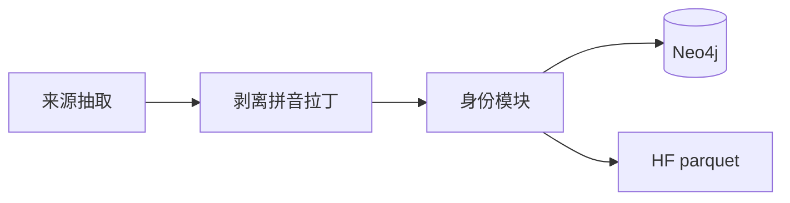
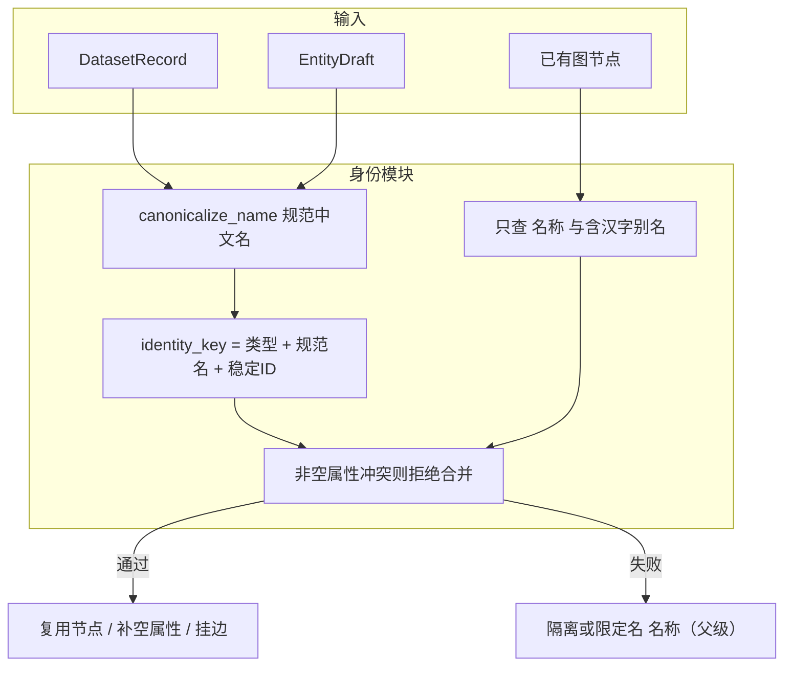
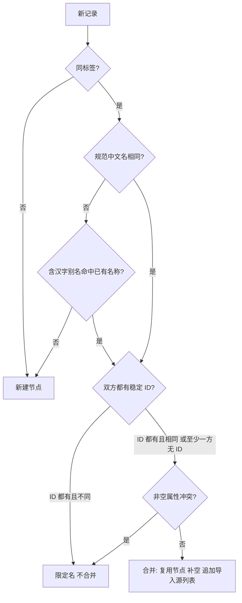
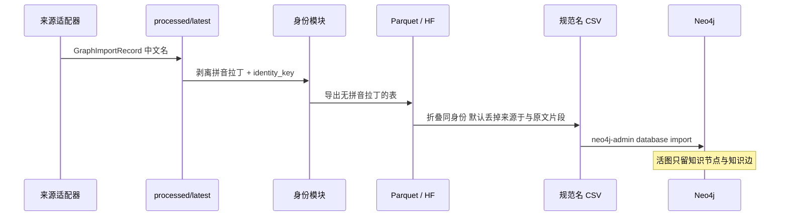

<!--
---
doc_kind: architecture
status: stable
tags: ["knowledge-graph", "data-ingestion", "entity-resolution"]
summary: 图与数据集只保留中文名称属性；身份、消歧、合并收口到同一套规则模块
audience: developer
---
-->

# 实体消歧、合并与中文属性

图上的人读字段只保留中文。身份判定、消歧和合并走同一套规则模块，新源入库不得再各写一套启发式。

JSONL、发布 parquet 已剥离 `pinyin_name` / `latin_name` / `拼音` / `拉丁名`；入图查找不再用这两键。活图须用清洗后的 parquet **空库重建**，不要从旧 `exports/graph-zh-live.json` 回灌。细节见执行计划。

## 1. 为什么这样切

白草问答与图谱展示面向中文读者。拼音、拉丁学名曾用于药典对齐和跨源查找，但带来三处漂移：

1. 发布表、活图、API 同时暴露英文/拉丁字段，和「生产图谱用中文键」口径打架。
2. 入图查找曾用 `拼音` / `拉丁名` / 别名，清洗门禁却禁止用拼音做身份，两套规则会把不同实体并错或并漏。
3. 近重复合并、清洗 `merge_same_identity`、Neo4j `write_node` 三处各自为政，新源没有单一入口。

目标：名称类属性只留中文；消歧只认类型 + 规范中文名 + 可选稳定 ID；查找不再走拼音/拉丁。

## 2. 中文属性口径

### 2.1 删除

| 形态 | 例子 | 处理 |
|---|---|---|
| 结构化名称字段 | `pinyin_name`、`latin_name`、`拼音`、`拉丁名` | 从 JSONL `properties`、Parquet `properties_json`、Neo4j 节点属性删除 |
| 纯拼音/拉丁行 | 药典头两行 `Yizhihuanghua`、`SOLIDAGINISHERBA` | 从 `evidence_text` 及同类文本属性按行丢掉 |
| 入图查找键 | `import_dataset_neo4j` 对拼音/拉丁名的 MATCH | 停止使用 |

别名里若整段是拉丁字母或拼音、不含汉字，同样删除，不当作中文别名。

### 2.2 保留

| 形态 | 为什么 |
|---|---|
| 中文 `名称` / 含汉字的 `别名` | 身份与展示 |
| 稳定 ID：`snomed_id`、`tcmt_id`、`icd11_code`、`term_code` 等 | 这是编码，不是名称；同名消歧仍可用 |
| 中英混排的证据正文 | 只删「整行没有汉字」的拼音/拉丁行，不改写含汉字的句子 |
| `source_id`、路径、prompt_hash | 技术溯源，不是展示名 |

PostgreSQL `Herb.latin_name` 与 graph schema 里的同名字段随图谱口径停写、停返回，避免事务库再发一套拉丁名。

### 2.3 落点

剥离发生在**发布与入图边界**（`slim_record` / parquet 导出 / 一次性回写 JSONL），不要求每个来源适配器同一天改完。适配器随后不得再产出已删字段。

HF private 仓 `ticoAg/baicao-knowledge` 必须重导 parquet：public 与 restricted 两层都不再含上述字段。

## 3. 身份与合并模块

目标真源：`packages/data_ingestion/data_ingestion/entity_identity.py`（可扩成同目录 `identity/`，对外仍一个入口）。

入图、清洗整理、近重复合并都调用这套函数，禁止在 `import_dataset_neo4j` 里另写查找键。

现有三层怎么收口：

| 现码 | 目标 |
|---|---|
| `entity_identity.merge_same_identity` / `assign_display_names` | 保留，作为清洗与入图共用的合并核 |
| `import_dataset_neo4j.find_existing` / `NodeCache` | 查找键改为与 `identity_key` 一致；去掉拼音、拉丁名、纯拉丁别名 |
| `merge_near_duplicates` | 仍只合标点/OCR 与共享词条表面键；不升级成语义消歧 |

穴位「太溪 / 太溪穴」仍属中文表面变体，留在 `lookup_names`，不算拼音规则。

## 4. 合并策略

按优先级，先到先得：

硬规则（与 [data-sources.md 审核约束](data-sources.md#14-审核时必须遵守) 对齐，并纠正入图实现）：

- 只合并**同一节点类型**。药材「鳖甲」与方剂「鳖甲」永远分开。
- 身份不用拼音、拉丁名、编辑距离、向量、LLM。
- 药典已有非空中文属性仍受 `PROTECTED_EXISTING_PROPS` 保护，新源只补空、不覆盖。
- 共享词条（功效/性味/归经/病证/治法/穴位/工艺）允许近重复表面键合并；药材/饮片/方剂/医案**不**按文本近义合并。
- 跨本体节点仅当类型相同、规范中文名精确一致、稳定 ID 均保留且无冲突时聚合；不声明两个本体概念一般等价。

## 5. 新源入库路径

数据集（JSONL / Parquet / HF）可以保留 `来源于` 和 `evidence_text`。**写入图谱时默认不加**：不建 `来源于` 边、不写 `来源` 节点、不把原文片段写成节点属性。溯源看节点上的 `导入源` / `导入源列表`。需要证据链入图时加 `--include-source-graph`。

空库重建走 Python 消歧 → CSV → `neo4j-admin database import full`（`--mode admin`）。增量补源仍可用 Bolt `UNWIND`。身份折叠与 CSV 生成若成为瓶颈，再把 `identity_key` / `canonicalize_name` 抽成 Rust 扩展；先不要提前写。

新源不要直接 `SET n += props`。只走 `import_dataset_neo4j`（JSONL 或 `--dataset-root` parquet）。Bolt 写入按标签 `UNWIND`（默认 2000 行，证据降到 1000，上限 10000），并先给各中文标签的 `名称` 建唯一约束。拼音/拉丁剥离后，**不要**在旧图上只删属性：查找键变了，必须用清洗后的发布表重建或按源重导，否则会留下靠拉丁名并上的历史节点。

推荐：剥离 JSONL → 重导 parquet → 发布 HF → 空库 `--mode admin` 入图。

## 6. 明确不做

- 不做嵌入/聚类/LLM 实体链接。
- 不把「人参 = Panax ginseng」做成运行时别名检索（问答侧已明确不做拼音检索）。
- 不删除稳定编码字段，不把 ICD/SNOMED 当成拉丁名清掉。
- 不改写含汉字的证据句；不把全书原文重新上传。
- 不把 PostgreSQL 验证工作流改成第二套图模型。
- 不把数据集里的 `来源于` / `evidence_text` 删掉；只是默认不写入活图。

## 7. 现状与目标

| 项 | 当前事实 | 目标形态 |
|---|---|---|
| JSONL / Parquet | 已剥离 `pinyin_name` / `latin_name` | 保持剥离 |
| Neo4j | 无 `拼音` / `拉丁名`；只按中文名/汉字别名查找 | 同左 |
| 活图载荷 | 默认不写 `来源于` 与 `evidence_text` | 同左；`--include-source-graph` 才写入 |
| HF | `ticoAg/baicao-knowledge` 已重发，抽查无拼音/拉丁键 | 同左 |

## 8. 相关文档

- 中文图模型与跨类型不合： [knowledge-model-and-ingestion.md §7](knowledge-model-and-ingestion.md#7-中文图模型口径)
- 数据集信封与入图命令： [knowledge-dataset.md](knowledge-dataset.md)
- 审核合并禁令： [data-sources.md §1.4](data-sources.md#14-审核时必须遵守)
- 代码核： `packages/data_ingestion/data_ingestion/entity_identity.py`
- 入图载荷： `packages/data_ingestion/data_ingestion/graph_store_payload.py`
- 入图： `packages/data_ingestion/data_ingestion/cli/import_dataset_neo4j.py`
- 近重复： `packages/data_ingestion/data_ingestion/cli/merge_near_duplicates.py`
