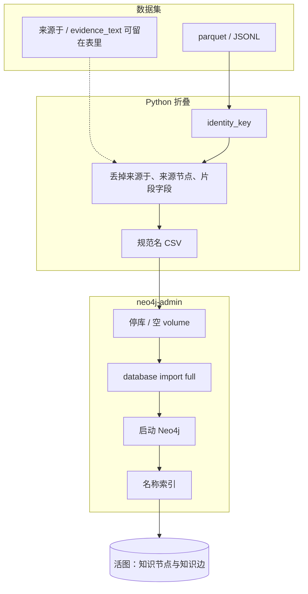
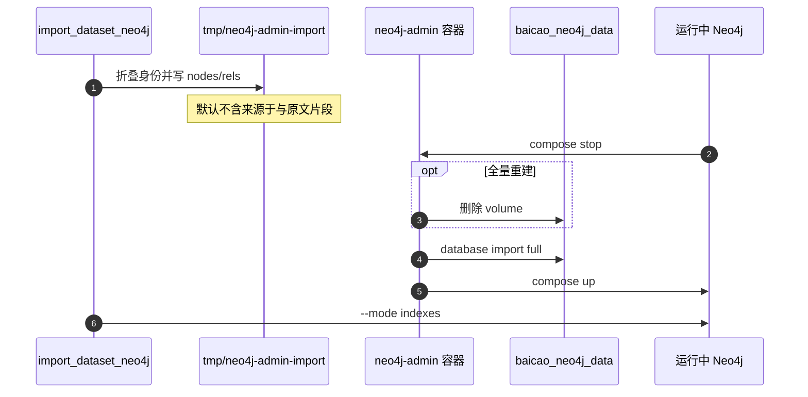

<!--
---
doc_kind: architecture
status: stable
tags: ["data-ingestion", "huggingface", "parquet", "knowledge-graph"]
summary: 白草自有知识数据集的任务定义、目录、Parquet 发布与筛选口径
audience: developer
---
-->

# 白草知识数据集

这份文档是「用 Hugging Face Dataset 维护本项目产出数据」的稳定定义。图模型真源仍是 `packages/knowledge_model/`，数据集只存实例。

## 1. 任务背景

白草要的不是又一份问答语料，而是可入图、可按源/批次查询、可追溯证据的结构化知识。

当前有三类产出；第三源只进入本地 staging：

| 波次 | 源 | 知识形态 | 处理链 |
|------|----|----------|--------|
| 药典 2022 | `national-standard-2022-pharmacopoeia` | 条目字段：药材/饮片/性味/归经/功效 | 规则切段 + LLM → `GraphImportRecord` |
| 道医苏子阳 | `daoyi-suyang` | 叙事医案：主诉、方剂、针灸、治法 | 按章切分 + 抽取 → 同一信封 |
| Knowlegde_Graph_TCM | `fengxi177-knowledge-graph-tcm` | 药材与处方关系 | 规则清洗 → `DatasetRecord`；无许可证，`publish: false` |

第一波苏子阳抽取（`2026-08-16-suyang-b*`）验收失败：覆盖够，但方剂被标成药材、证据被标成书名、边大量缺失。
`2026-08-16-suyang-v2-*` 信封过关但语义灌水（空壳医案、方剂无组成、治法混进武术/诊法），已从 Neo4j 回滚。
`2026-08-16-suyang-v3-*` 起按第 4 节「宁缺毋滥」重抽，高 skip 是预期。

## 2. 数据集身份

| 项 | 口径 |
|----|------|
| HF repo | `ticoAg/baicao-knowledge`（**private**） |
| 本地 staging | `datasets/baicao-knowledge/`（元数据进 git，载荷 gitignore） |
| 主存储格式 | **Apache Parquet**（HF Dataset Viewer 主路径） |
| 分层 | `data/public/`（`release_tier=public`）与 `data/restricted/`（许可受限，仍进同一 private 仓） |
| 辅助格式 | JSONL 仅作抽取中间态，不作为发布真源 |
| 图模型版本 | catalog 钉死 `packages/knowledge_model` |

发布目录：

```text
datasets/baicao-knowledge/
  README.md
  catalog.json
  tasks/ledger.json
  data/
    public/
      records.parquet
      edges.parquet
    restricted/
      records.parquet
      edges.parquet
  sources/<source_id>/
    SOURCE.md
    VIEW.md
    source/              # 原文
    processed/latest/
      records.jsonl      # 中间态，不上 HF
```

Viewer 分成 `records` / `edges`（public 层）与 `restricted_records` / `restricted_edges`。筛选列：`source_id`、`batch_id`、`unit_id`、`node_type`、`release_tier`、`license_status`。

## 3. 记录信封

每条节点记录必须能回答：来自哪份源、哪一次处理批次、哪个原文单元。

| 字段 | 作用 |
|------|------|
| `source_id` | 源，如 `daoyi-suyang` |
| `batch_id` | 处理批次，如 `2026-08-16-suyang-v3-b01` |
| `unit_id` | 原文单元，药典 `entry:人参`，苏子阳 `chapter-002` |
| `node_type` / `node_name` | 图节点 |
| `prompt_hash` | 抽取契约 SHA256 前 12 位 |
| `import_scope_key` | 入图筛选键 |
| `evidence_refs` | **证据节点名**，不是章号 |
| `edges` | 指向本批已存在的 `node_name` |

入图溯源（节点、边、属性键一律中文）：

- 标签用 `药材`/`方剂`/`医案` 等，不用 `Herb`
- 属性键用 `名称`/`来源`/`导入源`/`抽取契约哈希` 等
- 状态值用 `待验证`/`已验证`/`已拒绝`
- Neo4j Browser 侧边栏读的是 `db.propertyKeys()` 目录。APOC 改名和 `neo4j-admin dump` 都清不掉幽灵英文键；要清目录，只能空 volume 后按 [§3.1](#31-入图标准路径) 从 parquet 做 `neo4j-admin database import`。不要从旧 `exports/graph-zh-live.json` 或 `recreate_graph_store` 回灌。

同类型且 `名称` / 含汉字的 `别名` 命中已有节点时复用，只补空属性、挂新边。穴位额外对齐「太溪 / 太溪穴」。不再用 `拼音` / `拉丁名` 做查找或发布，见 [entity-resolution.md](entity-resolution.md)。

近重复文本只合标点、空白、书名号和白名单 OCR（如 `置于燥处`→`置干燥处`，性味 `成`→`咸`），不合「置干燥处」与「置阴凉防蛀」这类条件差。共享词条（功效/性味/归经/病证/治法/穴位/工艺）同名表面键才并节点；药材/饮片/方剂/医案不按文本合并。命令：`python -m data_ingestion.cli.merge_near_duplicates --apply`。

Cypher 筛选：

```cypher
MATCH (n)
WHERE n.导入源 = '道医苏子阳'
   OR '道医苏子阳' IN coalesce(n.导入源列表, [])
RETURN n

MATCH ()-[r]->()
WHERE r.导入范围键 = '人工:白草知识:道医苏子阳'
RETURN type(r), count(*)
```

### 3.1 入图标准路径

生产图谱**一律**走 Python 身份折叠 → 规范名 CSV → `neo4j-admin database import full`。不要用会 `SET n += props` 的 `app.importers.cli --neo4j`，也不要把 Bolt `UNWIND` 当默认入图。`--mode bolt` 只留给已有活图上追加极小批次；新源、全量、清幽灵键、换身份规则之后，都空库重建。

数据集（JSONL / Parquet / HF）可以保留 `来源于` 和 `evidence_text`。**写入图谱时默认不加**：不建 `来源于` 边、不写 `来源` 节点、不把原文片段写成节点属性。活图溯源看 `导入源` / `导入源列表`。需要证据链入图时才加 `--include-source-graph`。



折叠时同类型 + 规范中文名 + 可选稳定 ID 并成一个节点。CSV `:ID` 是 `标签:名称` 或 `标签:名称:稳定ID`，所以**同显示名可以是两个节点**。导入后只建 `名称` 索引，不要强行 `UNIQUE`。

本机 Docker（compose 项目名 `baicao`，镜像 `neo4j:5-community`）：

```bash
cd packages/data_ingestion
uv run --with pyarrow python -m data_ingestion.cli.import_dataset_neo4j \
  --dataset-root ../../datasets/baicao-knowledge --dry-run
uv run --with pyarrow python -m data_ingestion.cli.import_dataset_neo4j \
  --dataset-root ../../datasets/baicao-knowledge \
  --admin-dir ../../tmp/neo4j-admin-import

cd ../../infra
docker compose stop neo4j
docker compose rm -f neo4j
docker volume rm baicao_neo4j_data   # 仅全量重建时删

docker run --rm \
  --volume baicao_neo4j_data:/data \
  --volume "$PWD/../tmp/neo4j-admin-import:/import:ro" \
  --entrypoint /bin/sh \
  neo4j:5-community \
  /import/neo4j-admin.sh

docker compose up -d neo4j

cd ../packages/data_ingestion
uv run --with neo4j python -m data_ingestion.cli.import_dataset_neo4j --mode indexes
```

`neo4j-admin.sh` 用 `$ROOT` 解析 CSV，必须把目录挂到容器的 `/import`。不要在宿主机直接跑这份脚本，也不要给 `docker run` 加 `--user`：镜像里的 `neo4j-admin` 不在默认 `PATH`，脚本已写绝对路径 `/var/lib/neo4j/bin/neo4j-admin`。生成的 CSV 在 `tmp/neo4j-admin-import/`，导入后可删。

仍可用 `--records path/to/records.jsonl` 或单层 parquet 作为折叠输入；默认 `--mode admin`。`--mode bolt` 按标签 `UNWIND`（默认 2000 行，证据 1000，上限 10000），只用于活图上的小增量。



## 4. 苏子阳抽取任务定义

**目标：** 抽出可入图的临床知识（真实医案、完整方剂组成、施用穴位、炮制）。宁缺毋滥，情节章 skip。

**输入：** `sources/daoyi-suyang/work/batches/batch-XX-*.md`  
**契约：** `packages/data_ingestion/data_ingestion/EXTRACT_SUYANG.md`  
**输出：** `work/extracts-v3/batch-XX.jsonl` → merge → Parquet

类型（只许用这些）：

- 节点：原有药材/饮片/…/证据，加上 **方剂、医案、穴位、治法**
- 新边：`组成药材` `使用方剂` `取用穴位` `采用治法` `记载于医案`
- 必有边：知识节点（非单纯 skip）必须同时有 `来源于` 和 `由证据支持`

禁止：

- 方剂标成 `药材` 或 `证据`
- 书名标成 `证据`（书是 `来源`）
- `证据` 节点名不是 `证据:...`
- `edges` 不是数组
- 边 target 在本批不存在
- 无患者+干预却造医案
- 原文有剂量却漏 `组成药材`
- `病证 -治疗病证→ *`
- 空类病证（内科杂病）或武术/诊法当 `治法`
- 为了覆盖去抽情节章（高 skip 合法）

验收脚本：`python -m data_ingestion.cli.validate_suyang_extract`

通过条件见该脚本；失败不得把该批标成 `processed/latest`，也不得上传 HF。

## 5. 统计与 VIEW

数量只能由脚本生成：

```bash
cd packages/data_ingestion
uv run python -m data_ingestion.cli.compute_dataset_stats \
  --records ../../datasets/baicao-knowledge/sources/daoyi-suyang/processed/latest/records.jsonl \
  --source-id daoyi-suyang \
  --out-dir ../../datasets/baicao-knowledge/sources/daoyi-suyang/processed/latest \
  --filter-key manual:baicao-knowledge:daoyi-suyang
```

`VIEW.md` 的数字段被脚本覆盖。禁止手改 count。

## 6. Parquet 发布

```bash
cd packages/data_ingestion
uv run --with pyarrow python -m data_ingestion.cli.export_dataset_parquet \
  --dataset-root ../../datasets/baicao-knowledge
```

产出 `data/public/*.parquet` 与 `data/restricted/*.parquet`。`publish: true` / `release_tier=public` 进 public 层；其余进 restricted 层。两层都上传到同一个 private Hugging Face 数据集 `ticoAg/baicao-knowledge`。导出会保留入图所需的 `evidence_text` 以及边属性 `dosage` / `dosage_ratio` / `evidence_ref`，并从 `properties_json` 删除全书字段 `raw_text`、`source_text`、`content`、`text`（这些键本就不会进入 `slim_record`）。行内带 `release_tier`、`license`、`license_status`。从 HF / 本地 parquet 重建图与 JSONL 走同一套 `slim_record`，再按 [§3.1](#31-入图标准路径) 做 `neo4j-admin` 导入；不要省略 `--dry-run` 直接 Bolt 写入。

```bash
uv run --with pyarrow python -m data_ingestion.cli.import_dataset_neo4j \
  --dataset-root ../../datasets/baicao-knowledge --dry-run
```

仍可用 `--records path/to/records.jsonl` 或 `--records path/to/records.parquet`（同目录需有 `edges.parquet`）。上传统一走 allowlist CLI；每次发布会删除远端非允许文件，但保留 Hugging Face 管理的 `.gitattributes`：

```bash
uv run --with huggingface_hub python -m data_ingestion.cli.dataset_publish \
  --dataset-root ../../datasets/baicao-knowledge --dry-run
uv run --with huggingface_hub python -m data_ingestion.cli.dataset_publish \
  --dataset-root ../../datasets/baicao-knowledge
```

不要上传苏子阳原文、切章、抽取中间态、任务批次稿，也不要上传 `exports/graph-zh-live.json`。

验证 Viewer：

```bash
curl -s "https://datasets-server.huggingface.co/is-valid?dataset=ticoAg/baicao-knowledge"
curl -s "https://datasets-server.huggingface.co/splits?dataset=ticoAg/baicao-knowledge"
```

截至 2026-09-06，HF 仓为 private；public 层与 restricted 层分目录上传。全书原文与本地 JSONL 不进入 allowlist；parquet 含证据片段，可重建数据集。活图默认不含 `来源于` 与原文片段。

## 7. 清洗完成后的本地保留

catalog 里源为 `imported`、且 `processed/latest/records.jsonl` 非空时，视为该源已清洗。此后本地只保留能再入图和再发布的产物，不长期堆原文。

| 保留 | 路径 | 原因 |
|---|---|---|
| 身份与台账 | `SOURCE.md`、`VIEW.md`、`catalog.json`、`tasks/` | 进 Git；许可与产量真源 |
| 可导入快照 | `sources/*/processed/latest/records.jsonl` 或 `data/{public,restricted}/*.parquet` | 整库重建读 parquet；JSONL 仅增量 Bolt |
| 发布表 | `data/public/`、`data/restricted/` | 可从 JSONL 再导出；HF private 仓已有副本 |
| 缓存说明 | `.cache/README.md` | 路径约定 |

| 可删 | 路径 | 原因 |
|---|---|---|
| 原始语料 | `.cache/{huggingface,github,dropbox}/` | 清洗输入；再抽需重新下载 |
| 抽取中间态 | `sources/*/work/extracts*`、`work/queue` | 已被 `processed/latest` 取代 |
| 少数源原文目录 | `sources/*/source/`（如苏子阳全文） | 不上 Git / HF；快照已在 JSONL |
| 入图临时 CSV | `tmp/neo4j-admin-import/` | 一次性产物，导入后可删 |
| 旧活图 dump | `exports/graph-zh-live.json` | 禁止回灌；会把拼音/拉丁和幽灵键带回来 |

不删：Neo4j 活图、`processed/latest/records.jsonl`、Git 跟踪的元数据。未购买的 wangekxy 全量本来就不在本机。

## 8. 相关文档

- 图模型真源：`packages/knowledge_model/knowledge_model/constants.py`
- 抽取契约：`packages/data_ingestion/data_ingestion/EXTRACT_SUYANG.md`
- 候选外源：`data-sources.md`
- 本机缓存指针：`.cache/README.md`
