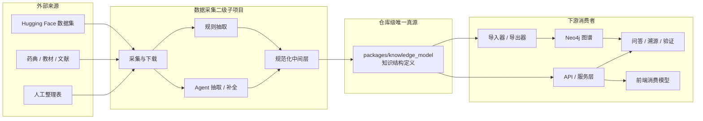

<!--
---
doc_kind: architecture
status: stable
tags: ["knowledge-graph", "data-ingestion", "schema", "ssot"]
summary: 仓库级图模型唯一真源与数据采集二级子项目架构
audience: developer
---
-->

# 图模型唯一真源与数据采集架构

## 1. 目标

本项目把“数据采集”定义为一个长期存在的二级子项目，但它不是一套独立知识体系，而是仓库级统一图模型的消费者。

本架构文档确认以下稳定口径：

- 图模型、实体、关系、知识结构定义必须在仓库内共享，并具有唯一真源
- 唯一真源采用**代码优先**方式维护，而不是先写一份文档再让代码各自实现
- 唯一真源应由可执行声明承载，优先使用 `pydantic`、`Literal`、`StrEnum` 等方式表达
- 文档负责解释语义、边界和演进规则；代码负责承载可复用的结构定义
- 数据采集允许大量定制脚本，但所有脚本最终都必须收敛到同一份图模型真源

## 2. 适用范围

本口径适用于仓库内所有会读写中药材图谱知识结构的模块，包括但不限于：

- 数据采集与规范化
- 规则抽取脚本
- agent 抽取与补全链路
- 导入器 / 导出器
- API schema 与服务层
- 图谱查询、问答、溯源与验证工作流
- 后续新增的多级子项目

## 3. 术语口径

为降低中文语境下的歧义，仓库内的架构与设计文档统一采用下表作为主表达：

| 英文术语 | 中文主称 | 说明 |
| --- | --- | --- |
| Entity | 实体 | 指图谱中的业务对象 |
| Relation | 关系 | 指实体之间的语义连接 |
| Schema | 知识结构定义 | 指节点类型、关系类型、字段与约束的整体定义 |
| Graph Model | 图模型 | 指面向 Neo4j 与导入链路的知识结构 |
| Node Type | 节点类型 | 图中可出现的实体类别 |
| Edge Type | 关系类型 | 图中可出现的关系类别 |
| Source | 来源 | 文献、数据集、药典、教材或人工整理来源 |
| Verification Status | 验证状态 | 待验证、已验证、已拒绝等状态 |

补充约束：

- 文档叙述、表格和设计说明默认使用中文主称
- 技术实现中的 label、关系值、枚举值可以保留英文技术标识
- 中文语义与英文技术标识之间必须存在明确映射，不允许靠上下文猜测

## 4. 唯一真源原则

### 4.1 真源位置

仓库级统一图模型的唯一真源应放在**独立共享代码包**中，而不是绑定在某一个应用子项目内部。

推荐目标位置：

```text
packages/knowledge_model/
```

该包负责承载：

- 节点类型定义
- 关系类型定义
- 节点属性模型
- 关系属性模型
- 导入中间格式
- 中文语义映射
- 版本信息与兼容性约束

### 4.2 为什么不是 API 内部 schema

虽然当前 API 侧已经存在图谱 `schema`、枚举和导入记录模型，但它们位于 `packages/api/` 内，天然更偏向“API 子项目内部事实”。

这不满足“多级子项目共享”的目标，也不利于数据采集、导入、后续离线处理任务直接复用。

### 4.3 为什么不是文档优先

文档必须解释设计，但不能成为唯一可执行真源。

如果实体、关系和字段约束只写在文档里，数据采集、API、导入器、前端会再次出现多份实现漂移。

因此本项目采用：

- 代码优先：共享模型包是唯一结构真源
- 文档同步：架构文档解释语义与边界
- 消费方跟随：其他模块只消费，不自定义平行结构

## 5. 图模型共享架构



## 6. 数据采集二级子项目的角色

### 6.1 项目定位

数据采集二级子项目负责把外部来源转成可进入本项目图谱的候选知识，但它不拥有图结构定义。

它的职责是：

- 管理候选数据源
- 执行下载、清洗和规范化
- 对非结构化数据做规则抽取或 agent 抽取
- 输出统一中间格式
- 将结果映射到共享知识结构定义

它不负责：

- 发明新的节点类型或关系类型
- 单独维护一套字段命名
- 直接绕过共享模型写入 Neo4j

### 6.2 处理模式

本项目支持“规则 + agent”的混合处理模式：

1. 规则优先  
   对高确定性字段进行稳定抽取，例如固定表头、结构化条目、明确的章节分段。

2. agent 补充  
   对半结构化或非结构化文本执行抽取、归并、补全、候选映射。

3. 统一规范化  
   无论上游来自规则还是 agent，输出都必须先进入统一中间格式。

4. 收敛到唯一真源  
   中间格式只有在通过共享知识结构定义校验后，才能进入正式导入链路。

### 6.3 为什么允许定制脚本

不同来源的数据质量、排版方式和语义密度差异很大，因此采集与抽取脚本允许高度定制。  
但这些定制只能存在于“来源适配层”，不能侵入统一图模型本身。

## 7. 中文图模型口径

### 7.1 中文实体名称

| 中文实体 | 英文技术标识 | 说明 |
| --- | --- | --- |
| 药材 | `Herb` | 核心药材实体 |
| 成分 | `Component` | 化学成分、活性成分等 |
| 品种 | `Variant` | 同源不同种、变种 |
| 工艺 | `Process` | 加工、炮制、储存相关工艺 |
| 性状 | `Trait` | 外观、内部或化学性状 |
| 功效 | `Efficacy` | 功效、作用归纳 |
| 性味 | `Flavor` | 性味与药性 |
| 归经 | `Meridian` | 归属经脉 |
| 病证 | `Disease` | 疾病或证候相关对象 |
| 时间点 | `TimePoint` | 年份、陈化时间等时间维度 |
| 来源 | `Source` | 文献、药典、教材、数据集来源 |

### 7.2 中文关系名称

| 中文关系 | 英文技术标识 | 说明 |
| --- | --- | --- |
| 包含成分 | `CONTAINS` | 药材包含某成分 |
| 来源于 | `EXTRACTED_FROM` / `ORIGINATED_FROM` | 成分或药材与来源地/来源对象的关系 |
| 具有品种 | `HAS_VARIANT` | 药材拥有品种 |
| 属于药材 | `VARIANT_OF` | 品种归属于药材 |
| 经过工艺 | `PROCESSED_BY` | 药材经由加工或炮制工艺 |
| 适用于 | `APPLIES_TO` | 工艺适用对象 |
| 储存时间 | `STORED_FOR` | 时间维度关系 |
| 具有性状 | `HAS_TRAIT` | 药材或品种具有性状 |
| 观察于 | `OBSERVED_IN` | 性状反向观察关系 |
| 具有功效 | `HAS_EFFICACY` | 药材、成分、品种与功效关系 |
| 具有性味 | `HAS_FLAVOR` | 药材与性味关系 |
| 归于经脉 | `ENTERS_MERIDIAN` | 药材与归经关系 |
| 治疗病证 | `TREATS` | 药材或成分与病证关系 |
| 相互作用 | `INTERACTS_WITH` | 成分之间的相互作用 |
| 相似于 | `SIMILAR_TO` | 药材、功效等相似关系 |

## 8. 共享包的推荐结构

推荐共享包采用 Python-first 结构，以声明式模型承载唯一真源：

```text
packages/knowledge_model/
├── pyproject.toml
└── knowledge_model/
    ├── __init__.py
    ├── 常量.py
    ├── 节点.py
    ├── 关系.py
    ├── 知识结构定义.py
    ├── 导入记录.py
    ├── 中文映射.py
    └── 版本.py
```

其中：

- `常量.py`：`Literal`、`StrEnum`、字段键集合
- `节点.py`：节点类型与属性模型
- `关系.py`：关系类型与属性模型
- `知识结构定义.py`：联合类型、注册表、校验入口
- `导入记录.py`：面向采集与导入的统一中间格式
- `中文映射.py`：中文主称、展示名、说明文本

说明：

- 文件名是否最终保留中文，可以在实施时结合工具链兼容性调整
- 但中文语义必须存在于该共享包中，不能只写在文档里

## 9. 稳定约束

### 9.1 允许的扩展

- 新增来源适配器
- 新增规则抽取器
- 新增 agent 抽取器
- 新增导出器
- 在共享包中显式增加新的实体、关系或字段

### 9.2 不允许的扩展方式

- 采集脚本私自新增节点类型
- API 路由层定义一套与共享包不一致的图谱结构
- 前端服务层手写长期漂移的图结构字段
- 导入器通过匿名 `dict` 长期承载核心图模型

## 10. 当前事实与目标形态

当前仓库内已经完成这条主线收敛：

- `packages/knowledge_model/` 已成为共享图模型与导入记录的代码真源
- API graph schema 直接复用共享 `NodeType` / `NodeStatus`
- importer / exporter 统一消费共享 `GraphImportRecord`
- `packages/data_ingestion/` 已作为共享模型消费者落地，不再重复定义图谱枚举

当前仍保留的边界差异与后续扩展点是：

- API `EdgeType` 仍保留少量 API-only superset
- 真实导入执行、更多来源接入与更高层联调证据还可继续补强
- 稳定架构文档继续只解释边界与口径，不承担可执行真源角色

## 11. 与其他文档的关系

- 项目整体定位：见 [../../README.md](../../README.md)
- 图谱与数据模型基础：见 [data-model.md](data-model.md)
- 数据处理工作台架构：见 [data-pipeline-workbench.md](data-pipeline-workbench.md)
- 本轮设计 spec：见 `docs/superpowers/specs/`
- 本轮实施计划：见 `docs/superpowers/plans/`
