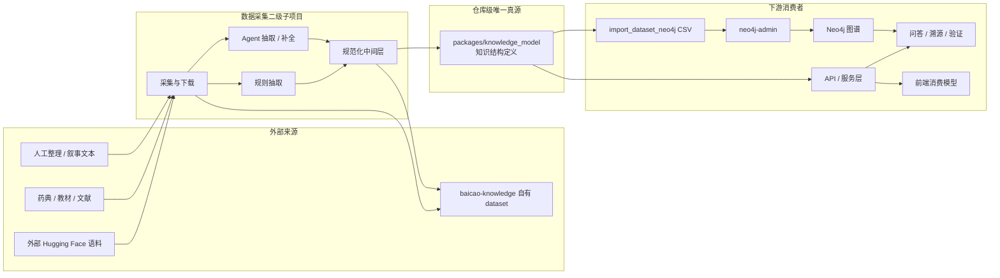
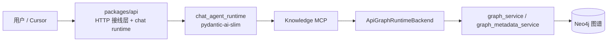
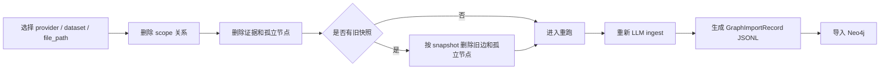

<!--
---
doc_kind: architecture
status: stable
tags: ["knowledge-graph", "data-ingestion", "schema", "ssot"]
summary: 仓库级图模型唯一真源与数据采集二级子项目架构
audience: developer
---
-->

# 图模型唯一真源与数据采集架构

## 1. 目标

本项目把“数据采集”定义为一个长期存在的二级子项目，但它不是一套独立知识体系，而是仓库级统一图模型的消费者。

本架构文档确认以下稳定口径：

- 图模型、实体、关系、知识结构定义必须在仓库内共享，并具有唯一真源
- 唯一真源采用**代码优先**方式维护，而不是先写一份文档再让代码各自实现
- 唯一真源应由可执行声明承载，优先使用 `pydantic`、`Literal`、`StrEnum` 等方式表达
- 文档负责解释语义、边界和演进规则；代码负责承载可复用的结构定义
- 数据采集允许大量定制脚本，但所有脚本最终都必须收敛到同一份图模型真源

## 2. 适用范围

本口径适用于仓库内所有会读写中药材图谱知识结构的模块，包括但不限于：

- 数据采集与规范化
- 规则抽取脚本
- agent 抽取与补全链路
- 导入器 / 导出器
- API schema 与服务层
- 图谱查询、问答、溯源与验证工作流
- 后续新增的多级子项目

## 3. 术语口径

为降低中文语境下的歧义，仓库内的架构与设计文档统一采用下表作为主表达：

| 英文术语 | 中文主称 | 说明 |
| --- | --- | --- |
| Entity | 实体 | 指图谱中的业务对象 |
| Relation | 关系 | 指实体之间的语义连接 |
| Schema | 知识结构定义 | 指节点类型、关系类型、字段与约束的整体定义 |
| Graph Model | 图模型 | 指面向 Neo4j 与导入链路的知识结构 |
| Node Type | 节点类型 | 图中可出现的实体类别 |
| Edge Type | 关系类型 | 图中可出现的关系类别 |
| Source | 来源 | 文献、数据集、药典、教材或人工整理来源 |
| Verification Status | 验证状态 | 待验证、已验证、已拒绝等状态 |

补充约束：

- 文档叙述、表格和设计说明默认使用中文主称
- 技术实现中的 label、关系值、枚举值可以保留英文技术标识
- 中文语义与英文技术标识之间必须存在明确映射，不允许靠上下文猜测

## 4. 唯一真源原则

### 4.1 真源位置

仓库级统一图模型的唯一真源应放在**独立共享代码包**中，而不是绑定在某一个应用子项目内部。

推荐目标位置：

```text
packages/knowledge_model/
```

该包负责承载：

- 节点类型定义
- 关系类型定义
- 节点属性模型
- 关系属性模型
- 导入中间格式
- 中文语义映射
- 版本信息与兼容性约束

### 4.2 为什么不是 API 内部 schema

虽然当前 API 侧已经存在图谱 `schema`、枚举和导入记录模型，但它们位于 `packages/api/` 内，天然更偏向“API 子项目内部事实”。

这不满足“多级子项目共享”的目标，也不利于数据采集、导入、后续离线处理任务直接复用。

### 4.3 为什么不是文档优先

文档必须解释设计，但不能成为唯一可执行真源。

如果实体、关系和字段约束只写在文档里，数据采集、API、导入器、前端会再次出现多份实现漂移。

因此本项目采用：

- 代码优先：共享模型包是唯一结构真源
- 文档同步：架构文档解释语义与边界
- 消费方跟随：其他模块只消费，不自定义平行结构

## 5. 图模型共享架构



自有数据集 `datasets/baicao-knowledge/` 只存源、结构化快照、VIEW 和产量台账，**不是第二套图模型**。节点/关系类型仍只以 `packages/knowledge_model/` 为准。

### 5.1 Graph Runtime / Agent 运行边界

当前 chat 主链的 agent runtime 已收敛到 `packages/api/app/services/chat_agent_runtime/`。pydantic-ai-slim 做 loop，经官方 mcp v2 同进程客户端调用 Knowledge MCP，并用 `message_history` 续接会话。循环中的结构化判定调用 TypeSafe `system_one`，不把判定标准交给问答模型现写。`/mcp` 是同一台 server 的外部入口。轻量检索边界见 [chat-agent-mcp.md](chat-agent-mcp.md)。

早期 `packages/graph_runtime/` 已从仓库删除；图读能力在 `packages/api/` 的 `graph_service` 与 Knowledge MCP。不要再恢复那套 planner / CLI / graph-agent。



## 6. 数据采集二级子项目的角色

### 6.1 项目定位

数据采集二级子项目负责把外部来源转成可进入本项目图谱的候选知识，但它不拥有图结构定义。

它的职责是：

- 管理候选数据源
- 执行下载、清洗和规范化
- 对非结构化数据做规则抽取或 agent 抽取
- 输出统一中间格式
- 将结果映射到共享知识结构定义

它不负责：

- 发明新的节点类型或关系类型
- 单独维护一套字段命名
- 直接绕过共享模型写入 Neo4j

### 6.2 处理模式

本项目支持“规则 + agent”的混合处理模式，四层必须走同一条合同，而不是各写旁路：

1. 业务规则  
   图模型在 `packages/knowledge_model/`；身份与合并在 `data_ingestion/entity_identity.py`；隐私过滤去掉电话、证件、住院号、国药准字和品牌。
2. 工作流程  
   `organize prepare` 由规则切分并生成 `agent_queue.jsonl`；agent 只处理队列中的不确定抽取；`organize accept` 把 `ExtractionCandidate` 再送回同一套门禁。
3. 脚本  
   来源适配器可以定制，但只能输出 `WorkUnit` / `ExtractionCandidate` / `DatasetRecord`。
4. 底层图库  
   只有通过身份门禁的 `DatasetRecord` 才能进入 importer / Neo4j。agent 不得直接写库。

确定性高的国标术语继续走规则清洗；名医验案、教材等半结构文本走 prepare → agent → accept。

### 6.3 为什么允许定制脚本

不同来源的数据质量、排版方式和语义密度差异很大，因此采集与抽取脚本允许高度定制。  
但这些定制只能存在于“来源适配层”，不能侵入统一图模型本身。

## 7. 中文图模型口径

### 7.1 中文实体名称

| 中文实体 | 英文技术标识 | 说明 |
| --- | --- | --- |
| 药材 | `Herb` | 核心药材实体 |
| 饮片 | `PreparedHerb` | 炮制后的药材形态 |
| 成分 | `Component` | 化学成分、活性成分等 |
| 品种 | `Variant` | 同源不同种、变种 |
| 工艺 | `Process` | 加工、炮制、储存相关工艺 |
| 性状 | `Trait` | 外观、内部或化学性状 |
| 功效 | `Efficacy` | 功效、作用归纳 |
| 性味 | `Flavor` | 性味与药性 |
| 归经 | `Meridian` | 归属经脉 |
| 病证 | `Disease` | 疾病或证候相关对象 |
| 症状 | `Symptom` | 患者表现或来源显式标注的症状对象；与疾病、证候分开 |
| 方剂 | `Formula` | 临床组方 |
| 医案 | `MedicalCase` | 叙事医案 |
| 穴位 | `Acupoint` | 针灸取穴 |
| 治法 | `TreatmentMethod` | 治法 / 治则 |
| 时间点 | `TimePoint` | 年份、陈化时间等时间维度 |
| 来源 | `Source` | 文献、药典、教材、数据集来源 |
| 证据 | `Evidence` | 入图证据块 |

### 7.2 中文关系名称

| 中文关系 | 英文技术标识 | 说明 |
| --- | --- | --- |
| 具有饮片 | `HAS_PREPARED_FORM` | 药材对应饮片 |
| 包含成分 | `CONTAINS` | 药材包含某成分 |
| 提取自 | `EXTRACTED_FROM` | 成分提取来源 |
| 来源于 | `ORIGINATED_FROM` | 节点与文献/数据集来源 |
| 具有品种 | `HAS_VARIANT` | 药材拥有品种 |
| 属于药材 | `VARIANT_OF` | 品种归属于药材 |
| 经过工艺 | `PROCESSED_BY` | 药材经由加工或炮制工艺 |
| 适用于 | `APPLIES_TO` | 工艺适用对象 |
| 储存时间 | `STORED_FOR` | 时间维度关系 |
| 具有性状 | `HAS_TRAIT` | 药材或品种具有性状 |
| 观察于 | `OBSERVED_IN` | 性状反向观察关系 |
| 具有功效 | `HAS_EFFICACY` | 药材、成分、品种与功效关系 |
| 具有性味 | `HAS_FLAVOR` | 药材与性味关系 |
| 归于经脉 | `ENTERS_MERIDIAN` | 药材与归经关系 |
| 治疗病证 | `TREATS` | 药材、方剂或医案与病证关系 |
| 关联药材 | `RELATED_HERB` | 未分类临床概念与来源标为中药的对象之间的中性关联 |
| 关联治法 | `RELATED_TREATMENT_METHOD` | 未分类临床概念与来源标为治法的对象之间的中性关联 |
| 关联证候 | `RELATED_SYNDROME` | 未分类临床概念与来源标注为证候的对象之间的中性关联 |
| 关联症状 | `RELATED_SYMPTOM` | 病证或证候与来源显式症状对象之间的中性关联 |
| 组成药材 | `CONTAINS_HERB` | 方剂组成 |
| 使用方剂 | `USES_FORMULA` | 医案使用方剂 |
| 取用穴位 | `USES_ACUPOINT` | 医案或治法取穴 |
| 采用治法 | `USES_METHOD` | 医案采用治法 |
| 记载于医案 | `RECORDED_IN_CASE` | 知识记载于医案 |
| 由证据支持 | `SUPPORTED_BY` | 节点由证据块支持 |
| 派生自 | `DERIVED_FROM` | 派生关系 |
| 父类 | `PARENT_OF` | 层级父类 |
| 子类 | `CHILD_OF` | 层级子类 |
| 相互作用 | `INTERACTS_WITH` | 成分之间的相互作用 |
| 相似于 | `SIMILAR_TO` | 药材、功效等相似关系 |

### 7.3 生产图谱存储

Neo4j 里的标签、关系类型、属性键和状态值用中文（`药材`、`具有性味`、`名称`、`待验证`）。API DTO 仍可通过 `graph_i18n.PROPERTY_ZH_TO_EN` 映回英文。`db.propertyKeys()` 会残留历史英文键；清目录只能空 volume 后从清洗 parquet 做 `neo4j-admin database import`，不能靠 `neo4j-admin dump` 或 `recreate_graph_store` 回灌旧活图。生产入图步骤见 [knowledge-dataset.md §3.1](knowledge-dataset.md#31-入图标准路径)。近重复文本只合标点/OCR，见同一文档。

当来源只用 relation 给 tail 标注药材、治法或证候、但未给 head 提供疾病或症状类型时，head 继续使用 `病证` + `中医类型=未分类临床概念`，并按来源方向使用 `关联药材`、`关联治法` 或 `关联证候` 指向带来源类型的 tail。来源若以独立表明确区分证候和症状，则分别使用 `病证`、`症状`，以 `关联症状` 连接；跨类型同名仍保留为不同节点，不据名称建立等价或合并关系。未经独立核实的证候 tail 使用 `中医类型=来源标注证候`，这些中性关系和来源类型都不等于治疗、诊断、因果、语义等价或已验证分类。只有显式类型或可信标准标识才能进一步拆分疾病、症状与证候；名称后缀、编辑距离、跨语言候选和 LLM 猜测不得触发自动拆分或合并。

来源同时给出标准本体标签和标识时，只接受与目标节点类型明确一致的标签；标识缺失时不得生成或猜测。来源嵌套字段明确列出疾病的 clinical manifestations 时，可投影为 `关联症状`，但必须保留原始嵌套值和逐项证据定位，并注明其中可能同时包含患者症状与临床体征；该关系仍是中性来源关联，不是因果或诊断标准。

当结构化来源只给出 indication、适应或适用对象，而没有足以支持疗效结论的原始证据时，方剂到病证使用中性 `适用于`，不得提升为 `治疗病证`。跨本体节点只有在目标类型相同、规范中文名精确一致、稳定 ID 均保留且非空属性无冲突时才允许确定性聚合；这种聚合只用于消除当前导入范围内的重复节点，不声明两个本体概念一般等价。方剂/饮片、疾病/症状/证候等跨类型同名始终保持独立。

## 8. 共享包的推荐结构

推荐共享包采用 Python-first 结构，以声明式模型承载唯一真源：

落地文件名保持英文，中文语义在模块内容里：

```text
packages/knowledge_model/
├── pyproject.toml
└── knowledge_model/
    ├── __init__.py
    ├── constants.py
    ├── node_models.py
    ├── edge_models.py
    ├── schema.py
    ├── labels.py
    ├── graph_i18n.py
    └── text_normalize.py
```

中文语义必须存在于该共享包中，不能只写在文档里。

## 9. 稳定约束

### 9.1 允许的扩展

- 新增来源适配器
- 新增规则抽取器
- 新增 agent 抽取器

### 9.2 数据集重跑与重置

数据采集任务允许因为 prompt、抽取模型、正则切段或图谱映射优化而重新执行。为避免同一数据集多轮运行后在 Neo4j 中留下无法定位的旧关系，正式导入记录必须携带可清理的来源 scope。

当前药典 ingest 的稳定做法是：

- `GraphImportRecord.properties` 写入 `source_provider`、`dataset_name`、`file_path`、`entry_title`、`evidence_id`、`import_scope_key`
- `GraphImportEdge.properties` 写入同一组 scope 字段
- 来源适配器有精确表行定位时，`GraphImportEdge.properties.evidence_ref` 写入关系属性 `证据定位`
- Neo4j 写关系时，若存在 `import_scope_key`，用它参与关系 `MERGE`
- 重置时先删除该 scope 下的关系，再删除证据节点和无关系的孤立节点
- 对旧版本不带 scope 的快照，使用快照中的 `source -> type -> target` 精确删除旧关系

这让“优化处理方法后对某个数据集一键重跑”变成可恢复流程：



失败重跑不需要清理已成功条目。它只读取上一轮 `validated_extractions.jsonl` 中 `status != success` 的 `entry_key`，再按这些 key 从源文件重新切段和抽取。
- 新增导出器
- 在共享包中显式增加新的实体、关系或字段

### 9.2 不允许的扩展方式

- 采集脚本私自新增节点类型
- API 路由层定义一套与共享包不一致的图谱结构
- 前端服务层手写长期漂移的图结构字段
- 导入器通过匿名 `dict` 长期承载核心图模型

## 10. 当前事实与目标形态

当前仓库内已经完成这条主线收敛：

- `packages/knowledge_model/` 已成为共享图模型与导入记录的代码真源
- `packages/api/app/services/chat_agent_runtime/` 已成为 chat 主链 agent runtime 的代码真源
- API graph schema 直接复用共享 `NodeType` / `NodeStatus`
- chat 主链已经收敛到 `/api/v1/chat/stream`，上下文通过进程内 `message_history` 续接，30 分钟未访问即回收
- importer / exporter 统一消费共享 `GraphImportRecord`
- `packages/data_ingestion/` 已作为共享模型消费者落地，不再重复定义图谱枚举

当前仍保留的边界差异与后续扩展点是：

- API `EdgeType` 仍保留少量 API-only superset
- 真实导入执行、更多来源接入与更高层联调证据还可继续补强
- 稳定架构文档继续只解释边界与口径，不承担可执行真源角色

## 11. 与其他文档的关系

- 项目整体定位：见 [../../README.md](../../README.md)
- 图谱与数据模型基础：见 [data-model.md](data-model.md)
- 数据处理工作台架构：见 [data-pipeline-workbench.md](data-pipeline-workbench.md)
- 身份、消歧与中文属性：见 [entity-resolution.md](entity-resolution.md)
