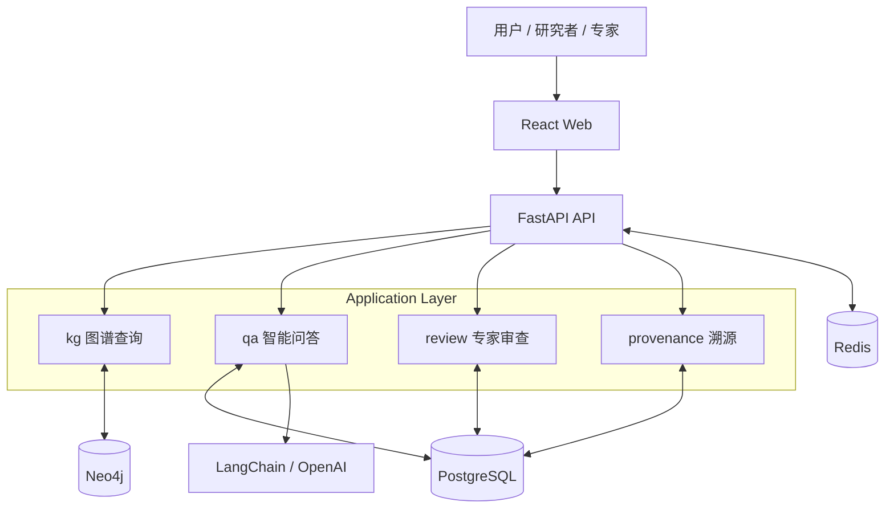
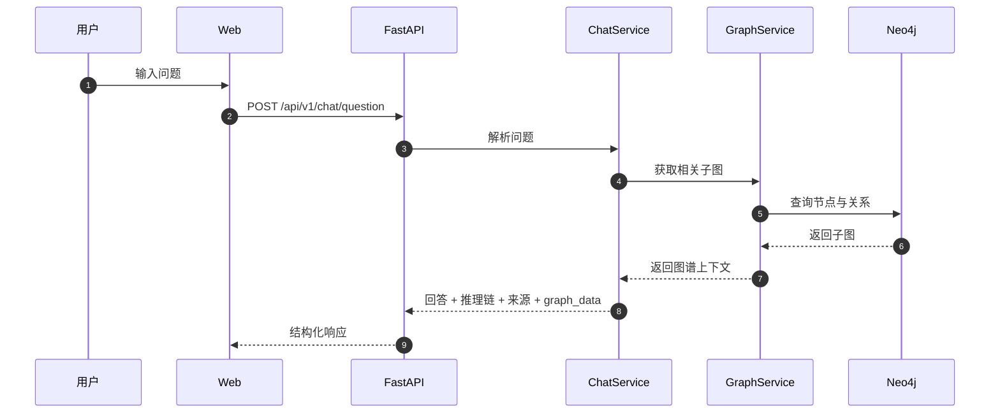
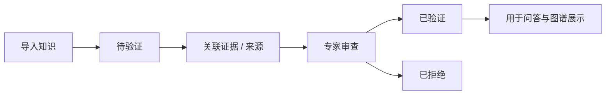

<!--
---
doc_kind: architecture
status: stable
tags: ["system", "overview"]
summary: 白草药坛系统整体架构概览
audience: developer
---
-->

# 系统架构概览

## 1. 项目定位

BaiCao ShiTan（白草药坛）是一个面向中药材知识场景的可信问答系统，核心不是“只给答案”，而是让答案尽量同时具备：

- 图谱支撑
- 推理可见
- 证据可查
- 状态可验证

项目当前统一定位为：**可溯源、可解释、可验证的中药材知识图谱智能问答系统**。

## 2. 当前阶段

当前仓库处于 **MVP 早期实现中**，需要把“代码里已经存在的骨架”和“架构上已确认的目标形态”分开理解：

- 已实现：monorepo 骨架、Docker Compose 编排、FastAPI 基础路由、React 页面原型、Neo4j 样例图谱、CSV/JSONL 导入器
- 进行中：更完整的溯源链路、专家审查闭环、问答质量提升、图谱可视化增强
- 规划中：事件驱动集成、缓存策略、SSE 流式输出、监控与追踪完善

## 3. 架构模式

当前采用 **Modular Monolith** 作为主架构方向：

- 对外是一个统一应用系统，部署和认知成本较低
- 对内按领域边界拆成独立模块，便于演进
- 先保证主链路清晰，再为 Redis 缓存和事件驱动预留扩展位

## 4. 整体架构

### 4.1 分层职责

| 层 | 主要职责 | 当前事实 |
|------|------|------|
| Web | 问答、搜索、图谱浏览、验证管理 | 已有页面原型和基础路由 |
| API | 统一暴露 REST 接口，编排业务流程 | 已有 `health`、`herbs`、`graph`、`verifications`、`chat` 路由 |
| Application Modules | 组织图谱、问答、审查、溯源等业务能力 | 已有 kg / services / verification / chat 等主骨架 |
| Data Layer | 存储图谱、事务数据和缓存 | Compose 已编排 PostgreSQL、Neo4j、Redis |

## 5. 核心模块边界

### 5.1 `packages/api` - FastAPI 后端

| 路径 | 角色 |
|------|------|
| `app/api/` | API 路由层，暴露 herbs / graph / verifications / chat |
| `app/core/` | 配置、数据库连接、应用初始化 |
| `app/models/` | SQLAlchemy 模型 |
| `app/schemas/` | Pydantic schema |
| `app/services/` | 业务服务，如 herb、chat |
| `app/kg/` | 图谱查询服务 |
| `app/importers/` | CSV / JSONL 导入器 |
| `app/exporters/` | 导出器骨架 |
| `app/provenance/` | 溯源模块（ProvenanceService - Evidence/Source 链路管理） |

### 5.2 `packages/web` - React 前端

| 路径 | 角色 |
|------|------|
| `src/components/` | 公共组件 |
| `src/pages/` | 首页、搜索、图谱、验证、问答等页面 |
| `src/services/` | 前端 API 封装 |
| `src/main.tsx` | 应用入口，挂载 Router / React Query / Ant Design |

### 5.3 `packages/shared` - 共享定义

| 路径 | 角色 |
|------|------|
| `types/` | 跨语言共享类型的放置位置 |

### 5.4 `packages/db` - 数据脚本

| 路径 | 角色 |
|------|------|
| `neo4j/` | Neo4j 约束、索引和样例图谱 |
| `import/` | CSV / JSONL 样例导入文件 |

## 6. 关键数据流

### 6.1 问答链路

### 6.2 知识可信度闭环

## 7. 存储职责

| 存储 | 主要职责 | 当前状态 |
|------|------|------|
| PostgreSQL | 用户、验证申请、验证证据、结构化事务数据 | 已接入并由 API 初始化建表 |
| Neo4j | 中药材知识图谱、节点关系、验证状态镜像 | 已有约束脚本和陈皮样例数据 |
| Redis | 缓存、会话、后续事件驱动与异步演进预留 | 基础设施已编排，业务侧仍在继续落地 |

## 8. 基础设施

- Docker Compose：统一编排本地开发环境
- PostgreSQL 15：结构化数据存储
- Neo4j 5：知识图谱存储
- Redis 7：缓存与后续异步演进预留
- Nginx：统一入口与反向代理

## 9. 当前实现与目标形态的差异

为了避免误读，这里明确列出当前还没有完全闭环的部分：

- 问答服务当前仍以原型逻辑为主，LLM 与图谱协同质量仍需继续提升
- `review`、`provenance` 是确定的领域边界，但代码中仍在逐步补齐完整实现
- 事件驱动和 SSE 已在架构草案中明确，但还不是仓库里的完成事实

## 10. 相关文档

- [../../README.md](../../README.md) - 项目总入口
- [../../README.md](../../README.md) - 项目总入口与阶段说明
- [data-model.md](data-model.md) - 数据模型详细设计
- [../_dev/brainstorm/README.md](../_dev/brainstorm/README.md) - 早期 brainstorm 索引
