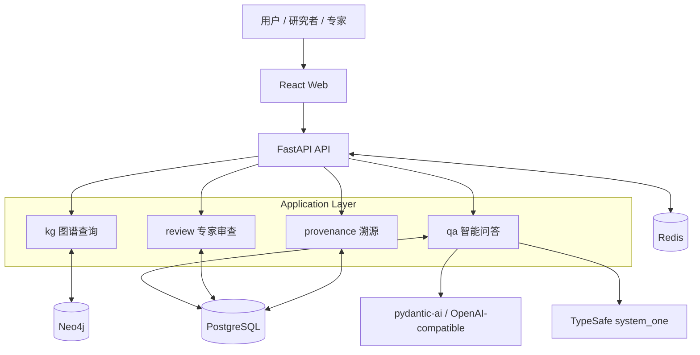
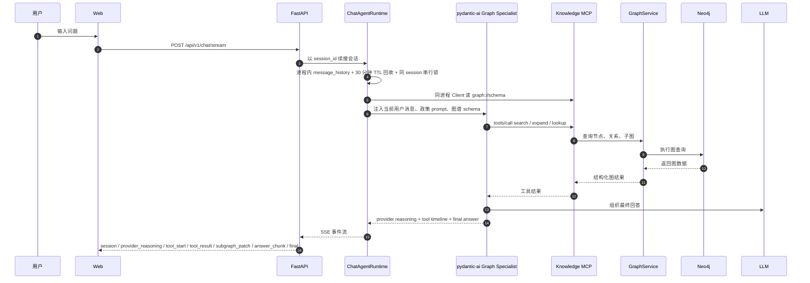
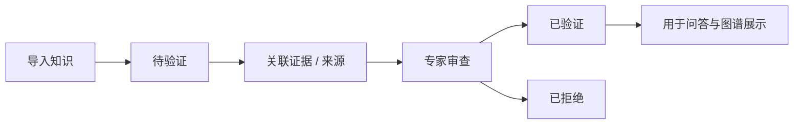

<!--
---
doc_kind: architecture
status: stable
tags: ["system", "overview"]
summary: 白草药坛系统整体架构概览
audience: developer
---
-->

# 系统架构概览

## 1. 项目定位

BaiCao ShiTan（白草药坛）是一个面向中药材知识场景的可信问答系统，核心不是“只给答案”，而是让答案尽量同时具备：

- 图谱支撑
- 推理可见
- 证据可查
- 状态可验证

项目当前统一定位为：**可溯源、可解释、可验证的中药材知识图谱智能问答系统**。

## 2. 当前阶段

当前仓库处于 **MVP 早期实现中**，需要把“代码里已经存在的骨架”和“架构上已确认的目标形态”分开理解：

- 已实现：monorepo 骨架、Docker Compose 编排、FastAPI / React 主骨架、Graph Workbench `/graph`、数据处理工作台 `/data/pipeline`、共享知识模型 / 数据采集边界、发布 parquet 经 `neo4j-admin` 空库导入（默认不写 `来源于` / 原文片段）、review/export 持久化、SSE 问答流（pydantic-ai-slim + 结构化图工具）、MinIO 本地对象存储
- 进行中：`datasets/baicao-knowledge/` 的 catalog/publish CLI，以及 Workbench / 问答消费方剂、医案、穴位、治法
- 规划中：更完整的溯源链路、事件驱动、鉴权治理、多 worker 会话持久化、监控

## 3. 架构模式

当前采用 **Modular Monolith** 作为主架构方向：

- 对外是一个统一应用系统，部署和认知成本较低
- 对内按领域边界拆成独立模块，便于演进
- 先保证主链路清晰，再为 Redis 缓存和事件驱动预留扩展位

## 4. 整体架构

### 4.1 分层职责

| 层 | 主要职责 | 当前事实 |
|------|------|------|
| Web | 问答、搜索、图谱浏览、验证管理、数据处理 | 已有页面原型、Graph Workbench `/graph`、数据处理工作台 `/data/pipeline` 和基础路由 |
| API | 统一暴露 REST 接口，编排业务流程 | 已有 `health`、`herbs`、`graph`、`verifications`、`chat`、`pipeline`、`review/export` 路由，`graph` 已补 metadata 与 `scene` 契约 |
| Application Modules | 组织图谱、问答、审查、溯源、数据处理等业务能力 | 已有 kg / chat / verification / pipeline / review / export 等主骨架 |
| Data Layer | 存储图谱、事务数据、对象快照和缓存 | Compose 已编排 PostgreSQL、Neo4j、Redis、MinIO |

## 5. 核心模块边界

### 5.1 `packages/api` - FastAPI 后端

| 路径 | 角色 |
|------|------|
| `app/api/` | API 路由层，暴露 herbs / graph / verifications / chat / pipeline |
| `app/core/` | 配置、数据库连接、应用初始化 |
| `app/models/` | SQLAlchemy 模型 |
| `app/schemas/` | Pydantic schema |
| `app/services/` | 业务服务，如 herb、chat |
| `app/kg/` | 图谱查询、metadata、Neo4j 连接与声明式图模型 |
| `app/importers/` | CSV / JSONL 导入器 |
| `app/exporters/` | 导出器骨架 |
| `app/pipeline/` | 固定步骤工作台、预览快照与步骤编排 |
| `app/review/` | 人工确认与逐项修订持久化 |
| `app/export/` | 显式导出执行、JSONL snapshot 与 Neo4j 写入 |
| `app/storage/objects/` | 对象存储抽象与 MinIO backend |
| `app/provenance/` | 溯源模块（ProvenanceService - Evidence/Source 链路管理） |

### 5.2 `packages/web` - React 前端

| 路径 | 角色 |
|------|------|
| `src/components/` | 公共组件 |
| `src/pages/` | 首页、搜索、Graph Workbench、验证、问答等页面 |
| `src/services/` | 前端 API 封装 |
| `src/main.tsx` | 应用入口，挂载 Router / React Query / Ant Design |

### 5.3 `packages/shared` - 共享定义

| 路径 | 角色 |
|------|------|
| `types/` | 跨语言共享类型的放置位置 |

### 5.4 `packages/knowledge_model` / `packages/data_ingestion`

| 路径 | 角色 |
|------|------|
| `packages/knowledge_model/` | 共享图模型、导入记录与图谱常量真源 |
| `packages/data_ingestion/` | 数据采集边界，承载来源适配与候选抽取辅助模型 |

### 5.5 `packages/db` - 数据脚本

| 路径 | 角色 |
|------|------|
| `neo4j/` | Neo4j 约束、索引和样例图谱 |
| `import/` | CSV / JSONL 样例导入文件 |

## 6. 关键数据流

### 6.1 问答链路

- 图谱问答主入口已经收敛到 `/api/v1/chat/stream`，不再保留独立 `graph-agent` 主路径。
- pydantic-ai graph specialist 的上下文真源是进程内 `message_history`；应用层不再手动回放完整 thread 历史。
- 当前进程内会话策略为：30 分钟未访问即从 registry 移除历史；同一 `session_id` 的并发请求串行执行，不同 session 可并发；应用退出会清空全部会话。
- 四个图操作只在 Knowledge MCP 实现一次：chat 用同进程 `Client(server)`，`/mcp` 给外部客户端。原始 Cypher 在独立 Neo4j READ-only 身份落地前保持禁用。检索边界见 [chat-agent-mcp.md](chat-agent-mcp.md)。
- 执行中的选项、是/否和分档判定走 TypeSafe `system_one`（`judge` 工具）。未配置 `TYPESAFE_API_KEY` 时不注册该工具，问答仍只走四个图工具。
- provider 原生 reasoning 仅在模型提供时透传到页面；若 provider 不返回 reasoning，页面不会伪造该内容。

### 6.2 知识可信度闭环

## 7. 存储职责

| 存储 | 主要职责 | 当前状态 |
|------|------|------|
| PostgreSQL | 用户、验证申请、验证证据、结构化事务数据 | 已接入并由 API 初始化建表 |
| Neo4j | 中药材知识图谱、节点关系、验证状态镜像 | 已有约束脚本和样例数据，运行时访问已统一到 `neomodel.adb` |
| MinIO | JSONL snapshot、导出审计对象与对象存储演进边界 | 已接入本地开发编排，并被 review/export 主链使用 |
| Redis | 缓存、会话、后续事件驱动与异步演进预留 | 基础设施已编排，业务侧仍在继续落地 |

## 8. 基础设施

- Docker Compose：统一编排本地开发环境
- PostgreSQL 15：结构化数据存储
- Neo4j 5：知识图谱存储
- Redis 7：缓存与后续异步演进预留
- MinIO：本地对象存储与导出 snapshot 审计真源
- Nginx：统一入口与反向代理

## 9. 当前实现与目标形态的差异

为了避免误读，这里明确列出当前还没有完全闭环的部分：

- 问答服务当前仍以原型逻辑为主，LLM 与图谱协同质量仍需继续提升
- `provenance` 是确定的领域边界，但更完整的证据链与跨模块查询仍在逐步补齐
- 专家权限、审计日志与关系级治理仍未形成完整治理系统
- 事件驱动、缓存策略和监控追踪仍停留在规划或预留阶段

## 10. 相关文档

- [../../README.md](../../README.md) - 项目总入口与阶段说明
- [../local-development.md](../local-development.md) - 本地开发栈
- [data-model.md](data-model.md) - 数据模型详细设计
- [chat-agent-mcp.md](chat-agent-mcp.md) - 问答 agent 检索工具、prompt 与 MCP 边界
- [../_dev/brainstorm/README.md](../_dev/brainstorm/README.md) - 早期 brainstorm 索引
