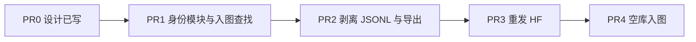

# 中文属性与实体消歧合并

口径见 [实体消歧 · 中文属性口径](../../../architecture/entity-resolution.md#2-中文属性口径) 与 [合并策略](../../../architecture/entity-resolution.md#4-合并策略)。[^ident]
跨类型不合、稳定 ID 规则见 [图模型 · 中文图模型口径](../../../architecture/knowledge-model-and-ingestion.md#7-中文图模型口径)。[^km]
入图命令见 [知识数据集 · 入图溯源](../../../architecture/knowledge-dataset.md#3-记录信封)。[^dataset]
审核禁令见 [数据源 · 审核时必须遵守](../../../architecture/data-sources.md#14-审核时必须遵守)。[^sources]

## Context

活图、JSONL、HF parquet 仍带 `拼音` / `拉丁名`。入图查找也用这两键，和清洗门禁「禁止拼音做身份」不一致。用户要求展示名只留中文，并且要有系统化的消歧/合并模块，而不是继续在 `write_node` 里叠启发式。

不要从旧活图 `recreate_graph_store export` 再导回去：`拼音`/`拉丁名` 是中文键，导出清洗 ASCII 键时删不掉。必须先剥离 JSONL/parquet，再空库入图。

## Approach

先把查找与合并收到 `entity_identity`，入图不再读拼音/拉丁。再在导出/slim 边界剥离字段和「整行无汉字」的文本。然后重导 parquet、发布 HF、空库从 parquet 入图。来源适配器同一轮能改就改，改不完也没关系，边界会挡住。

## Key Decisions

见 [entity-resolution.md](../../../architecture/entity-resolution.md)。

## Scope

- In: 身份模块与入图查找键；JSONL `properties` / `evidence_text` 剥离；parquet 与 HF 重发；Neo4j 用清洗表重建；测试与架构交叉引用
- Out: 嵌入/LLM 消歧；删 SNOMED/ICD 等编码；改写含汉字的证据句；从旧 `graph-zh-live.json` 重导

## Files

- [`packages/data_ingestion/data_ingestion/entity_identity.py`](../../../../packages/data_ingestion/data_ingestion/entity_identity.py) — 身份核、剥离函数、统一查找键
- [`packages/data_ingestion/data_ingestion/cli/import_dataset_neo4j.py`](../../../../packages/data_ingestion/data_ingestion/cli/import_dataset_neo4j.py) — `NodeCache` / `find_existing` 去掉拼音拉丁
- [`packages/data_ingestion/data_ingestion/cli/export_dataset_parquet.py`](../../../../packages/data_ingestion/data_ingestion/cli/export_dataset_parquet.py) — 导出前剥离
- [`packages/data_ingestion/data_ingestion/provenance.py`](../../../../packages/data_ingestion/data_ingestion/provenance.py) — `GRAPH_NODE_PROPS` / `PROTECTED_EXISTING_PROPS` 去掉 latin/pinyin
- [`docs/architecture/entity-resolution.md`](../../../architecture/entity-resolution.md) — 策略真源（本节已写）

## Reuse

- [`entity_identity.merge_same_identity`](../../../../packages/data_ingestion/data_ingestion/entity_identity.py) `merge_same_identity` — 清洗核，入图对齐它
- [`canonicalize_name`](../../../../packages/knowledge_model/knowledge_model/text_normalize.py) `canonicalize_name` — 规范中文名
- [`lookup_names`](../../../../packages/data_ingestion/data_ingestion/provenance.py) `lookup_names` — 只留穴位中文表面变体
- [`import_dataset_neo4j --dataset-root`](../../../../packages/data_ingestion/data_ingestion/cli/import_dataset_neo4j.py) — 清洗后重建图
- [`export_dataset_parquet` / `dataset_publish`](../../../../packages/data_ingestion/data_ingestion/cli/export_dataset_parquet.py) — HF 重发

## 依赖



待办三态：`- [ ]` 未完成，`- [x]` 完成，`- [-]` 废弃。

## PR0 文档

- [x] 写入 `docs/architecture/entity-resolution.md` 并挂到架构索引
- [x] `knowledge-dataset.md` / `knowledge-model-and-ingestion.md` 链到该文
- [x] 本计划与 `docs/plans/` 索引互相能点到

验收：章节锚点可点；无业务代码。

## PR1 身份模块与入图查找

- [x] 在 `entity_identity` 增加剥离：删 `pinyin_name`/`latin_name`/`拼音`/`拉丁名`；删不含汉字的别名；按行删 `evidence_text` 中无汉字的拼音/拉丁行
- [x] `identity_key` / 图查找只使用节点类型 + 规范中文名 + 可选稳定 ID；含汉字别名可命中已有 `名称`
- [x] `import_dataset_neo4j` 的 `NodeCache`/`find_existing` 去掉 `pinyin_name`/`latin_name`/`拼音`/`拉丁名`
- [x] `provenance.GRAPH_NODE_PROPS` 与 `PROTECTED_EXISTING_PROPS` 去掉这两类键
- [x] 单测：剥离用例；同名不同稳定 ID 不合并；入图查找不再因拉丁名命中

验收：`pytest packages/data_ingestion/tests/test_entity_identity.py tests/test_import_dataset_neo4j.py` 通过；查找键列表不含拼音拉丁。

## PR2 回写 JSONL 并导出

- [x] 对 30 源 `processed/latest/records.jsonl` 跑剥离并写回（或导出时剥离且提供回写 CLI，避免只改内存）
- [x] `export_dataset_parquet` 导出前调用同一剥离函数
- [x] 抽查药典/TCM-MKG：`properties_json` 无 `latin_name`/`pinyin_name`；药典 `evidence_text` 无纯拉丁行，中文正文仍在
- [x] 适配器（药典 mapping、`tcm_mkg.py`）能改则停止写入这两字段，改测试夹具

验收：本地 `data/public|restricted/*.parquet` 抽查无拼音/拉丁名键；JSONL 回写后同样干净。

## PR3 重发 HF

- [x] `dataset_publish --dry-run` 仍是 allowlist
- [x] 实际上传到 `ticoAg/baicao-knowledge`
- [x] catalog `publication` 记下本次 published_at；文档不再写「入图用拼音拉丁名查找」为当前事实

验收：private 仓 parquet 抽样无 `拼音`/`拉丁名`/`pinyin_name`/`latin_name`。

## PR4 重建 Neo4j

- [x] 不要用旧 `exports/graph-zh-live.json` 回灌
- [x] 入图默认丢掉 `来源于` 与 `evidence_text`；数据集仍保留
- [x] 空库后 `--mode admin` 产出规范名 CSV，再 `neo4j-admin database import`；抽查无拼音/拉丁、无默认 `来源于`
- [x] 抽查：`db.propertyKeys()` 无 `拼音`/`拉丁名`；药典「人参」节点无拉丁属性；节点/边数量与清洗后 parquet（去掉来源于/来源节点）量级对照

验收：活图属性键与 HF 表一致（片段字段除外）；`MATCH (n) WHERE n.拼音 IS NOT NULL OR n.拉丁名 IS NOT NULL RETURN count(n)` 为 0；`MATCH ()-[r:来源于]->() RETURN count(r)` 为 0（除非 `--include-source-graph`）。

## Verification

```bash
cd packages/data_ingestion
uv run --with pytest pytest tests/test_entity_identity.py tests/test_import_dataset_neo4j.py tests/test_export_dataset_parquet.py -q
uv run --with pyarrow python -m data_ingestion.cli.export_dataset_parquet --dataset-root ../../datasets/baicao-knowledge
uv run --with huggingface_hub python -m data_ingestion.cli.dataset_publish --dataset-root ../../datasets/baicao-knowledge --dry-run
# 空库后：
uv run --with neo4j,pyarrow python -m data_ingestion.cli.import_dataset_neo4j --dataset-root ../../datasets/baicao-knowledge --dry-run
```

失败时：HF 仍有拉丁名就先停入图；旧 dump 回灌会把拼音带回来。

## 不做

- 不做向量/LLM 消歧
- 不删 ICD/SNOMED 等编码
- 不从旧活图 dump 重建
- 不把本计划范围扩到删 `.cache` 原文（那是另一份计划）

[^ident]: 实体消歧、合并与中文属性
[^km]: 图模型与数据采集
[^dataset]: 白草知识数据集
[^sources]: 数据源审核与路径
