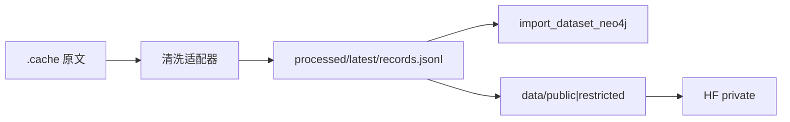
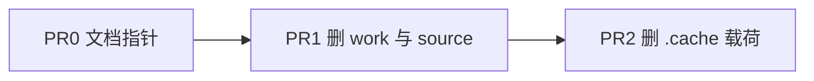

# 清洗完成后删除原文与中间态

保留口径见 [知识数据集 · 清洗完成后的本地保留](../../../architecture/knowledge-dataset.md#7-清洗完成后的本地保留)。[^retention]
源目录形状见 [数据源 · 怎么打开一个源](../../../architecture/data-sources.md#3-怎么打开一个源)。[^opensource]
清洗脚本默认读 [本地原始数据缓存](../../../../.cache/README.md)。[^cache]
入图仍读 `processed/latest/records.jsonl`，见 [`import_dataset_neo4j.py`](../../../../packages/data_ingestion/data_ingestion/cli/import_dataset_neo4j.py)。[^importer]

## Context

catalog 30 个源全部 `status: imported`，且每个都有非空 `processed/latest/records.jsonl`（本轮逐源核对，见下表）。HF private 仓 `ticoAg/baicao-knowledge` 已有脱敏 parquet。本机仍堆着约 **3.4G** `.cache` 原文、约 **65M** `work/` 抽取稿，以及苏子阳 `source/` 全文。

2026-08-20 的「古籍 TXT / ZY-BERT rar 先留着还能再抽」已被后续 held-extract 覆盖：那些源现在都是 `imported`。再抽只能重新下载，不靠本机原文。

`tcm-sd` 的 JSONL 有 54750 行，catalog 入图计数是 148 条证候词条——多出来的是隔离医案行，仍是清洗快照，不是未处理原文。药典前言缺 751、`tcmchat-sft-knowledge` 有 dangling 边，是已导入源内部缺口，不挡删除原文。

## Approach

先把 [§7 保留表](../../../architecture/knowledge-dataset.md#7-清洗完成后的本地保留) 指到 `.cache/README.md` 和「怎么打开一个源」，再按表删除。

推荐顺序：先清 `work/` 文件和 `source/` 原文、旧布局 parquet，再清 `.cache` 载荷。目录骨架留下：`source_layout.validate_source_layout` 要求每个源仍有空的 `work/{queue,extracts,notes}` 和 `processed/latest/`。

不改 Neo4j 写入逻辑。HF parquet 保留 `evidence_text` 与边属性，入图 CLI 可读 parquet；与 JSONL 经 `slim_record` 后图载荷一致。全书字段仍不进发布表。



删除后左边 `.cache` 断开；右边 JSONL → Neo4j / 再导出仍通。

## Key Decisions

见 [§7 清洗完成后的本地保留](../../../architecture/knowledge-dataset.md#7-清洗完成后的本地保留)。

## Scope

- In: 本机 `.cache/{huggingface,github,dropbox}` 载荷、`sources/*/work` 里的抽取文件、`daoyi-suyang/source/`、`data/records.parquet` 与 `data/edges.parquet`（旧根路径）、`processed/latest` 里可再生成的 per-source parquet
- Out: `processed/latest/records.jsonl`、`SOURCE.md` / `VIEW.md` / catalog、`data/public/` 与 `data/restricted/`、`.cache/README.md`、Neo4j 活图、`exports/`、未购买的 wangekxy 全量、改 `import_dataset_neo4j` 去读 parquet

## Files

- [`docs/architecture/knowledge-dataset.md`](../../../architecture/knowledge-dataset.md#7-清洗完成后的本地保留) — 保留表（本节已写入）
- [`.cache/README.md`](../../../../.cache/README.md) — 标明清洗完成后载荷可删
- [`docs/architecture/data-sources.md`](../../../architecture/data-sources.md#3-怎么打开一个源) — `source/` / `work/` 改为「可空」
- [`packages/data_ingestion/data_ingestion/source_layout.py`](../../../../packages/data_ingestion/data_ingestion/source_layout.py) — 删除后仍要过 `validate_catalog_layouts`

## Reuse

- [`source_layout.validate_catalog_layouts`](../../../../packages/data_ingestion/data_ingestion/source_layout.py) `validate_catalog_layouts` — 删完后必须 0 error
- [`ensure_source_layout`](../../../../packages/data_ingestion/data_ingestion/source_layout.py) `ensure_source_layout` — 清 `work/` 文件后重建空分区
- [`catalog.json`](../../../../datasets/baicao-knowledge/catalog.json) — 30 源身份，不改 status

## 依赖



PR0 不删文件。PR1 失败则不要做 PR2。

待办三态：`- [ ]` 未完成，`- [x]` 完成，`- [-]` 废弃。

## PR0 文档

- [x] 在 `knowledge-dataset.md` 写入 §7 保留 / 可删表
- [ ] `.cache/README.md` 增加一句：登记源 `imported` 且 JSONL 非空后，平台子目录载荷可删；再抽需重新下载
- [ ] `data-sources.md`「怎么打开一个源」注明 `source/` 与 `work/` 文件可空，分区目录仍要在
- [x] 本计划与 `docs/plans/` 索引互相能点到

验收：三处文档指向同一张保留表；无代码、无删除。

## PR1 确认并清中间态

本轮逐源核对（2026-09-06，cwd 仓库根）：

| source_id | jsonl 行 | 层 | 本机原文 | 可删 work 文件 |
|---|---:|---|---|---|
| national-standard-2022-pharmacopoeia | 3431 | public | `.cache` TCMChat | 无 |
| daoyi-suyang | 1687 | public | `source/` 7.4M | extracts / v2 / v3 / batches 41 |
| fengxi177-knowledge-graph-tcm | 4996 | restricted | `.cache` github | 无 |
| shennong-tcm-kg | 19066 | restricted | `.cache` github | 无 |
| tcm-db | 1715 | restricted | `.cache` github | 无 |
| dragontcm | 11598 | restricted | `.cache` HF | 无 |
| tcm-mkg | 19519 | restricted | `.cache` HF | 无 |
| tcm-sd | 54750 | restricted | `.cache` github | 无 |
| tcm-ner | 2961 | restricted | `.cache` DeepNER | notes 1 |
| tcm-ancient-books | 9188 | restricted | `.cache` github 245M | extracts 4 |
| classical-tcm-canon | 4100 | restricted | `.cache` HF 样本 | notes 1 |
| tcm-formulary | 494 | restricted | `.cache` HF 样本 | 无 |
| tcm-materia-medica | 705 | restricted | `.cache` HF 样本 | queue/notes |
| tcm-case-records | 482 | restricted | 同上 | queue/notes |
| tcm-acupuncture-classics | 197 | restricted | 同上 | queue/notes |
| tcm-diagnostics | 410 | restricted | 同上 | queue/notes |
| tcm-gynecology-pediatrics | 435 | restricted | 同上 | queue/notes |
| tcm-external-surgical | 432 | restricted | 同上 | queue/notes |
| tcm-collected-works | 411 | restricted | 同上 | queue/notes |
| tcm-health-cultivation | 99 | restricted | 同上 | queue/notes |
| tcm-reference-compendia | 465 | restricted | 同上 | queue/notes |
| sylvanl-tcm-pretrain | 4962 | restricted | `.cache` HF 293M | 无 |
| zybert-pretrain-corpus | 11920 | restricted | `.cache` dropbox 1.0G | extracts 2 |
| tcmchat-600k | 16894 | restricted | `.cache` TCMChat 1.7G | notes 1 |
| national-standard-terms | 5227 | restricted | `.cache` TCMChat | 无 |
| tcmchat-medical-cases | 28604 | restricted | `.cache` TCMChat | 无 |
| tcmchat-textbooks | 41419 | restricted | `.cache` TCMChat | 无 |
| tcmchat-sft-knowledge | 7459 | restricted | `.cache` TCMChat | 无 |
| tcmchat-web | 2290 | restricted | `.cache` TCMChat | 无 |
| tcmchat-chatmed | 1043 | restricted | `.cache` TCMChat | 无 |

- [x] 30/30 `imported` 且 `records.jsonl` 非空
- [ ] 删除各源 `work/` 下的文件（含 `daoyi-suyang/work/extracts*`、`batches/`、`tcm-ancient-books/work/extracts`、`zybert-pretrain-corpus/work/extracts`）；保留或重建空的 `queue`/`extracts`/`notes`
- [ ] 删除 `datasets/baicao-knowledge/sources/daoyi-suyang/source/` 内原文
- [ ] 删除 `datasets/baicao-knowledge/data/records.parquet` 与 `data/edges.parquet`（2026-08-19 旧根路径）
- [ ] 删除各源 `processed/latest/*.{parquet}`（JSONL 保留）
- [ ] `uv run python -c` 调 `validate_catalog_layouts`，错误列表为空
- [ ] 抽查任一源 `processed/latest/records.jsonl` 仍在且行数与上表一致

验收：`work/` 无抽取稿；`daoyi-suyang/source/` 空或不存在；布局校验 0 error；30 份 JSONL 仍在。

## PR2 删除 .cache 载荷

约 3.4G。保留 [`.cache/README.md`](../../../../.cache/README.md)。

- [ ] 删除 `.cache/huggingface/` 内容（TCMChat 1.7G、SylvanL 293M、wangekxy 样本、DragonTCM、TCM-MKG）
- [ ] 删除 `.cache/github/` 内容（Ancient-Books 245M、ZY-BERT 117M、tcm-db、Knowlegde_Graph_TCM、DeepNER、ShenNong、未登记的 `ywjawmw/TCM_KG`）
- [ ] 删除 `.cache/dropbox/zybert/`（约 1.0G rar + 解压 txt）
- [ ] `du -sh .cache` 只剩 README 量级；`git status` 无已跟踪文件被删

验收：`.cache/README.md` 仍在；三个平台子目录不存在或为空；`datasets/baicao-knowledge/` 下 Git 跟踪的 `SOURCE.md` / `VIEW.md` / catalog 未变。

## Verification

```bash
# 布局
cd packages/data_ingestion
uv run python -c "from pathlib import Path; from data_ingestion.source_layout import validate_catalog_layouts; e=validate_catalog_layouts(Path('../..').resolve()); print(e or 'ok')"

# 30 份 JSONL 仍在
python3 - <<'PY'
import json
from pathlib import Path
root = Path('datasets/baicao-knowledge')
cat = json.loads((root/'catalog.json').read_text())
missing=[]
for s in cat['sources']:
    p = root/'sources'/s['source_id']/'processed'/'latest'/'records.jsonl'
    if not p.exists() or p.stat().st_size==0:
        missing.append(s['source_id'])
print('sources', len(cat['sources']), 'missing', missing)
PY

du -sh .cache
git status --short
```

失败时：若 parquet 与 JSONL 图载荷对不上就停，先跑导出测试再删 JSONL。`.cache` 删错可用原下载命令再拉，见各源 `SOURCE.md`。

## 不做

- 不删 `processed/latest/records.jsonl`（parquet 入图已接线，JSONL 仍作再导出输入）
- 不删 Neo4j、不删 `exports/graph-zh-live.json`
- 不 `git reset --hard`
- 不买、不下载未持有的 wangekxy 全量
- 不把 8-20 清理笔记里「先留着再抽」当成当前保留令

[^retention]: 白草知识数据集
[^opensource]: 数据源审核与路径
[^cache]: 本地原始数据缓存
[^catalog]: 数据集 catalog
[^importer]: JSONL 入图 CLI
