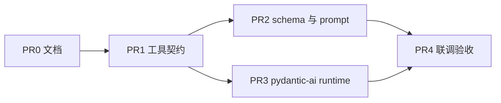

# 问答 agent MCP 检索收口

本计划的工具契约 / schema / pydantic-ai loop 仍然有效。runtime 口径「chat 不走 MCP、不升 mcp v2、进程内 Function Tool」已被 [问答 chat 走最新 MCP 并清适配](问答-chat-走最新-mcp-并清适配-b042.md) 取代；不要再按那些项实施。

设计与取舍在 [问答 Agent 检索与 MCP 边界](../../../architecture/chat-agent-mcp.md#overview)，这篇只回答**怎么落、按什么顺序、验收什么**。[^mcp-arch]
问答主链以 [系统架构概览 · 问答链路](../../../architecture/system-overview.md#61-问答链路) 为准。[^overview]

## Context

产品问答已经有四个图工具，方向符合轻量目标：网络 LLM + Neo4j 只读检索。不顺手的是 tool 契约、`expand_neighbors` 实际 1 跳、schema 靠 prompt 死记。openai-agents 本身不重，但 stdio 子进程 + SQLiteSession + LangChain 遗留适配偏绕。产品 loop 改 `pydantic-ai-slim` 进程内 tool；MCP 只留 `/mcp` 给外部。不升 mcp v2，不装 pydantic-ai MCP extra / Harness。

## Approach

先把四个图操作收成模型可执行的契约，并把 schema 做成 Resource / 开场注入。产品 chat 的 agent loop 换成 `pydantic-ai-slim`，工具进程内调用同一套 handler。`/mcp` 继续给 Cursor。不加 websearch，不把 Cypher 还给模型。

有意义的取舍见 [Agent Runtime SDK](../../../architecture/chat-agent-mcp.md#agent-runtime-sdk) 与 [轻量边界](../../../architecture/chat-agent-mcp.md#轻量边界)。[^mcp-arch]

## Key Decisions

见 [目标拓扑](../../../architecture/chat-agent-mcp.md#目标拓扑)、[Prompt 评估](../../../architecture/chat-agent-mcp.md#prompt-评估)、[MCP 规范对齐](../../../architecture/chat-agent-mcp.md#mcp-规范对齐)。[^mcp-arch]

## Scope

- In: MCP tool schema/描述/空结果契约；`expand_neighbors` 允许 2 跳以便证据→来源；`graph://schema` Resource；system prompt 收成政策；chat 改 pydantic-ai-slim 进程内 tool
- Out: websearch、mcp SDK v2、pydantic-ai Harness / MCP extra、Cypher 暴露、新 tool、向量 RAG、LangGraph 回流

## Files

- [`packages/api/app/services/knowledge_mcp/server.py`](../../../../packages/api/app/services/knowledge_mcp/server.py) — tool 描述、返回形态、schema resource、instructions
- [`packages/api/app/services/knowledge_mcp/agent_client.py`](../../../../packages/api/app/services/knowledge_mcp/agent_client.py) — chat 不再持有 stdio MCP 客户端
- [`packages/api/app/services/chat_agent_runtime/runtime.py`](../../../../packages/api/app/services/chat_agent_runtime/runtime.py) — pydantic-ai loop + 消息历史
- [`packages/api/app/services/chat_agent_runtime/system_prompt.py`](../../../../packages/api/app/services/chat_agent_runtime/system_prompt.py) — 去掉写死本体，保留政策与失败协议
- [`packages/api/app/kg/graph_service.py`](../../../../packages/api/app/kg/graph_service.py) — `expand_node_graph` 深度钳制与 `search_nodes` 匹配面；中文标签/关系仍以 [图模型口径](../../../architecture/knowledge-model-and-ingestion.md#7-中文图模型口径) 为准。[^ingest]
- [`packages/api/tests/services/test_knowledge_mcp.py`](../../../../packages/api/tests/services/test_knowledge_mcp.py) — MCP 面回归

## Reuse

- [`packages/api/app/services/knowledge_mcp/handlers.py`](../../../../packages/api/app/services/knowledge_mcp/handlers.py) `KnowledgeMcpHandlers` — 继续当唯一 handler
- [`packages/api/app/kg/graph_metadata_service.py`](../../../../packages/api/app/kg/graph_metadata_service.py) `list_labels` / `list_relationship_types` — schema resource 数据
- [`packages/api/app/graph_runtime_backend.py`](../../../../packages/api/app/graph_runtime_backend.py) `get_schema_summary` — 可并入 resource，不要再包一层 tool
- `pydantic_ai.Agent` — 仅作 loop，不要 Harness / MCP capability
- [`packages/api/app/services/chat_agent_runtime/citations.py`](../../../../packages/api/app/services/chat_agent_runtime/citations.py) `citations_from_graph_state` — citation 仍只从图状态生成
- [`packages/api/tests/services/test_system_prompt.py`](../../../../packages/api/tests/services/test_system_prompt.py) — prompt 政策断言

## 依赖

P2 与 P3 不改同一传输文件，可并行。P4 等前两块都进主链后再做真实 provider smoke。

待办三态：`- [ ]` 未完成，`- [x]` 完成，`- [-]` 废弃。完成或废弃一项就改那一行。

## PR0 文档

- [x] 架构口径写在 [`docs/architecture/chat-agent-mcp.md`](../../../architecture/chat-agent-mcp.md)
- [x] [`docs/plans/README.md`](../../README.md) 与 [`docs/plans/2026/README.md`](../README.md) 能点到本计划
- [x] [`docs/README.md`](../../../README.md) 能发现 `docs/plans/`
- [x] [`docs/superpowers/plans/README.md`](../../../superpowers/plans/README.md) 有一条指向本计划，避免只看旧任务索引的 agent 漏掉

验收：frontmatter 可解析；引用的章节在架构文里存在。无业务代码。

## PR1 工具契约

- [x] MCP 四个 tool 的 docstring / 参数说明与 LangChain `graph_tools` 对齐：何时用、`标识` 示例、limit 含义。chat 主链只认 MCP 面。
- [x] tool 返回 dict/list，不再 `json.dumps` 成无 schema 的字符串；空结果带 `count: 0` 和下一步 hint。
- [x] `expand_node_graph` 允许 `depth` 1..2（仍 cap 节点数）。验收：从带「由证据支持」的实体展开 2 跳能看见「来源于」邻居。
- [x] `search_nodes` 至少同时匹配 `名称 CONTAINS` 与 `标识` 精确相等；默认 limit 提到 10，上限仍有界。
- [x] 测试：`tests/services/test_knowledge_mcp.py` 覆盖 list_tools 描述关键词、空结果形状；为 expand depth=2 补 graph_service 或 handler 测试。

验收：`uv run pytest tests/services/test_knowledge_mcp.py tests/kg/test_graph_service.py tests/services/test_graph_tools.py -q` 在 `packages/api` 通过。模型无需猜 `标识` 格式。不新增 tool。

## PR2 schema 与 prompt

- [x] 增加只读 Resource `graph://schema`（或 FastMCP `@mcp.resource` 等价 URI）：中文标签、关系名、`标识` 规则。数据来自 `graph_metadata_service`，不要手抄 prompt。
- [x] `KNOWLEDGE_MCP_INSTRUCTIONS` 只保留路由一句 + 禁止 Cypher。
- [x] `build_graph_specialist_system_prompt()` 只保留：不编造、无证据就明说、失败时换 label/关键词、最终 Markdown、不要把工具 JSON 写进用户可见答案。实体/关系清单改指向 schema resource。
- [x] Runtime 开场注入 schema（`@agent.instructions` 或 prepend），不要靠 prompt 长表。
- [x] 更新 `tests/services/test_system_prompt.py`：不再要求 prompt 罗列全部关系名；必须保留「没有图谱证据」「不要编造」。

验收：`list_resources`（或等价 API）能读到 schema；prompt 测试通过；本体变更只改图模型/metadata，不必改 prompt 长表。

## PR3 pydantic-ai runtime

- [x] 依赖改为 `pydantic-ai-slim[openai]`，移除 chat 主链对 `openai-agents` 的引用。不要加 `pydantic-ai-harness` 或 `pydantic-ai-slim[mcp]`。
- [x] `stream_turn` 用 pydantic-ai `run_stream_events`；四个图 tool 进程内调用 `KnowledgeMcpHandlers` + 与 MCP 相同的 payload 包装。
- [x] 会话改进程内 `message_history` + 现有 TTL manager；去掉 `SQLiteSession` 与 stdio MCP 子进程。
- [x] stdio `/mcp` 入口保留给 Cursor。`--transport sse` 标明 Deprecated。
- [x] 重写 `tests/services/test_chat_agent_runtime.py` 覆盖历史续接、TTL 回收、shutdown。

验收：chat runtime 测试通过；一次 `/chat/stream` 不再多一个 `python -m app.services.knowledge_mcp` 子进程。

## PR4 联调验收

- [x] `packages/api` 定向：`uv run pytest tests/services/test_knowledge_mcp.py tests/services/test_system_prompt.py tests/services/test_chat_agent_runtime.py -q`
- [x] 对照 [chat-mainline 验收](../../../acceptance/chat-mainline.md) 跑已有 SSE / citation 断言。[^accept]
- [ ] 若有 Fireworks + Neo4j：用同一条「组方 + 出处」问题看工具次数、是否出现来源节点。没有真实 key 时在回复里标未验证。

验收：结构化工具、citation、SSE 事件不回退；depth=2 路径在有证据的样本上能接到来源。

## Verification

- `cd packages/api && uv run pytest tests/services/test_knowledge_mcp.py tests/services/test_system_prompt.py tests/services/test_chat_agent_runtime.py tests/kg/test_graph_service.py -q`
- 问答页走一条需要出处的问题：先 search 再 expand，final 带 citation；空图问题必须说出没有图谱证据
- 失败时看 SSE `tool_start` / `tool_result` 的 `node_id` 是否为 `标识`，以及 expand 的 `depth`

## 不做

见 [轻量边界](../../../architecture/chat-agent-mcp.md#轻量边界)。[^mcp-arch] 本轮尤其不要：websearch、`read_cypher` 回到 MCP、升 `mcp>=2`、pydantic-ai Harness / MCP extra、给 agent 加第五个图 tool、把 `packages/graph_runtime` 接回 chat。

[^mcp-arch]: 问答 Agent 检索与 MCP 边界
[^overview]: 系统架构概览
[^accept]: 智能问答主链路验收
[^ingest]: 图模型与数据采集
