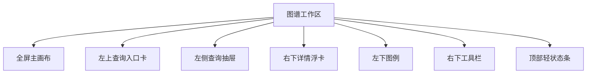
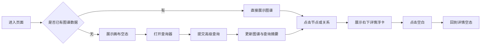

# 图谱工作区沉浸式画布重构设计

## 背景

当前 `/graph` 页面已经具备“左侧查询构建 + 中央图谱 + 右侧详情”的完整原型，但它仍然更像一个被三栏后台包裹的可视化页面，而不是一个真正以探索为中心的知识图谱工作区。

结合本轮用户反馈，当前实现存在几类核心问题：

- 画布不是真正主角，用户进入页面后注意力被两侧面板分走
- “深度”同时出现在查询构建区和顶部浮层，控制职责冲突
- 图例与画布语义绑定不紧，却被放在右侧详情面板内部
- 右侧详情在未选中状态和长字段展示上都不够友好
- `JSON payload` 对普通用户噪音过高，却长期占据主路径空间

用户已明确确认本轮目标：

- 允许对页面进行明显重构，不受当前固定三栏布局约束
- 页面气质应偏向“探索画布”，而不是传统后台分析台
- 默认主路径是“先看图谱”，查询器按需唤出，而不是先填条件再看图

## 目标

### 主要目标

1. 把图谱画布提升为页面绝对主视觉和默认操作中心
2. 将查询、详情、图例、画布控制改造成围绕画布工作的浮动能力层
3. 消除“深度”控制的重复与歧义，只保留单一真源
4. 优化详情面板的空态、长字段、层级和信息可读性
5. 在不改后端协议的前提下，完成一轮可感知变化足够大的前端重构

### 非目标

- 不改动现有图谱查询 API 契约或 Zustand store 主结构
- 不在首轮重构中引入复杂动画系统或大规模动效编排
- 不在本轮实现完整的移动端专属布局体系，仅保证基础可用
- 不扩展为任意 Cypher 编辑器或复杂图谱编辑器

## 用户确认后的关键方向

- 页面方向：明显重构，但保留“查 / 看 / 详情”三类能力
- 产品气质：探索画布优先
- 默认主路径：进入页面先看图谱
- 体验原则：查询是辅助能力，不应抢占主视觉

## 核心设计决策

### 决策 1：用“单主画布 + 浮动能力层”替代固定三栏

页面不再把画布夹在左右栏之间，而是让画布占据主要空间，其余能力以浮动卡片、抽屉、工具条的形式叠加在画布上。

这样做的原因：

- 更符合“探索图谱”的心智模型
- 更容易建立画布与图例、工具栏、详情卡之间的空间关系
- 更适合后续演进为更沉浸的节点探索、路径分析和局部展开

### 决策 2：查询器从常驻表单改为按需展开的左侧抽屉

查询能力保留，但退出默认主路径。

默认状态下，页面左上角只展示轻量查询入口卡，包含：

- 当前模式
- 当前图谱对象或查询摘要
- “打开查询器”动作
- 在高级查询模式下的“编辑查询 / 重置查询”动作

点击后，从左侧打开完整查询器。

这样做的原因：

- 保留高级查询能力而不挤压画布
- 让“先看图，再收窄范围”的工作流更自然
- 与用户确认的默认主路径一致

### 决策 3：删除顶部重复“探索深度”，只保留查询深度

当前页面中的“深度”在语义上属于数据请求参数，因此应回归查询器，命名为“查询深度”。

顶部浮层中的深度选择器删除，不再出现第二个语义近似的控制项。

补充约束：

- 若后续需要“从某节点继续扩展一层”的交互，应作为节点级操作单独设计
- 不与查询深度复用同一个控件、命名或状态

### 决策 4：详情从右侧常驻面板改为右下上下文浮卡

详情面板改为悬浮在画布右下区域的上下文卡：

- 点击节点时展示节点详情
- 点击边时展示关系详情
- 点击画布空白处时回到空态

详情卡应优先展示用户“此刻最想知道的内容”，而不是字段堆叠。

信息优先级：

1. 名称 / 关系名
2. 类型与状态
3. 与当前图的上下文信息
4. 来源、描述、分类等阅读性字段
5. 验证 ID、验证人、时间等低频元数据

### 决策 5：把图例和工具栏都收回画布内部

图例与工具栏都应成为画布的一部分：

- 图例固定在左下角
- 画布操作工具栏固定在右下角

工具栏首轮建议包括：

- 放大
- 缩小
- 适应画布
- 回到中心节点

这样做的原因：

- 画布能力的可发现性更强
- 不再要求用户依赖鼠标手势猜测能力
- 图例不再因为右侧详情滚动而脱离视线

### 决策 6：开发者能力退出默认路径

`JSON payload` 预览保留，但收纳进查询器底部的“开发者预览”折叠区，并默认关闭。

这样既不损失调试价值，也不再干扰普通业务用户。

## 页面结构设计

### 整体结构

### 主要区域说明

#### 1. 主画布

- 占据页面主区域
- 默认进入即看到图谱或画布空态
- 保留现有 `NetworkGraph` 作为绘制核心
- 保持节点选中、边选中、适应视图等现有主链路能力

#### 2. 顶部轻状态条

顶部仅保留轻量状态信息，不承担重复控制。

建议展示：

- 当前视图模式：默认图谱 / 查询结果
- 节点数、边数
- 结果是否被截断
- 刷新动作

不再展示：

- 深度选择

#### 3. 左上查询入口卡

默认常驻但足够轻，不等于完整表单。

建议展示：

- 当前图谱标题或查询摘要
- 若有高级查询，则显示简洁过滤摘要
- 主按钮：“打开查询器”
- 次动作：“重置查询”或“返回默认图谱”

#### 4. 左侧查询抽屉

完整查询表单收纳于此，沿用现有字段能力：

- 节点名称、类型、状态、来源、属性键值
- 关系类型、状态、关联节点名称
- 查询深度
- limit

新增交互：

- 清空 / 重置
- 开发者预览折叠区

#### 5. 右下详情浮卡

详情卡片悬浮于画布右下，尺寸固定、可滚动。

建议分层：

- 顶部：标题区，显示名称 / 关系名 + 状态标签
- 中部：核心属性键值
- 底部：上下文动作，如查看完整详情、复制 ID

空态文案示例：

“点击图谱中的节点或关系，可在这里查看上下文详情。”

#### 6. 左下图例

- 悬浮在画布角落
- 默认只显示核心实体类别
- 类别多时允许展开

#### 7. 右下工具栏

- 一列垂直按钮
- 与详情浮卡在位置上避让
- 操作语义显性化

## 交互流设计

### 默认进入流

- `/graph/:name`：直接展示该实体图谱，并将主节点设为初始选中对象
- `/graph`：进入空工作区，提示用户打开查询器构建图谱

### 查询流

- 用户点击左上查询入口卡
- 打开左侧查询抽屉
- 填写并提交条件
- 查询器关闭或保留，画布切换到查询结果图
- 左上入口卡更新为查询摘要态

### 探索流

- 用户在画布中点击节点或边
- 右下浮卡展示对应详情
- 图例和工具栏始终可见
- 点击空白处，详情回到空态

## 视觉语言

### 视觉基调

整体风格应从“后台表单感”转向“知识空间感”：

- 页面底层为浅雾灰绿
- 主画布为更亮的暖白或轻透材质
- 浮动层统一采用白底、轻阴影、柔和边框、大圆角

### 组件语言统一

以下组件应统一为同一视觉家族：

- 查询入口卡
- 查询抽屉中的模块卡
- 详情浮卡
- 图例
- 工具栏

### 标签规范

所有标签统一使用同一类视觉规范，不再混用多种表达方式。

建议规则：

- 类型标签：浅底色实体标签
- 状态标签：同体系状态色标签
- 图例标签：与类型标签同源，仅在内部加色点或小图标，不另起一套皮肤

### 长字段规则

对 `verification_id`、`verified_by` 这类长字段：

- 默认单行截断
- 悬浮显示完整内容
- 提供复制动作

避免在详情卡里强制换行撑高布局。

### 连线标签规则

关系标签继续使用白底 pill 胶囊背景，但细化样式：

- 轻白底
- 少量内边距
- 统一字重和圆角

目标是增强可读性，而不是让标签像零散贴纸。

## 状态与组件边界

### 保留现有状态边界

本轮不改 `useGraphWorkspace` 的主状态结构，继续沿用：

- `graphData`
- `querySummary`
- `mode`
- `loading`
- `selected`
- `depth`

### 需要新增或调整的前端局部状态

- 查询抽屉是否打开
- 开发者预览是否展开
- 详情浮卡是否处于空态或展示态

这些状态应保持在页面或页面级组件内，不向全局 store 扩散。

## 组件改造范围

### 主要改造文件

- `packages/web/src/pages/GraphPage.tsx`
  - 重构整体布局，改为画布主舞台 + 浮动能力层
- `packages/web/src/components/graph/GraphQueryPanel.tsx`
  - 从常驻表单升级为适配抽屉使用的查询器，并加入重置与开发者预览折叠
- `packages/web/src/components/graph/NodeDetail.tsx`
  - 改造节点详情层级、长字段展示和复制动作
- `packages/web/src/components/graph/EdgeDetail.tsx`
  - 改造关系详情层级与长字段展示
- `packages/web/src/pages/GraphPage.test.tsx`
  - 更新布局和关键交互回归测试

### 可选拆分组件

若实现中发现 `GraphPage.tsx` 过重，可拆出：

- `GraphWorkspaceToolbar`
- `GraphWorkspaceLegend`
- `GraphWorkspaceSummaryCard`
- `GraphSelectionCard`

拆分原则是增强边界清晰度，而不是为了拆分而拆分。

## 实施边界

### 本轮必须完成

1. 删除顶部重复的深度控件
2. 查询器改为按需展开，而不是常驻左栏
3. 详情改为浮动卡而不是固定右栏
4. 图例移入画布左下
5. 增加画布显性工具栏
6. `JSON payload` 改为默认折叠
7. 长 ID 改为截断 + Tooltip + 复制
8. 补齐对应测试

### 本轮不做

1. 不修改后端 API
2. 不重写图谱绘制引擎
3. 不做复杂动画和手势系统
4. 不做完整移动端重排

## 验证策略

按仓库 `docs/verification-matrix.md`，本轮属于 `packages/web/` 页面 / 组件改动，最低验证为：

- `pnpm run test:web`
- 建议补 `pnpm --dir packages/web exec vp build`

本轮还应补充的主链路检查：

1. `/graph/:name` 默认图谱模式可正常显示
2. `/graph` 空工作区可打开查询器并提交查询
3. 点击节点和边可正常切换详情浮卡
4. 画布工具栏可执行基本视图操作

## 风险与折中

### 风险 1：画布层级增加后，浮层之间互相遮挡

应对方式：

- 预先约束左上、左下、右下能力层的占位关系
- 详情浮卡与工具栏在视觉和空间上避让

### 风险 2：查询器退出常驻后，初次使用的可发现性下降

应对方式：

- 保留明显的左上查询入口卡
- 在空工作区中明确提示“打开查询器开始构建图谱”

### 风险 3：重构强度较大，容易带来测试回归

应对方式：

- 优先更新页面级回归测试
- 保持数据流和后端契约不变，把风险集中在布局和交互层

## 结论

本轮重构不再把 `/graph` 当成“带大一点画布的后台页面”，而是把它提升为一个以图谱探索为主路径的工作区。

其核心不是简单“把左右栏做得更好看”，而是把查询、详情、图例和控制能力重新组织到画布周围，让页面真正符合知识图谱产品的使用直觉：

- 先看图
- 再收束条件
- 再读上下文
- 再继续探索
