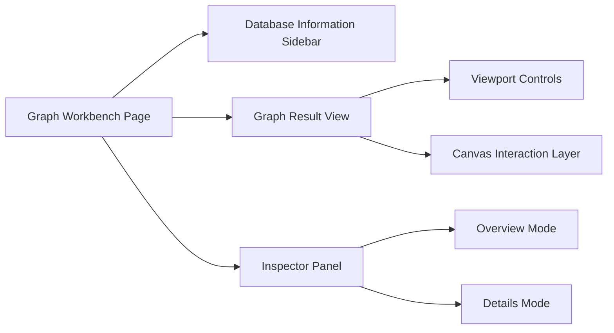
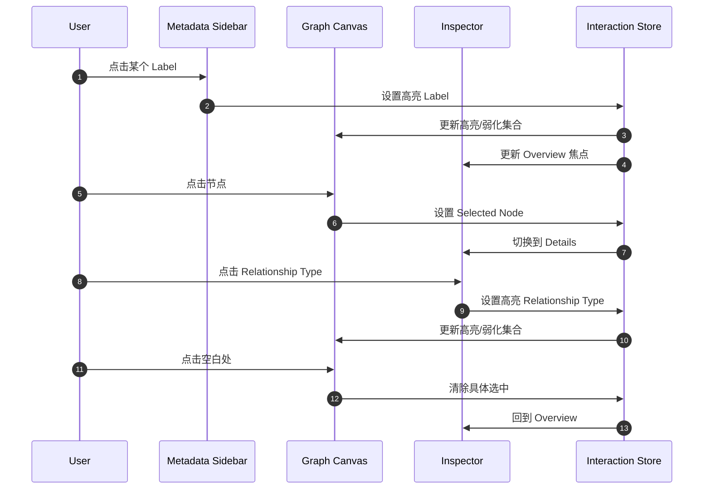
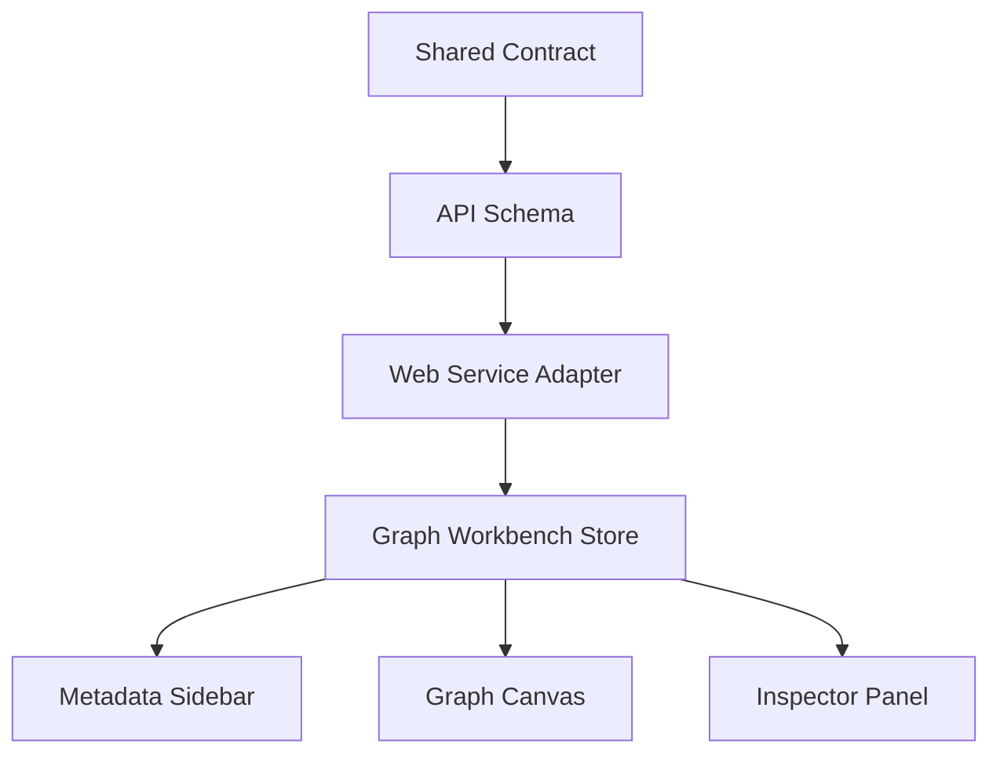

# Graph Workbench 设计规格

## 概览

本规格定义 BaiCao 的 `/graph` 页面如何重构为面向专业用户的图谱工作台，使其在交互层面尽可能对齐 Neo4j Browser 的图谱结果页，同时保持 BaiCao 自己的后端边界、业务语义和前后端契约治理方式。

本轮设计的核心不是“嵌入 Neo4j Browser”，而是复刻其 `Database information` 与 `Graph result view` 的工作方式，并以 BaiCao 的 API、类型系统和页面结构重新实现。

## 背景

当前 BaiCao 的 `/graph` 页面更像一个业务图谱浏览页，而不是专业图数据库工作台。它已经具备图谱请求、节点详情、路径探索和局部展开能力，但在以下方面与目标形态存在明显差距：

- 缺少数据库级 `Database information` 侧栏
- 图谱结果视图的交互反馈、图例联动、详情检查器与 Neo4j Browser 有明显体验差距
- 页面状态仍偏向“当前子图浏览”，而不是“数据库语义 + 结果画布 + 检查器”的三段式工作流
- 当前后端图谱接口只覆盖子图、搜索、路径、展开，不覆盖 labels、relationship types、property keys、indexes、constraints 等数据库级元数据

用户已明确确认以下方向：

- `/graph` 页面允许进行明显重构
- 页面将直接暴露 Neo4j 原生术语与数据库元信息
- `Database information` 整栏与图谱结果视图的所有关键交互都要复刻
- 允许新增后端元数据接口
- 本轮采用 `protocol first`
- 共享数据模型优先，运行时校验只发生在边界处一次，内部尽量依赖类型系统而不是重复校验

## 与既有计划的关系

仓库内曾存在“独立 Browser 风格 workbench 页”的旧方向，但该方向已经被本规格覆盖并删除，不再作为并行目标维护。

本规格覆盖该计划在 `/graph` 路径上的前提假设：

- 旧前提：Browser 风格 shell 不直接落到 `/graph`
- 新前提：`/graph` 本身升级为 Graph Workbench

后续实施计划必须以本规格为准，不再并行维护独立 Browser 壳层路线。

## 目标

### 主要目标

1. 将 `/graph` 重构为 Browser-style 图谱工作台
2. 在页面左侧提供数据库级 `Database information`
3. 在页面中央提供可交互的 `Graph result view`
4. 在页面右侧提供 `Overview / Details` 检查器，并允许其反向驱动画布高亮与过滤
5. 新增数据库元数据契约，支持 labels、relationship types、property keys、indexes、constraints、全库计数等只读信息
6. 采用 `protocol first`，先定义共享数据模型，再落地后端与前端实现

### 非目标

- 不直接嵌入或复制 Neo4j Browser 源码
- 不把 `/graph` 扩展成完整 Cypher IDE 或完整 Browser 产品
- 不在本轮实现写操作、DDL、导入、数据库管理、权限管理
- 不在本轮引入 GPL-3.0 代码
- 不为移动端单独设计完整专属工作台，仅保证基础可用

## 设计原则

### 原则 1：Protocol First

本轮先定义跨端共享数据模型，再实现 API、状态流与 UI。

单一事实源顺序：

1. `packages/shared/types/graph-workbench.ts`
2. `packages/api/app/schemas/graph_workbench.py`
3. `packages/api` 服务与路由
4. `packages/web` 服务适配、状态与组件

### 原则 2：边界单次校验

运行时校验只发生在系统边界：

- API 请求进入后端时
- 后端响应离开接口层时
- 前端接收远端响应并适配为本地 view model 时

进入系统内部后：

- 服务层、store、组件之间尽量使用静态类型传递
- 不在每层重复做相同的 schema parse / defensive normalization
- 不同时维护多套漂移的数据形状

### 原则 3：数据库语义与当前结果语义分离

页面同时存在两类事实：

- `DatabaseMeta`：数据库级事实，服务 `Database information`
- `GraphScene`：当前画布事实，服务图谱结果与检查器

两者不能混进同一个“万能响应”里，否则页面任一块刷新都会拖动其他块抖动。

### 原则 4：行为复刻优先于视觉模仿

本轮优先复刻的是交互模型、信息架构和状态联动，不是像素级复制 Neo4j Browser 的样式。

## 页面结构



### 1. 左侧：Database Information

该区域展示数据库级元数据，而不是当前子图统计。

包含分组：

- Summary
- Labels
- Relationship types
- Property keys
- Indexes
- Constraints

行为要求：

- 页面加载后独立请求元数据
- 各分组支持搜索、show more、show all
- 点击 label 或 relationship type 可反向驱动画布高亮与过滤
- `Indexes` 与 `Constraints` 默认只读展示，不直接改动画布
- 元数据可独立失败，不应拖垮中央图谱视图

### 2. 中央：Graph Result View

中央区域是主视觉与主交互区域。

必须支持：

- 拖拽平移
- 滚轮缩放
- fit to screen
- reset view
- hover 预高亮
- 选中节点
- 选中关系
- 点击空白恢复 overview
- 节点增量展开邻居
- 大图截断与邻居限制提示
- label / relationship type 稳定配色
- 非焦点元素弱化

### 3. 右侧：Inspector Panel

右侧检查器分为两种模式：

- `Overview`
- `Details`

`Overview` 用于展示当前画布中的统计与图例信息。

`Details` 用于展示当前选中节点或关系的属性详情。

关键要求：

- 未选中具体元素时默认展示 `Overview`
- 选中节点或关系后切换到 `Details`
- 在 `Overview` 与 `Details` 中点击 label / relationship type 时，必须反向驱动画布高亮与过滤
- 属性表显示系统字段和业务字段

## 交互模型



## 数据模型设计

### 1. DatabaseMeta

数据库级元数据真源。

建议结构：

```ts
export interface DatabaseMetaSummary {
  nodeCount: number
  relationshipCount: number
  labelCount: number
  relationshipTypeCount: number
  propertyKeyCount: number
  indexCount: number
  constraintCount: number
  truncated: boolean
  generatedAt: string
}

export interface LabelMetaItem {
  name: string
  count: number
  propertyKeys: string[]
}

export interface RelationshipTypeMetaItem {
  name: string
  count: number
  propertyKeys: string[]
}

export interface PropertyKeyMetaItem {
  name: string
  usedByLabels: string[]
  usedByRelationshipTypes: string[]
}

export interface SchemaIndexItem {
  name?: string
  type?: string
  entityType?: string
  labelsOrTypes: string[]
  properties: string[]
  state?: string
}

export interface SchemaConstraintItem {
  name?: string
  type?: string
  entityType?: string
  labelsOrTypes: string[]
  properties: string[]
}
```

### 2. GraphScene

当前画布真源。

建议保留现有 `GraphNode`、`GraphEdge`、`GraphData` 的核心语义，但新增工作台友好字段：

- `truncated`
- `nodeLimitHit`
- `relationshipLimitHit`
- `infoMessage`
- `focusContext`

### 3. InspectorViewModel

检查器不直接消费原始 API 响应，而是消费页面内部统一 view model：

```ts
export type InspectorMode = "overview" | "details"

export interface OverviewStats {
  nodeCount: number
  relationshipCount: number
  labels: Array<{ name: string; count: number; propertyKeys: string[] }>
  relationshipTypes: Array<{ name: string; count: number; propertyKeys: string[] }>
  truncated: boolean
  infoMessage?: string
}

export interface DetailPropertyItem {
  key: string
  value: string
  valueType: string
}
```

### 4. InteractionState

页面级交互状态建议集中管理：

```ts
export interface GraphWorkbenchInteractionState {
  selectedNodeId: string | null
  selectedRelationshipId: string | null
  hoveredNodeId: string | null
  hoveredRelationshipId: string | null
  highlightedLabel: string | null
  highlightedRelationshipType: string | null
  inspectorMode: "overview" | "details"
  isMetadataSidebarCollapsed: boolean
  isInspectorCollapsed: boolean
}
```

## 后端契约

现有图谱接口不足以支撑本轮目标，需要新增数据库元数据路由。

建议新增：

- `GET /api/v1/graph/meta/summary`
- `GET /api/v1/graph/meta/labels`
- `GET /api/v1/graph/meta/relationship-types`
- `GET /api/v1/graph/meta/property-keys`
- `GET /api/v1/graph/meta/schema`

约束：

- 全部只读
- 支持搜索、limit、offset 或 cursor
- 对大结果集允许截断，但必须显式返回截断信息
- 错误必须显性返回，不静默吞掉

## 前端架构

### 组件边界

- `GraphWorkbenchPage`
  - 负责页面布局和数据加载编排
- `GraphMetadataSidebar`
  - 负责 `Database information`
- `GraphCanvasWorkspace`
  - 负责图谱渲染和画布交互
- `GraphInspectorPanel`
  - 负责 `Overview / Details`

### 状态流



推荐状态分类：

- `data state`
  - `databaseMeta`
  - `graphScene`
- `selection state`
  - selected
  - hovered
- `highlight state`
  - highlightedLabel
  - highlightedRelationshipType
- `view state`
  - panel collapsed
  - zoom / fit / reset intent
- `async state`
  - loading
  - error
  - truncation

## 验证策略

### 1. 契约验证

- `packages/shared` 类型定义完成后先做 typecheck
- `packages/api` schema 与 route test 验证新元数据契约
- 确保 `DatabaseMeta` 与 `GraphScene` 没有互相污染字段

### 2. 页面交互验证

必须覆盖：

- `/graph` 首屏加载元数据与图谱结果
- 点击 label 高亮当前画布
- 点击 relationship type 高亮当前关系
- 点击节点切换右栏到 `Details`
- 点击空白切回 `Overview`
- 在右栏点击 label / relationship type 反向驱动画布
- 邻居展开限制提示可见

### 3. 回归验证

- 现有 `/graph/:name` 主路径仍然可用
- 现有图谱查询、节点展开、路径相关主链路不回退
- 元数据接口异常时，页面仍能展示图谱结果主区

## 风险与取舍

### 风险 1：继续在现有 GraphPage 上补丁式堆叠

这会让页面状态持续膨胀，难以支撑三方联动。

取舍：

- 本轮选择结构性重构，而不是继续往单页组件里塞逻辑

### 风险 2：数据库元数据查询量大

真实数据库可能拥有大量 labels、property keys、schema 项。

取舍：

- 允许分页、限制和截断
- 明确在 UI 中暴露“当前仅展示部分结果”

### 风险 3：过度扩大为完整 Neo4j Browser 复制工程

这会显著放大范围并偏离用户当前确认目标。

取舍：

- 本轮仅覆盖 `Database information` 与 `Graph result view`
- 不扩展为完整命令编辑器或 Cypher IDE

## 计划前置结论

本规格已经将问题收敛为单一可规划任务：

- 目标页面：`/graph`
- 目标形态：Graph Workbench
- 核心能力：Database information + Graph result view + Inspector 联动
- 架构方向：protocol first
- 实现原则：边界单次校验、类型优先、数据库语义与当前结果语义分离

下一步应基于本规格进入 `writing-plans`，先产出实施计划，再开始代码改动。
