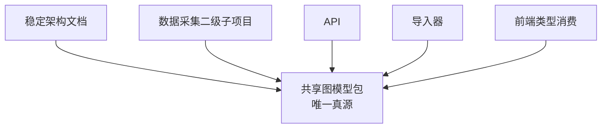

# 仓库级图模型唯一真源与数据采集二级子项目设计

## 背景

随着图谱查询、问答、验证、导入器和外部数据接入逐步展开，仓库已经出现多处与图模型相关的定义：

- `packages/shared/types/index.ts` 中维护了前端消费用的图节点与边类型
- `packages/api/app/models/enums.py` 中维护了 Python 侧节点与关系枚举
- `packages/api/app/schemas/graph.py` 中维护了 Pydantic 图谱模型
- `packages/api/app/importers/*.py` 中维护了导入记录格式

这些定义虽然方向一致，但仍然分散在不同子项目中：

- API 侧更偏服务实现
- shared 侧更偏前端消费
- 导入器侧更偏导入格式

这会带来几个问题：

- 多级子项目无法直接共享同一份图模型真源
- 数据采集子项目若开始落地，很容易再定义出一套新的中间结构
- 中文语义名称与英文技术标识的映射缺少统一承载点
- 架构文档、代码实现、导入格式可能继续漂移

因此，本轮设计的核心目标不是先做更多数据采集脚本，而是先建立**仓库级图模型唯一真源**，并把“数据采集”明确为它的消费者。

## 目标

### 主要目标

1. 建立仓库级、代码优先、可复用的图模型唯一真源
2. 用 `pydantic`、`Literal`、`StrEnum` 等声明式方式承载实体、关系、字段和导入中间格式
3. 把“数据采集”定义为长期维护的二级子项目，并明确它与图模型真源的边界
4. 在架构文档中正式确认中文术语主称与英文技术标识映射
5. 为后续规则抽取、agent 抽取、导入、API、前端消费建立同一条结构主线

### 非目标

- 不在本轮直接实现共享包代码
- 不在本轮完成数据采集脚本或 Hugging Face 数据集接入
- 不在本轮大规模重写现有 API schema、前端类型或导入器
- 不在本轮决定所有未来实体和关系的最终全集，只先明确收敛机制

## 用户确认后的边界

基于本轮沟通，已确认以下约束：

- 数据采集应成为本项目的一个二级子项目，而不是临时脚本集合
- 该二级子项目可以使用“规则 + agent”的混合模式处理非结构化数据
- 脚本可以高度定制，不要求所有来源共用同一套处理器
- 但图结构、实体、关系、知识结构定义必须共享，并且具有唯一真源
- 唯一真源采用**代码优先**方式维护
- 真源优先使用 `pydantic`、`Literal` 等声明式方式表达
- 文档中的实体、关系、schema 等重要语义优先使用中文主称

## 方案对比

### 方案 1：继续以 API 侧 schema 为真源

把 `packages/api/app/schemas/graph.py` 与 `packages/api/app/models/enums.py` 继续扩展为图模型真源，其他子项目都去引用 API 内部实现。

优点：

- 改动范围最小
- 现有代码已经具备一部分基础

缺点：

- 真源被绑定在 API 子项目内部
- 数据采集与后续离线任务的依赖方向不自然
- 仍然不满足“多级子项目共享”的目标

### 方案 2：新增仓库级共享图模型包

新增一个独立共享包，例如：

```text
packages/knowledge_model/
```

在其中统一承载节点类型、关系类型、字段模型、导入记录和中文映射，API、数据采集、导入器、前端类型生成等都依赖它。

优点：

- 最符合“仓库级共享、唯一真源、代码优先”的目标
- 能自然服务多级子项目
- 便于后续给 TS、API、导入器派生一致结构

缺点：

- 需要建立新的共享包
- 需要一次性梳理现有分散定义的迁移路径

### 方案 3：文档先行，代码后补

先在 `docs/architecture/` 写稳定结构定义，后续代码逐步跟进。

优点：

- 讨论时表达最完整

缺点：

- 与“代码优先”冲突
- 容易再次出现文档一套、代码一套的漂移问题

## 推荐方案

推荐采用 **方案 2：新增仓库级共享图模型包**。

### 推荐原因

1. 这是一条真正满足“多级子项目共享”的边界线  
   图模型不再属于 API，也不属于某一个数据采集实现，而是仓库级公共基础设施。

2. 这是一条真正能支撑“规则 + agent”共存的路径  
   规则与 agent 可以自由处理来源适配，但都必须产出符合共享真源的数据。

3. 这是一条能让中文语义稳定落位的路径  
   中文主称和英文技术标识都能进入共享包，而不是只停留在文档注释里。

## 设计决策

### 决策 1：唯一真源采用独立共享包

推荐在 `packages/` 下新增一个独立 Python 包，工作名为：

```text
packages/knowledge_model/
```

该包不属于 API、Web、DB 或数据采集子项目，而属于所有需要读写图结构的模块。

### 决策 2：共享包使用 Python-first 声明式模型

共享包使用以下技术表达唯一真源：

- `StrEnum`：定义节点类型、关系类型、状态枚举
- `Literal`：约束字段集合、判别联合或固定值域
- `pydantic`：定义节点、关系、导入记录与中间结构

这样做的原因：

- 与用户明确要求一致
- 更适合表达结构边界与验证规则
- 便于 API、导入器和采集脚本直接复用
- 未来也可反向生成或同步给 TS 消费侧

### 决策 3：中文语义进入共享包，而不是只写在文档

共享包不仅要保存英文技术值，还要保存中文主称和语义说明，例如：

- `药材 -> Herb`
- `包含成分 -> CONTAINS`
- `知识结构定义 -> schema family`

这样：

- 架构文档可以引用同一套中文口径
- 数据采集规则或 agent prompt 也可以直接复用中文定义
- 前端展示和管理台也能复用统一中文标签

### 决策 4：数据采集是消费者，不是结构定义者

数据采集二级子项目负责：

- 来源接入
- 下载与清洗
- 规则抽取
- agent 抽取
- 候选归并
- 中间格式产出

但它不负责：

- 新定义节点类型
- 新定义关系类型
- 长期维护平行字段命名

数据采集的所有输出都必须先通过共享图模型校验。

### 决策 5：稳定架构文档正式记录该边界

虽然图模型唯一真源是代码优先，但稳定架构文档仍需要明确以下内容：

- 为什么采用共享包
- 代码真源与文档解释之间的职责分工
- 数据采集子项目在整体架构中的角色
- 中文主称与英文技术标识的统一口径

## 推荐结构

### 共享包结构

```text
packages/knowledge_model/
├── pyproject.toml
└── knowledge_model/
    ├── __init__.py
    ├── 常量.py
    ├── 节点.py
    ├── 关系.py
    ├── 知识结构定义.py
    ├── 导入记录.py
    ├── 中文映射.py
    └── 版本.py
```

### 数据采集二级子项目的建议位置

数据采集作为独立子项目，推荐未来放在：

```text
packages/data_ingestion/
```

它直接依赖共享图模型包，而不是依赖 API 内部实现。

### 责任关系



## 中文口径

本轮确认以下文档主称：

| 中文主称 | 技术标识示例 |
| --- | --- |
| 药材 | `Herb` |
| 成分 | `Component` |
| 品种 | `Variant` |
| 工艺 | `Process` |
| 性状 | `Trait` |
| 功效 | `Efficacy` |
| 性味 | `Flavor` |
| 归经 | `Meridian` |
| 病证 | `Disease` |
| 时间点 | `TimePoint` |
| 包含成分 | `CONTAINS` |
| 具有功效 | `HAS_EFFICACY` |
| 具有性味 | `HAS_FLAVOR` |
| 归于经脉 | `ENTERS_MERIDIAN` |
| 治疗病证 | `TREATS` |
| 知识结构定义 | `schema` family |

## 风险与控制

### 风险 1：共享包与现有 API / TS 类型短期并存

控制方式：

- 先建立共享包
- 再逐步迁移 API 枚举、Pydantic schema、导入记录
- 最后处理 TS 类型同步

### 风险 2：中文文件名在部分工具链下兼容性一般

控制方式：

- 设计阶段允许使用中文职责名来讨论结构
- 实施阶段可根据工具链情况改用 ASCII 文件名
- 但中文语义必须保留在模型元数据与文档里

### 风险 3：数据采集过早扩展，反向驱动图模型膨胀

控制方式：

- 任何新增实体、关系、字段先进入共享真源评审
- 不允许采集子项目直接把来源偶发字段写进正式图模型

## 首批候选数据源整理

本轮优先调研了 Hugging Face 上与中药材 / 中医药相关的数据集。结论不是“没有数据”，而是“可直接接入图谱的高质量结构化数据很少，更多是问答或训练语料”。

### A. 优先评估的候选源

#### 1. `AIeathumberger/TCMKG`

链接：<https://huggingface.co/datasets/AIeathumberger/TCMKG>

定位判断：

- 最接近“图谱型数据”的候选
- 数据仓库中直接包含大量 Neo4j 存储文件

适配判断：

- 潜在价值高，因为它可能已包含实体与关系网络
- 但当前公开形态更像 Neo4j store 目录打包，而不是清晰导出的结构化图数据
- 缺少明确字段、标签、关系说明，接入风险较高

建议角色：

- 作为“高风险探索型候选源”
- 适合单独做一次导出可行性评估，不建议直接列为主真源

#### 2. `ZJUFanLab/TCMChat-dataset-600k`

链接：<https://huggingface.co/datasets/ZJUFanLab/TCMChat-dataset-600k>

定位判断：

- 大规模中医药训练语料与任务数据集合
- 包含 `knowledge.json`、`recommend_herb.json`、`2022年中药药典.txt` 等文件

适配判断：

- `knowledge.json` 中常包含药材介绍、类别、性味归经、功效主治、成分、配伍应用等内容
- 与本项目 `药材 / 成分 / 功效 / 性味 / 归经 / 来源` 结构有明显重合
- 但原始形式仍以 instruction/output 文本为主，不是可直接入图的结构化真源

建议角色：

- 作为“优先辅助抽取源”
- 适合进入规则 + agent 抽取链路
- 不建议直接当正式图谱真源

### B. 次优候选源

#### 3. `michaelwzhu/ShenNong_TCM_Dataset`

链接：<https://huggingface.co/datasets/michaelwzhu/ShenNong_TCM_Dataset>

定位判断：

- 以 `query/response` 为主的问答数据
- 更偏中医症状、证候、方剂或中药推荐

建议角色：

- 适合作为问答训练或评测语料
- 不适合作为图谱主数据源

#### 4. `xihao1/Traditional-Chinese-Medicine-Knowledge`

链接：<https://huggingface.co/datasets/xihao1/Traditional-Chinese-Medicine-Knowledge>

定位判断：

- `conversation/system/input/output` 结构
- 包含一定中药知识问答内容

建议角色：

- 可作为轻量辅助抽取语料
- 结构稳定性与可溯源性不足，不宜直接入图

### C. 辅助能力型数据源

#### 5. `TCMNER/TCMNER2025`

链接：<https://huggingface.co/datasets/TCMNER/TCMNER2025>

定位判断：

- 命名实体识别数据集
- 不是药材知识库，而是抽取能力训练数据

建议角色：

- 作为“抽取器训练 / 校验辅助数据”
- 服务于规则 + agent 的实体抽取流程，而不是直接入图

### 首批分级结论

| 候选源 | 分级 | 建议用途 |
| --- | --- | --- |
| `AIeathumberger/TCMKG` | 探索型图谱源 | 单独评估是否可导出为结构化图数据 |
| `ZJUFanLab/TCMChat-dataset-600k` | 优先辅助抽取源 | 从 `knowledge.json`、药典文本中抽实体与关系 |
| `michaelwzhu/ShenNong_TCM_Dataset` | 训练 / 评测语料 | 问答侧补料，不作为图谱真源 |
| `xihao1/Traditional-Chinese-Medicine-Knowledge` | 辅助问答语料 | 轻量知识补料，不作为图谱真源 |
| `TCMNER/TCMNER2025` | 抽取辅助数据 | 用于实体抽取质量提升或校验 |

### 首批落地顺序建议

1. 先以 `ZJUFanLab/TCMChat-dataset-600k` 作为首个辅助抽取源，验证“规则 + agent -> 统一中间格式 -> 共享图模型”主链路。
2. 并行做一次 `AIeathumberger/TCMKG` 的导出可行性评估，判断能否转成 CSV / JSONL / Cypher。
3. 在共享图模型稳定后，再决定是否把问答类语料纳入 RAG、评测或知识补全体系。

## 结果

本轮设计确认：

- 图模型唯一真源必须是仓库级共享代码包
- 数据采集是长期维护的二级子项目
- 数据采集支持“规则 + agent”混合处理非结构化数据
- 共享图模型使用 `pydantic`、`Literal`、`StrEnum` 等声明式方式维护
- 中文主称成为架构与设计文档默认表达

下一步进入实施计划，优先完成：

1. 稳定架构文档落位
2. 共享图模型包初始化
3. API 与导入器迁移到共享真源
4. 数据采集子项目骨架与中间格式
