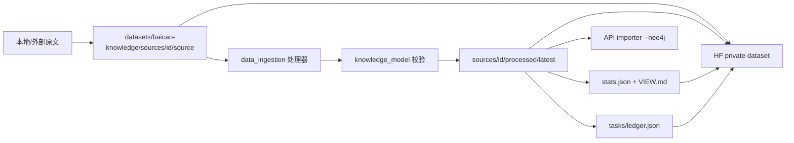

# 白草自有知识数据集与下一波数据源设计

**Status:** active  
**Date:** 2026-08-16  
**对应 plan:** `docs/superpowers/plans/2026-08-16-baicao-knowledge-dataset.md`  
**数据集台账:** `datasets/baicao-knowledge/`

## 1. 背景

仓库已有可运行的采集/入图链路，但数据资产仍散落在：

- 外部 HF 语料（`ZJUFanLab/TCMChat-dataset-600k`）
- 本地 gitignore 产物（`packages/data_ingestion/tmp/`）
- 仓库内样例（`packages/db/import/`）
- 新收到的单文件源（`道医苏子阳.md`，389 章叙事医案）

这些东西没有一份“白草自己的数据集”把源、结构化结果、任务量和筛选条件放在一起。下一波工作把这件事做成 SSOT。

## 2. 目标

1. 在 Hugging Face 建一份白草自有 dataset（默认 **private**）。
2. 每份源数据进数据集时必须同时有：`source/`、`processed/`、`VIEW.md`。
3. 任务文档、计划处理量、已完成量都进数据集，不只写在仓库 plan 里。
4. 药典 2022 作为第一份已处理源收口；`道医苏子阳` 作为第二份源接入。
5. 图模型真源仍是 `packages/knowledge_model/`，数据集只消费，不平行发明一套类型。

## 3. 非目标

- 本轮不公开转载未授权网文全文。苏子阳源文件只进 private dataset / 本地 staging，不进 git，不上公开 HF。
- 不把 `packages/graph_runtime/` 拉回 chat 主链。
- 不在本轮做鉴权、事件驱动、多 worker 会话持久化。
- 不把规划中的节点类型（方剂/医案/穴位）先写进 `knowledge_model`；先抽样，再决定是否扩模型。

## 4. 数据集身份

| 项 | 口径 |
|----|------|
| 建议 HF id | `ticoag/baicao-knowledge`（可改，改完回写 `catalog.json`） |
| 可见性 | private / gated |
| 仓库内 staging | `datasets/baicao-knowledge/` |
| 载荷 | `source/`、`processed/` 默认 gitignore；元数据、VIEW、任务台账入库 |
| 图模型版本 | catalog 钉死 `knowledge_model` 包版本或 git SHA |

## 5. 目录契约

```text
datasets/baicao-knowledge/
├── README.md
├── catalog.json
├── tasks/
│   ├── README.md
│   ├── ledger.json
│   └── YYYY-MM-DD-<task>.md
└── sources/
    └── <source_id>/
        ├── SOURCE.md
        ├── VIEW.md
        ├── source/          # 原文，不进 git
        └── processed/
            └── latest/      # 当前可导入快照，不进 git
                ├── graph_import_records.jsonl
                ├── summary.json
                └── stats.json
```

`source_id` 使用 kebab-case，稳定后不改。筛选该源在 Neo4j / 导入层的条件写进 `SOURCE.md` 和 `catalog.json.filter`。

药典沿用现有 scope：

```text
source_provider=huggingface
dataset_name=ZJUFanLab/TCMChat-dataset-600k
file_path=pretrain/train/books/national_standard/2022年中药药典.txt
import_scope_key=<上述三元组规范化 key>
```

苏子阳新 scope：

```text
source_provider=manual
dataset_name=baicao-knowledge
file_path=sources/daoyi-suyang/source/道医苏子阳.md
import_scope_key=manual:baicao-knowledge:daoyi-suyang
```

## 6. VIEW.md 必填段

每份源的 `VIEW.md` 必须能单独回答：

1. 这份源是什么、版权/许可、原始出处
2. 用什么条件把该源的节点/边从全图筛出来
3. 有哪些节点类型，各给 1 个真实或代表性示例
4. 有哪些关系类型，各给 1 个示例三元组
5. 各类型数量（计划 / 已完成 / 缺口）
6. 当前处理状态：`collected` / `segmented` / `extracted` / `imported` / `partial`

`stats.json` 是 VIEW 的机器可读真源；`VIEW.md` 可以手写解释，但数量必须能从 `stats.json` 再生。

## 7. 任务台账

`tasks/ledger.json` 是数据集内的任务量真源，字段：

- `task_id`
- `source_id`
- `status`: `planned` | `in_progress` | `done` | `blocked`
- `planned_units` / `completed_units` / `unit`（`entries` | `chapters` | `records`）
- `repo_plan`：仓库 plan 路径
- `notes`

仓库 `docs/superpowers/plans/` 继续管怎么改代码。数据集 `tasks/` 管处理了多少数据。两边互相引用，不互相替代。

## 8. 源清单（当前）

### 8.1 `national-standard-2022-pharmacopoeia`

- 类型：国家标准药典条目，规则切段 + LLM 抽取
- 源规模：605 条（segmentation 已锁定）
- 已处理：2026-04-19 多轮 ingest 合并估算成功约 595 条，约 10 条仍失败
- 结构化产物：各 run 的 `graph_import_records.jsonl`，需 merge 成 `processed/latest/`
- 当前模型够用：药材 / 饮片 / 性味 / 归经 / 功效 / 病证 / 证据 / 来源

### 8.2 `daoyi-suyang`

- 类型：道医叙事文本，389 章，约 6.9 万行 / 3.4MB
- 本地入口：`/Users/ticoag/Downloads/道医苏子阳.md`
- 原始目录声明：<https://www.biquge.tw/book/1270739/>（网文转载，**默认 private**）
- 知识形态：医案叙事，不是药典字段。可抽病证、症状、方药、针灸推拿、治法；方剂 / 医案 / 穴位是否升格为 `NodeType` 等抽样后再定
- 本轮只收源 + 空 processed + VIEW 骨架；抽取另开 task

## 9. 数据流



## 10. 后续任务波次

| 波次 | 做什么 | 完成定义 |
|------|--------|----------|
| A | 数据集骨架、catalog/VIEW/ledger、药典 merge、苏子阳收源、HF private 发布 | 两份源都能按 filter 找到；药典 latest 可导入 |
| B | 药典剩余失败条 + 正式 stats | 605 条有终态（成功或标注不可修复） |
| C | 苏子阳切段/抽样抽取/映射 | 至少 1 个可导入的 processed 快照 + VIEW 有真实统计 |
| D | 视抽样结果扩展 `knowledge_model`（方剂/医案等） | 先改模型真源，再改处理器 |
| 以后 | 溯源接到问答、鉴权、会话持久化 | 独立 spec，不塞进本数据集 plan |

## 11. 风险

- 苏子阳版权：只 private 分发，dataset card 写明来源与限制。
- 药典成功条目前是多 run 估算，merge 前不要把 595 写成精确已导入量。
- 叙事文本直接套药典 prompt 会抽脏；苏子阳必须有自己的处理器。
- 本地 `tmp/` 产物未进 git，换机器会丢；波次 A 必须把可复用快照搬进 dataset staging。
