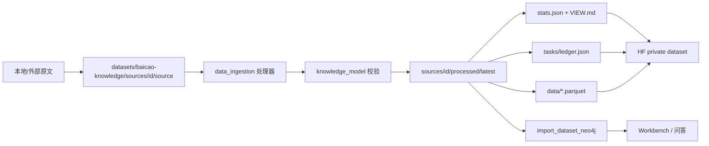

# 白草自有知识数据集与下一波数据源设计

**Status:** done（2026-08-19）
**Date:** 2026-08-16
**Updated:** 2026-08-19
**对应 plan:** `docs/superpowers/plans/2026-08-16-baicao-knowledge-dataset.md`；收口见 `docs/superpowers/plans/2026-08-19-trusted-chat-provenance-closure.md`
**数据集台账:** `datasets/baicao-knowledge/`

> 本文保留最初 private 设计的决策历史。用户后续确认采用 public 发布；最终脱敏与发布口径已毕业到 `docs/architecture/knowledge-dataset.md`，验收见 `docs/acceptance/baicao-knowledge-dataset.md`。

## 1. 背景

仓库已有可运行的采集/入图链路。药典 2022 与道医苏子阳 v3 的结构化结果已经进 `datasets/baicao-knowledge/` 并合并入 Neo4j；private HF 发布与 Workbench / 问答新类型消费也已落地。当前只剩 private Dataset Viewer 的账号能力限制。

## 2. 目标

1. 在 Hugging Face 维护一份白草自有 dataset（**private**，id 锁定 `ticoAg/baicao-knowledge`）。
2. 每份源必须同时有：`source/`、`processed/`、`VIEW.md`。
3. 任务量进数据集 `tasks/ledger.json`，代码任务进仓库 plan；两边互相引用。
4. 图模型真源仍是 `packages/knowledge_model/`，数据集只存实例。
5. Graph Workbench 与问答能按方剂、医案、穴位、治法过滤和游走。

## 3. 非目标

- 不公开转载未授权网文全文。苏子阳源文件只进 private dataset / 本地 staging，不进 git，不上公开 HF。
- 不把 `packages/graph_runtime/` 拉回 chat 主链。
- 不做鉴权、事件驱动、多 worker 会话持久化。
- **不再扩 `NodeType` / `EdgeType`。** 方剂、医案、穴位、治法已经落地。
- **不再重做苏子阳抽取或药典 LLM ingest。**

## 4. 数据集身份

| 项 | 口径 |
|----|------|
| HF id | `ticoAg/baicao-knowledge`（大小写以 catalog 为准，不要写成 `ticoag`） |
| 可见性 | private / gated |
| 仓库内 staging | `datasets/baicao-knowledge/` |
| 载荷 | `source/`、`processed/`、`work/`、`data/*.parquet`、`exports/` 默认 gitignore |
| 元数据 | `README.md`、`catalog.json`、`tasks/`、各源 `SOURCE.md` / `VIEW.md` 应进 git |
| 图模型版本 | catalog 钉死 `packages/knowledge_model` |

## 5. 目录契约

```text
datasets/baicao-knowledge/
├── README.md
├── catalog.json
├── data/                    # 拼好的 records/edges parquet，不进 git
├── exports/                 # 活图导出，不进 git
├── tasks/
│   ├── README.md
│   └── ledger.json
└── sources/
    └── <source_id>/
        ├── SOURCE.md
        ├── VIEW.md
        ├── source/          # 原文，不进 git
        ├── work/            # 切章/抽取中间态，不进 git
        └── processed/
            └── latest/      # 可导入快照，不进 git
                ├── records.jsonl
                ├── records.parquet
                ├── edges.parquet
                └── stats.json
```

`source_id` 使用 kebab-case，稳定后不改。筛选条件写进 `SOURCE.md` 和 `catalog.json.filter`。

生产图是中文键。验收 / VIEW Cypher 用：

```text
n.导入源 / n.导入源列表
r.导入范围键
```

不要再写 `import_source_id`。药典范围值：`抱抱脸:中药药典2022`；苏子阳：`人工:白草知识:道医苏子阳`。

## 6. VIEW.md 必填段

每份源的 `VIEW.md` 必须能单独回答：

1. 这份源是什么、版权/许可、原始出处
2. 用什么中文属性把该源的节点/边从全图筛出来
3. 有哪些节点类型，各给 1 个真实或代表性示例
4. 有哪些关系类型，各给 1 个示例三元组
5. 各类型数量（以 `stats.json` 为准）
6. 当前处理状态：`collected` / `segmented` / `extracted` / `imported` / `partial`

数量只能由 `compute_dataset_stats` 生成。禁止手改 count。

## 7. 任务台账

`tasks/ledger.json` 是数据集内的任务量真源。仓库 `docs/superpowers/plans/` 管怎么改代码。两边不互相替代。

## 8. 源清单（当前事实）

### 8.1 `national-standard-2022-pharmacopoeia`

- 类型：国家标准药典条目，规则切段 + LLM 抽取
- 源规模：605 条，全部 `succeeded`
- 结构化产物：`processed/latest/` 约 3431 条记录
- 入图：`pharm_nodes` 原 3431；近重复并点后全图节点约 4175
- 模型：药材 / 饮片 / 性味 / 归经 / 功效 / 病证 / 证据 / 来源

### 8.2 `daoyi-suyang`

- 类型：道医叙事文本，389 章
- 抽取：v1/v2 作废；当前真源是 `2026-08-16-suyang-v3-b01..b10`
- 结构化产物：1687 条；skip 262 是预期（宁缺毋滥）
- 入图：触达约 923 节点 / 3355 边；与药典同名只追加溯源，不覆盖 `拉丁名`
- 模型扩展已落地：方剂、医案、穴位、治法，以及 `组成药材` / `使用方剂` / `取用穴位` / `采用治法` / `记载于医案`

## 9. 数据流



苏子阳等自有源不要走 `app.importers.cli --neo4j`。

## 10. 波次状态

| 波次 | 做什么 | 状态 |
|------|--------|------|
| A | 数据集骨架、药典 merge、苏子阳收源 | 完成 |
| B | 药典 605 条终态 | 完成 |
| C | 苏子阳 v3 抽取 + 入图 | 完成 |
| D | 扩展方剂/医案/穴位/治法 | 完成 |
| E | catalog/publish CLI + private 上传 | 完成；private Viewer 需 PRO 或 Enterprise |
| F | Workbench / 问答消费新类型 | 完成 |
| 以后 | 鉴权、专家治理、多 worker 会话共享 | 独立 spec |

## 11. 风险

- 苏子阳版权：只 private 分发，dataset card 写明来源与限制。
- HF id 大小写曾写成 `ticoag`；以 `ticoAg` 为准。
- private Dataset Viewer 对当前账号返回 501，需 PRO 或 Enterprise；不得为绕过限制改成 public。
