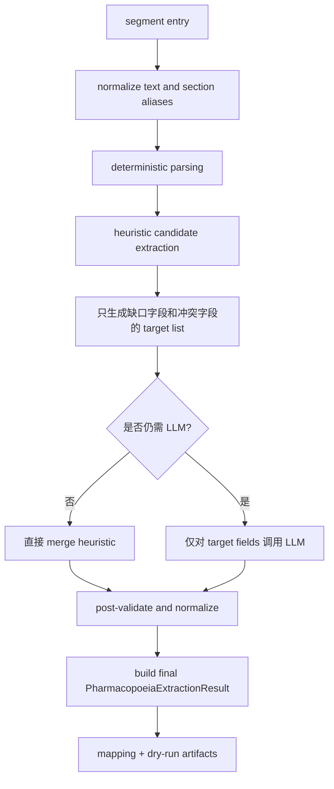

# national_standard_2022_pharmacopoeia 抽取重设计草案

## 1. 背景

当前 `national_standard_2022_pharmacopoeia` 的链路已经具备：

- 条目切段：`segmentation.py`
- 条目结构粗解析：`parsing.py`
- LLM 抽取：`llm_extraction.py`
- Graph bundle 映射：`mapping.py`
- dry-run 调试落盘：`dry_run.py`

但当前实际流程仍然偏向“一次性把整段原文交给 LLM，要求其直接输出最终 schema”，导致已有的结构解析没有真正参与抽取决策。

## 2. 当前流程与主要问题

### 2.1 当前流程


### 2.2 主要问题

1. `parsing.py` 已经拆出了 `header_lines`、`base_description`、`sections`、`piece_sections`，但 prompt 只吃 `raw_text`，等于浪费了预解析结构。
2. LLM 一次性承担“识别 section 语义 + 归一字段 + 冲突裁决 + JSON 输出”四件事，任务过重，容易在边界字段上不稳定。
3. 没有字段级证据定位。即使抽到了值，也无法知道它来自哪一段 section，后续难做冲突分析和置信判断。
4. 没有显式的启发式预抽取层，像 `拼音名`、`拉丁名`、`炮制`、`性味与归经`、`用法与用量`、`贮藏` 这类相对规则化的信息，没有优先用确定性规则消费。
5. 失败粒度过粗。当前只有：
   - 请求失败
   - JSON 非法
   - Schema 非法
   但没有“字段冲突”“低置信”“section 缺失”“启发式已覆盖无需 LLM”“LLM 仅补全缺口”等更细状态。
6. Prompt 现在要求模型直接输出最终对象，但没有字段级处理边界，导致模型会重复处理已被启发式稳定抽出的字段，既浪费 token，也增加抖动。

## 3. 目标与非目标

### 3.1 目标

- 提高稳定字段的确定性抽取比例，减少 LLM 负担
- 让 LLM 从“主抽取器”变成“判定器 + 补全器 + 冲突裁决器”
- 引入字段级 evidence span / source section 信息，便于 debug 与回放
- 让 dry-run 输出能直接回答“错在哪一层”
- 兼容现有 `PharmacopoeiaExtractionResult` 与 `mapping.py` 的消费方式

### 3.2 非目标

- 这一轮不直接改 graph schema
- 这一轮不要求把所有药典章节一次性做到通用抽取框架
- 这一轮不引入复杂 OCR / layout 纠偏能力

## 4. 候选方案对比

| 方案 | 核心思路 | 优点 | 风险 |
| --- | --- | --- | --- |
| A. 纯规则增强 | 大量正则与 section 规则直接产出最终结果 | 成本低、稳定、快 | 对变体脆弱，难处理模糊表述 |
| B. 改良版纯 LLM | 继续以 LLM 为主，但给更强结构化 prompt | 实现快，适应性强 | 成本仍高，解释性仍弱，错误定位差 |
| C. 启发式预抽取 + LLM 判定/补全 | 规则先产出候选和值域，LLM 只做缺口补全和冲突裁决 | 稳定性、成本、可解释性更平衡 | 需要增加中间模型与合并逻辑 |

推荐方案：`C. 启发式预抽取 + LLM 判定/补全`

理由：

- 当前药典文本并不是自由文本，section 结构相对强，适合先吃掉确定性信息。
- 现有 `parsing.py` 已经有不错的起点，补一个 heuristic 层性价比最高。
- `mapping.py` 需要的是相对稳定的最终结构，不需要把所有解释负担都压给 LLM。
- 你已经确认“已由启发式提取出的结构化字段，不再交给模型重复提取”，这正适合 review-only 流程。

## 5. 推荐的新流程

### 5.1 总体流程



### 5.2 分层职责

#### 层 1：切段与归一化

目标：保证后续阶段看到的是稳定文本。

建议增强点：

- 统一全角/半角标点
- 统一 section 标题别名，例如：
  - `功能与主治`
  - `功能主治`
  - `主治`
  统一映射为 canonical key
- 统一饮片标记，例如：
  - `饮片`
  - `【饮片】`
- 为每个 section 保留：
  - `section_name_raw`
  - `section_name_canonical`
  - `section_text`
  - `line_start`
  - `line_end`

#### 层 2：启发式候选抽取

目标：先把强结构、低歧义字段吃掉，并输出候选证据。

建议区分三类字段：

1. `deterministic`
   - `herb.herb_name`
   - `herb.pinyin_name`
   - `herb.latin_name`
   - `herb.base_description`
   - `prepared_piece.processing_text`
   - `prepared_piece.usage_text`
   - `prepared_piece.storage_text`
   - `prepared_piece.caution_text`
2. `semi_deterministic`
   - `prepared_piece.flavors`
   - `prepared_piece.nature`
   - `prepared_piece.meridians`
3. `semantic_or_split_required`
   - `herb.indications`
   - `prepared_piece.efficacies`
   - `prepared_piece.indications`

启发式输出不应该只有值，还应该带元信息：

```json
{
  "field_path": "prepared_piece.flavors",
  "value": ["辛", "苦"],
  "source_section": "性味与归经",
  "source_text": "辛、苦，凉。归肺、肝经。",
  "confidence": "high",
  "method": "regex_flavor_nature_meridian_v1"
}
```

#### 层 3：LLM 判定/补全

目标：只让 LLM 做它更擅长的部分：

- 根据 section 语义，把“功能与主治”拆成 `efficacies` 与 `indications`
- 在启发式候选冲突时做裁决
- 对缺失字段给出 `null` / `[]` 的明确结论
- 对异常条目给出 warnings

LLM 不再直接从零构建整个对象，而是对下面三种情况做处理：

1. `missing_fields`
2. `conflicting_candidates`
3. `semantic_split_fields`

额外约束：

- 已被启发式以 `high confidence` 填充的字段，不进入 LLM payload
- LLM 只看 `target_fields_for_review`
- 默认不要求模型输出判定理由、长解释或总结性说明

#### 层 4：合并与后校验

合并策略建议固定，避免“谁先来谁覆盖”：

1. `deterministic high confidence heuristic` 优先
2. `LLM reviewed values` 用于缺口补全与语义拆分
3. 若 heuristic 与 LLM 冲突：
   - 保留 heuristic
   - 记录 warning
   - 对低置信 heuristic 允许被 LLM 覆盖

后校验包括：

- 枚举清洗：`肺` -> `肺经`
- 去重与顺序稳定化
- `prepared_piece.parent_herb_name == herb.herb_name`
- `prepared_piece` 缺失时，饮片字段必须整体为空

## 6. 建议新增的中间模型

现有最终模型可保留，但建议增加中间层：

### 6.1 `NormalizedSection`

```python
class NormalizedSection(BaseModel):
    name_raw: str
    name_canonical: str
    text: str
    line_start: int | None = None
    line_end: int | None = None
```

### 6.2 `FieldCandidate`

```python
class FieldCandidate(BaseModel):
    field_path: str
    value: object
    source_section: str | None = None
    source_text: str | None = None
    confidence: Literal["high", "medium", "low"]
    method: str
```

### 6.3 `HeuristicExtractionDraft`

```python
class HeuristicExtractionDraft(BaseModel):
    herb: dict[str, object]
    prepared_piece: dict[str, object] | None
    candidates: list[FieldCandidate]
    missing_fields: list[str]
    conflicting_fields: list[str]
    warnings: list[str]
```

### 6.4 `LLMReviewResult`

这是建议给 LLM 的内部输出模型，不直接暴露给 mapping。

```python
class LLMFieldDecision(BaseModel):
    field_path: str
    value: object
    action: Literal["fill", "override", "leave_null"]
    evidence_quote: str | None = None

class LLMReviewResult(BaseModel):
    herb_updates: dict[str, object]
    prepared_piece_updates: dict[str, object] | None
    field_decisions: list[LLMFieldDecision]
    warnings: list[str]
```

最终再由 adapter 合成为现有的 `PharmacopoeiaExtractionResult`。

## 7. Prompt 设计

### 7.1 Prompt 设计原则

1. 不让模型“自由发挥抽整个对象”，而是让它在明确槽位上做判断。
2. 输入里显式提供：
   - canonical sections
   - heuristic draft
   - missing fields
   - conflicting fields
   - target fields
3. 输出里要求：
   - 仅输出 review JSON
   - 每个被 LLM 处理的字段都给 `action`
   - 可选返回短证据摘录，但不要求判定理由
4. prompt 采用动态注入：
   - 按条目实际缺口动态裁剪 `target_fields_for_review`
   - 已由启发式稳定提取的字段不注入 review 任务
   - 按是否存在饮片 section 动态切换 herb-only / herb+piece 模式

### 7.2 Prompt 加载方式

建议使用 LangChain 组织 prompt 与模型调用，而不是继续手写 OpenAI 请求拼装。

原因：

- 仓库内已有 LangChain LLM client 与结构化抽取调用样式可复用
- 更适合做动态 prompt 注入
- 后续如要切 OpenAI / Anthropic，更容易复用统一 model provider

建议形态：

- `ChatPromptTemplate` 或等价 message 组合
- `SystemMessage` 固定抽取规则
- `HumanMessage` 注入动态 payload
- review 阶段只传 JSON payload，不拼长自由文本

实现边界建议：

- `packages/data_ingestion` 如继续独立运行，可补最小 LangChain 依赖
- 或者仿照 [structured_extraction.py](/Users/ticoag/Documents/myws/BaiCao/packages/api/app/pipeline/structured_extraction.py) 的做法，抽一层轻量 transport adapter，避免把 API 目录直接耦合进 ingestion 包

### 7.3 推荐 system prompt 草案

```text
你是白草药坛的药典结构化抽取复核助手。

你的任务不是从零总结整条药典，而是基于：
1. 已切分的 canonical sections
2. 启发式预抽取草稿
3. 缺失字段与冲突字段列表

对指定字段做“确认 / 补全 / 覆盖建议 / 留空”。

规则：
- 只能依据输入证据判断，禁止补充常识
- 若证据不足，必须输出 leave_null
- 对“功能与主治”类文本，优先把治法或作用归入 efficacies，把病名/证候/症状归入 indications
- 只处理 target_fields_for_review 中列出的字段
- 不要重复返回未列入 target_fields_for_review 的字段
- 输出必须是严格 JSON，不要输出 markdown 或解释
```

### 7.4 推荐 user payload 结构

```json
{
  "entry_meta": {
    "entry_title": "一枝黄花"
  },
  "header": {
    "title_zh": "一枝黄花",
    "pinyin_name_candidate": "Yizhihuanghua",
    "latin_name_candidate": "SOLIDAGINISHERBA"
  },
  "canonical_sections": {
    "herb_base_description": "本品为菊科植物一枝黄花SolidagodecurrensLour.的干燥全草。",
    "piece_processing": "除去杂质，喷淋清水，切段，干燥。",
    "piece_flavor_nature_meridian": "辛、苦，凉。归肺、肝经。",
    "piece_functions_indications": "清热解毒，疏散风热。用于喉痹、乳蛾、咽喉肿痛。"
  },
  "heuristic_draft": {
    "herb": {
      "herb_name": "一枝黄花",
      "pinyin_name": "Yizhihuanghua",
      "latin_name": "SOLIDAGINISHERBA",
      "base_description": "本品为菊科植物一枝黄花SolidagodecurrensLour.的干燥全草。"
    },
    "prepared_piece": {
      "piece_name": "一枝黄花饮片",
      "parent_herb_name": "一枝黄花",
      "processing_text": "除去杂质，喷淋清水，切段，干燥。",
      "flavors": ["辛", "苦"],
      "nature": "凉",
      "meridians": ["肺经", "肝经"]
    }
  },
  "missing_fields": [
    "prepared_piece.efficacies",
    "prepared_piece.indications",
    "prepared_piece.usage_text",
    "prepared_piece.storage_text",
    "prepared_piece.caution_text"
  ],
  "conflicting_fields": [],
  "target_fields_for_review": [
    "prepared_piece.efficacies",
    "prepared_piece.indications",
    "prepared_piece.usage_text",
    "prepared_piece.storage_text",
    "prepared_piece.caution_text"
  ]
}
```

注意：

- `target_fields_for_review` 是动态生成的，不是固定全集
- 若 `flavors`、`nature`、`meridians` 已被启发式高置信抽出，则这些字段不会出现在 payload 中
- 若无饮片 section，则 `prepared_piece.*` 不应进入 target list

### 7.5 推荐 LLM 输出结构

```json
{
  "herb_updates": {},
  "prepared_piece_updates": {
    "efficacies": ["清热解毒", "疏散风热"],
    "indications": ["喉痹", "乳蛾", "咽喉肿痛"],
    "usage_text": null,
    "storage_text": null,
    "caution_text": null
  },
  "field_decisions": [
    {
      "field_path": "prepared_piece.efficacies",
      "value": ["清热解毒", "疏散风热"],
      "action": "fill",
      "evidence_quote": "清热解毒，疏散风热。"
    },
    {
      "field_path": "prepared_piece.indications",
      "value": ["喉痹", "乳蛾", "咽喉肿痛"],
      "action": "fill",
      "evidence_quote": "用于喉痹、乳蛾、咽喉肿痛。"
    }
  ],
  "warnings": []
}
```

## 8. 启发式规则设计建议

### 8.1 header 规则

- 第 1 行：`herb_name`
- 第 2 行：若全字母或拼音样式，记为 `pinyin_name`
- 第 3 行：若大写拉丁/英文样式，记为 `latin_name`

### 8.2 section alias 归一

建议建立一份小型 alias map：

```python
SECTION_ALIAS_MAP = {
    "炮制": "piece_processing",
    "性味与归经": "piece_flavor_nature_meridian",
    "功能与主治": "piece_functions_indications",
    "用法与用量": "usage_text",
    "贮藏": "storage_text",
    "注意": "caution_text",
    "注意事项": "caution_text",
}
```

### 8.3 性味 / 药性 / 归经

建议拆成独立规则，不把它们混在一个 regex 里：

- `extract_flavors(text) -> list[str]`
- `extract_nature(text) -> str | None`
- `extract_meridians(text) -> list[str]`

这样好处是：

- 单元测试更细
- 某个字段失败时不拖垮整段
- 便于后续替换词表

### 8.4 功效 / 主治 拆分

这里建议“规则先粗切，LLM 再复核”：

规则：

- 以 `。`、`；`、`用于`、`主治` 等触发词切句
- 句首是动作/治法型短语，如 `清热解毒`、`疏散风热`，优先归 `efficacies`
- `用于`、`治`、`主治` 后面的名词性病证，优先归 `indications`

但这层不要过度自信，建议默认 `medium confidence`，交给 LLM 复核。

## 9. 伪代码设计

### 9.1 主流程

```python
def process_pharmacopoeia_entry(block: RawEntryBlock, transport: ExtractionTransport) -> PharmacopoeiaExtractionResult:
    normalized_entry = normalize_entry(block)
    parsed = parse_entry_v2(normalized_entry)

    heuristic_draft = build_heuristic_draft(parsed)

    if should_skip_llm(heuristic_draft):
        llm_review = None
    else:
        llm_payload = build_llm_review_payload(parsed, heuristic_draft)
        llm_review = review_with_llm(llm_payload, transport)

    merged = merge_heuristic_and_llm(
        parsed=parsed,
        heuristic_draft=heuristic_draft,
        llm_review=llm_review,
    )

    final_result = finalize_extraction_result(merged)
    validate_cross_field_constraints(final_result)
    return final_result
```

### 9.2 heuristic draft

```python
def build_heuristic_draft(parsed: ParsedEntry) -> HeuristicExtractionDraft:
    candidates = []

    herb_name = parsed.title_zh
    pinyin_name = extract_pinyin_from_header(parsed.header_lines)
    latin_name = extract_latin_from_header(parsed.header_lines)
    base_description = parsed.base_description

    piece_processing = parsed.canonical_sections.get("piece_processing")
    flavor_text = parsed.canonical_sections.get("piece_flavor_nature_meridian", "")
    function_text = parsed.canonical_sections.get("piece_functions_indications", "")

    flavors = extract_flavors(flavor_text)
    nature = extract_nature(flavor_text)
    meridians = extract_meridians(flavor_text)
    efficacy_candidates, indication_candidates = split_functions_and_indications(function_text)

    candidates.extend(
        collect_header_candidates(
            herb_name=herb_name,
            pinyin_name=pinyin_name,
            latin_name=latin_name,
            base_description=base_description,
        )
    )
    candidates.extend(
        collect_piece_candidates(
            piece_processing=piece_processing,
            flavors=flavors,
            nature=nature,
            meridians=meridians,
            efficacy_candidates=efficacy_candidates,
            indication_candidates=indication_candidates,
            flavor_text=flavor_text,
            function_text=function_text,
        )
    )

    return HeuristicExtractionDraft(
        herb={
            "herb_name": herb_name,
            "pinyin_name": pinyin_name,
            "latin_name": latin_name,
            "base_description": base_description,
        },
        prepared_piece={
            "piece_name": infer_piece_name(parsed.title_zh, parsed),
            "parent_herb_name": herb_name,
            "processing_text": piece_processing,
            "flavors": flavors,
            "nature": nature,
            "meridians": meridians,
            "efficacies": efficacy_candidates,
            "indications": indication_candidates,
        } if parsed.has_piece else None,
        candidates=candidates,
        missing_fields=compute_missing_fields_from_candidates(
            parsed=parsed,
            candidates=candidates,
        ),
        conflicting_fields=compute_conflicting_fields_from_candidates(candidates),
        warnings=[],
    )
```

### 9.3 LLM review

```python
def build_llm_review_payload(parsed: ParsedEntry, draft: HeuristicExtractionDraft) -> dict[str, object]:
    return {
        "entry_meta": {"entry_title": parsed.title_zh},
        "canonical_sections": parsed.canonical_sections,
        "heuristic_draft": draft.model_dump(mode="json"),
        "missing_fields": draft.missing_fields,
        "conflicting_fields": draft.conflicting_fields,
        "target_fields_for_review": select_target_fields_excluding_high_confidence_fields(draft),
    }
```

```python
def merge_heuristic_and_llm(parsed, heuristic_draft, llm_review):
    merged = deep_copy(heuristic_draft)

    if llm_review is None:
        return merged

    for decision in llm_review.field_decisions:
        if decision.action == "leave_null":
            continue
        if can_apply_llm_decision(decision, heuristic_draft):
            apply_decision(merged, decision)
        else:
            merged.warnings.append(
                f"field conflict kept heuristic: {decision.field_path}"
            )

    merged.warnings.extend(llm_review.warnings)
    return merged
```

## 10. dry-run 输出建议升级

当前 dry-run 很适合做链路观测，建议新增以下落盘文件：

- `normalized_sections.jsonl`
- `heuristic_candidates.jsonl`
- `heuristic_drafts.jsonl`
- `llm_review_requests.jsonl`
- `llm_review_responses.jsonl`
- `merged_extractions.jsonl`

这样一条失败记录可以直接定位为：

- 切段错
- section 归一错
- heuristic 错
- LLM review 错
- merge 错
- mapping 错

## 11. 建议先做一次预处理评估

在正式改 prompt 与 merge 逻辑前，建议先写一个轻量评估脚本，只跑：

`segmentation -> parsing -> canonical section -> heuristic draft`

目的不是直接上线，而是回答两个问题：

1. 启发式到底能稳定覆盖多少字段
2. 哪些字段最值得交给 LLM review

建议输出的评估指标：

- 条目总数
- 存在饮片 section 的条目数
- `pinyin_name` 命中率
- `latin_name` 命中率
- `processing_text` 命中率
- `flavors` / `nature` / `meridians` 命中率
- `functions_indications` 可粗切比例
- 每字段 `high / medium / low confidence` 分布

建议附加落盘：

- `preprocess_summary.json`
- `preprocess_samples.jsonl`
- `field_coverage.csv`

如果这一步结果显示：

- `flavors` / `nature` / `meridians` 高覆盖高稳定
- `efficacies` / `indications` 仍然语义性强

那就更能证明“启发式预抽取 + LLM 仅 review 缺口字段”是正确方向。

## 12. 建议的代码组织

建议在当前目录下增加这些模块，而不是把逻辑继续堆进 `llm_extraction.py`：

- `section_aliases.py`
- `heuristic_candidates.py`
- `heuristic_rules_header.py`
- `heuristic_rules_piece.py`
- `llm_review_models.py`
- `llm_review_prompts.py`
- `merge.py`
- `preprocess_assessment.py`

保留现有文件职责的大方向：

- `segmentation.py`：只负责切段
- `parsing.py`：升级为结构解析与 canonical section 生成
- `llm_extraction.py`：改名或收窄为 `llm_review.py` 更合理
- `mapping.py`：尽量不感知内部抽取重构细节

## 13. 最小实施顺序

建议分 5 步落地：

1. 先补 canonical section 和 heuristic draft，不接 LLM
2. 先跑一次 preprocess assessment，确认字段覆盖率与主要缺口
3. 再把 prompt 从“直接抽最终对象”改成“review draft only for target fields”
4. 再加 merge 与更细 dry-run 落盘
5. 最后补冲突用例、弱结构条目用例和抽样评估脚本

## 14. 需要你确认的点

1. Prompt 调用层按 LangChain 组织是否就按这个方向定下来。
2. `prepared_piece.efficacies` 与 `prepared_piece.indications` 是否同意采用“规则粗切 + LLM 复核”的混合策略。
3. 是否先做一次预处理评估脚本，再进入正式实现。

## 15. 我的建议结论

如果目标是“让这个数据集抽取得更稳、更容易调”，最值得做的不是继续堆 prompt，而是把链路改成：

`结构切分 -> canonical section -> heuristic draft -> LLM review -> merge -> final schema`

也就是：

- 规则先吃掉强结构字段
- LLM 只处理缺口字段和冲突字段
- dry-run 能看到每一层的中间证据

这条路对当前代码改动量适中，但能明显改善稳定性、成本和可解释性。
