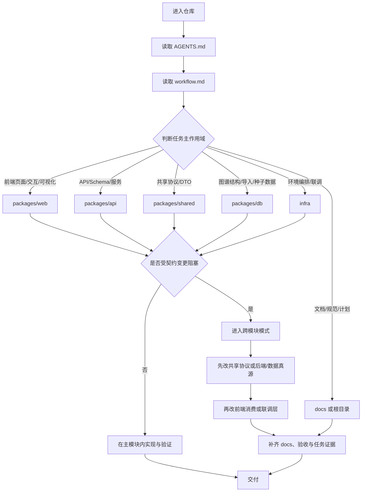

# BaiCao Workflow

本文档定义 BaiCao 仓库内 `packages/api/`、`packages/web/`、`packages/shared/`、`packages/db/`、`infra/`、`docs/` 与 `docs/superpowers/` 的协作工作流。目标不是把规则重复写进每层文档，而是让仓库内的研发推进方式保持一致、可恢复、可追溯，并围绕知识图谱、溯源与问答链路坚持 contract-first。

## 仓库模型

## 1. 初始化流程

每次开始一个新任务时，按以下顺序收敛上下文：

1. 读当前作用域内的 `AGENTS.md`
2. 读根目录 `workflow.md`
3. 判断任务主作用域：`packages/api/`、`packages/web/`、`packages/shared/`、`packages/db/`、`infra/`、`docs/`，还是跨模块任务
4. 读目标作用域的 README、配置文件和最相关文档，同时确认 `README.md` 与相关 `docs/superpowers/plans/*.md` 中的目标/阶段定位
5. 只补读与当前任务直接相关的代码、测试和调用点

判定主作用域时，优先看“谁是真源”，不要看“哪里更容易打补丁”：

- 需求与阶段目标真源：`README.md`、`docs/superpowers/plans/*.md`
- 任务状态与实施分解真源：`docs/superpowers/plans/*.md`
- 跨端共享协议入口：`packages/shared/types/index.ts`
- 后端 API Schema / DTO 真源：`packages/api/app/schemas/**`
- 后端领域模型与业务逻辑真源：`packages/api/app/models/**`、`packages/api/app/services/**`
- 图谱 Schema / Cypher / 导入样例真源：`packages/db/neo4j/**`、`packages/db/import/**`
- 前端请求封装与展示态适配真源：`packages/web/src/services/**`
- 运行编排与联调事实真源：`infra/docker-compose.yml`、`infra/.env.schema`
- 本地开发操作入口：`docs/local-development.md`
- 长期维护文档真源：`docs/architecture/**`、`docs/acceptance/**`

## 2. 任务分流规则

### 2.1 进入 `packages/web/` 的任务

适用于：

- 页面 UI、交互、图谱可视化、状态流、组件拆分
- 前端服务封装、列表/详情/问答/验证页面展示
- 页面加载态、空态、错误态、推理链与证据展示
- 前端相关验收文档同步

执行时：

1. 查看 `packages/web/package.json`、相关页面/组件、`src/services/**`
2. 若接口字段或状态结构不确定，回到 `packages/shared/` 和 `packages/api/app/schemas/` 确认，不在组件里猜字段
3. 完成后至少做一条页面主路径验证；必要时补 `docs/acceptance/` 证据

### 2.2 进入 `packages/api/` 的任务

适用于：

- FastAPI 路由、Pydantic Schema、SQLAlchemy 模型
- 服务层业务逻辑、问答编排、图谱查询、溯源服务、验证服务
- 导出 / 导入接口、配置项、LangChain / OpenAI 集成
- 后端日志、错误处理、主路径契约保证

执行时：

1. 查看 `packages/api/pyproject.toml` 与相关 `app/**`
2. 涉及协议变化时优先检查 `packages/shared/types/` 与 `packages/api/app/schemas/`
3. 完成后至少做一条接口、服务或契约验证；若影响前端消费，补一条前端消费侧检查

### 2.3 进入 `packages/shared/` 的任务

适用于：

- 前后端共享类型、DTO、响应结构、枚举和值域
- 对外暴露给 web 消费的知识图谱、问答、验证、溯源 payload

执行时：

1. 先确认共享类型是否真的是跨端共享语义，而不是某一端的临时展示模型
2. 共享类型变更后，同步检查 `packages/api/app/schemas/**` 与 `packages/web/src/services/**`
3. 至少执行 `pnpm --dir packages/shared typecheck`，并补一条消费方验证

### 2.4 进入 `packages/db/` 的任务

适用于：

- Neo4j 约束、Cypher、种子数据
- 导入样例、结构化导入格式、图谱初始数据
- 与知识图谱实体 / 关系定义直接相关的变更

执行时：

1. 先确认改动影响的是图谱结构、导入数据，还是被上层服务消费的查询语义
2. 若影响 API 返回或前端展示，进入跨模块模式
3. 完成后至少保留一条可复现的数据或查询验证说明

### 2.5 进入 `infra/` 的任务

适用于：

- Docker Compose 编排、环境变量模板、Nginx / PostgreSQL / Neo4j 配置
- 本地联调路径、端口、服务依赖、容器启动脚本

执行时：

1. 先确认是运行时编排变化还是仅本地开发便利性变化
2. 完成后至少执行 `docker compose -f infra/docker-compose.yml config`
3. 若影响主链路访问方式或环境要求，补 `docs/local-development.md` / acceptance / task 文档

### 2.6 文档与规范治理任务

适用于：

- 根目录 `AGENTS.md`、`workflow.md`
- `docs/README.md`、`docs/architecture/**`、`docs/acceptance/**`、`docs/_dev/**`
- `docs/agent-skill-routing.md`、`docs/verification-matrix.md`
- 与 `docs/superpowers/` 相关的研发协作文档

执行时：

1. 先确认文档作用域与真源目录
2. 若变更会影响默认研发动作或交接方式，优先同步根目录入口文档与相关 docs 门户
3. 更新最小必要文档，避免同一规则写在多处且互相漂移
4. 检查引用路径、命令、文件名与当前仓库结构一致

### 2.7 进入跨模块模式的任务

只在以下情况进入跨模块模式：

- API 字段、请求参数、响应结构、事件负载、枚举取值发生变化
- 图谱结构、Cypher 查询结果、导入格式变化影响 API 或前端展示
- `packages/shared/types/` 的共享协议变化
- `infra/` 变化影响主链路启动、联调或验收路径
- 需要证明“后端能力 + 前端消费 + 文档 / 验收”已经形成闭环

标准顺序：

1. 明确主模块与次模块
2. 先在共享协议、后端 Schema、图谱结构等真源完成改动
3. 在后端或数据层完成最小验证
4. 再到前端更新 `src/services/**`、状态和页面渲染
5. 补齐 `docs/` 下相关文档与 `docs/superpowers/plans/` 证据
6. 追加一条跨模块闭环验证

跨模块时不要做的事：

- 先在前端做临时字段兼容，再忘记回补共享协议或后端真源
- 在 `shared`、`api`、`web` 各维护一份互相漂移的字段定义
- 把跨模块共享语义塞进某个页面组件或某个 route 的临时补丁里

## 3. 类型优先 / Contract First 工作流

当前仓库已经具备共享类型目录，因此跨端协议默认按以下方式落位：

- 共享协议入口：`packages/shared/types/**`
- 后端 API Schema / DTO：`packages/api/app/schemas/**`
- 后端领域模型与服务输入输出：`packages/api/app/models/**`、`packages/api/app/services/**`
- 前端请求封装、适配与页面消费：`packages/web/src/services/**`、`packages/web/src/pages/**`
- 图谱结构与导入形态：`packages/db/neo4j/**`、`packages/db/import/**`

凡是新增或修改以下内容，必须优先走 contract-first 流程：

- 前后端共享字段
- 请求参数、响应体、验证状态、推理链结构
- 图谱节点 / 边 / 路径查询返回结构
- 导入记录、证据、来源等需要跨端展示的对象
- 依赖环境配置且会影响启动 / 调试行为的配置对象

默认顺序：

1. 定义领域对象、图谱 / 数据边界和共享命名
2. 更新 `packages/shared/types/**`（若属于跨端共享契约）
3. 更新 `packages/api/app/models/**`、`packages/api/app/schemas/**`、`packages/api/app/services/**`
4. 如涉及图谱或导入结构，更新 `packages/db/**`
5. 接入 `packages/api/app/api/**`
6. 更新 `packages/web/src/services/**` 的请求、适配与前端友好模型
7. 更新页面 / 组件渲染与状态逻辑
8. 同步 `docs/`、验收与 `docs/superpowers/plans/` 证据

补充约束：

- 后端若已有可复用 Schema，不要长期在路由层保留匿名 dict / `BaseModel` 临时结构
- 前端不要在多个页面里散落硬编码字段名或兼容逻辑
- 由于项目仍处于早期演进阶段，可做清晰的边界调整，但 breaking change 必须显式写明影响范围与迁移步骤

## 4. 仓库现状下的标准研发流

### 4.1 前端本地任务

推荐顺序：

1. 确认页面、组件、路由与 `src/services/**` 的影响范围
2. 梳理页面需要的数据模型、状态与交互事件
3. 若依赖接口数据，先检查共享类型与后端 Schema
4. 实现页面与组件，保证加载态、空态、错误态完整
5. 补齐至少一条页面或服务验证，并按需同步验收文档

### 4.2 后端本地任务

推荐顺序：

1. 确认领域边界、调用方与是否涉及协议或图谱结构
2. 先更新模型、Schema、服务和必要的数据结构
3. 在 `app/api/**` 接线，保持路由层轻薄
4. 验证主路径、失败路径和兼容路径
5. 如有契约变化，补前端消费侧或 integration 检查

### 4.3 图谱 / 溯源 / 问答链路任务

这类任务默认视为跨模块敏感任务，因为它通常同时影响：

- `packages/db/` 中的图谱结构或样例数据
- `packages/api/` 中的查询、问答或溯源服务
- `packages/web/` 中的展示、推理链和证据可视化
- `docs/architecture/` 与 `docs/acceptance/` 中的稳定口径和验收闭环

执行顺序：

1. 先确认图谱 / 领域模型与返回结构
2. 再确认 API 查询与服务编排
3. 最后确认前端消费与展示
4. 补齐验收文档和实现证据

### 4.4 文档 / 任务治理任务

推荐顺序：

1. 先确认该信息属于 `architecture`、`acceptance`、`_dev`、`superpowers` 还是根级协作文档
2. 只把稳定信息放进稳定目录，草案保留在 `_dev/`
3. 任务完成后同步相关入口页，避免“文档存在但无法被发现”
4. 若 `docs/superpowers/plans/` 的计划状态发生变化，确保其证据可追到代码或验收结果

补充口径：

5. 若 `docs/superpowers/specs/` 或 `docs/superpowers/plans/` 对应任务已经完成，稳定事实必须毕业到 `docs/architecture/`，验收与结果必须毕业到 `docs/acceptance/`
6. 若新需求已完整覆盖旧 spec / plan，删除旧文档，不并行维护多条互相冲突的 requirement lineage
7. 毕业或删除后，同步更新目录 `README`、入口索引和状态字段

## 5. 渐进式披露约定

- 简单问题或小修复：直接输出结论、改动点和验证方式
- 中等改动：先给简短方案，覆盖范围、契约影响、验证方式，再进入实现
- 复杂任务：按阶段汇报进度，但默认只披露“下一步行动所需的信息”
- 不把大段日志、大文件全文或冗余推理过程直接塞进回复；优先摘要 + 路径定位
- 用户继续追问时，再展开设计权衡、迁移策略与证据链

## 6. 验证与交接

- 验证矩阵（各类改动的最低验证标准）见 `docs/verification-matrix.md`
- 若任务在本轮未完成，交接信息至少应覆盖：当前进度、下一步、已验证项、阻塞或风险
- 若本轮同时更新了 `docs/superpowers/plans/`、`docs/acceptance/` 或其他 `docs/superpowers/` 文档，确保这些文档与实际代码状态一致，下一位协作者能直接接手
